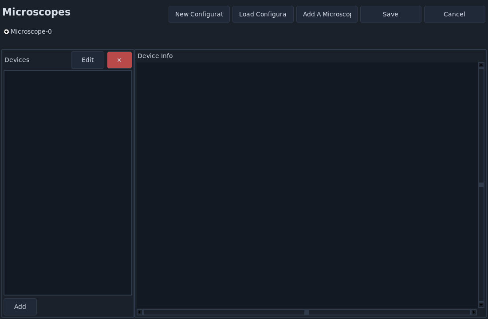

.. _configuring_navigate:

====================
Configuring Navigate
====================

This page is the fastest path to a first working microscope configuration in
**navigate**.

The :file:`configuration.yaml` file defines the hardware and microscope settings
loaded at startup. By default, the local file is saved at:

* Windows: :file:`C:\\Users\\Username\\AppData\\Local\\.navigate\\config\\configuration.yaml`
* macOS/Linux: :file:`~/.navigate/config/configuration.yaml`

.. warning::
   The configuration file is sensitive. A reliable strategy is to build a
   working setup using only virtual devices first, then replace devices with
   real hardware one at a time.

.. tip::
   If you cannot locate :file:`configuration.yaml`, launch with synthetic
   hardware (``navigate -sh``), then select
   :menuselection:`File --> Open Configuration Files`.

Configuration Wizard
--------------------

1. Activate the environment used for installation.
2. Launch the configurator:

.. code-block:: console

    navigate -c

3. Choose :guilabel:`New Configuration` to create a new file, or
   :guilabel:`Load Configuration` to edit an existing file.
4. If needed, click :guilabel:`Add A Microscope` to create additional
   microscope entries.
5. In each hardware tab, the first column shows configuration entries (most are
   likely required), the middle column is where you enter values, and the
   right column contains field help text.
6. Fill required hardware fields (DAQ, camera, stage, lasers, filter wheel,
   etc.), validating one device at a time.
7. Save as :file:`configuration.yaml` in your local :file:`.navigate/config`
   directory, then launch:

.. code-block:: console

    navigate

Need More Control?
------------------

Manual editing supports advanced use cases such as:

* multiple microscopes and inheritance,
* stage axis mapping and flip behavior,
* stage limits and offsets,
* zoom calibration and stage-compensation tables.

For full details, see :ref:`Advanced Software Configuration <configuration_file>`.
