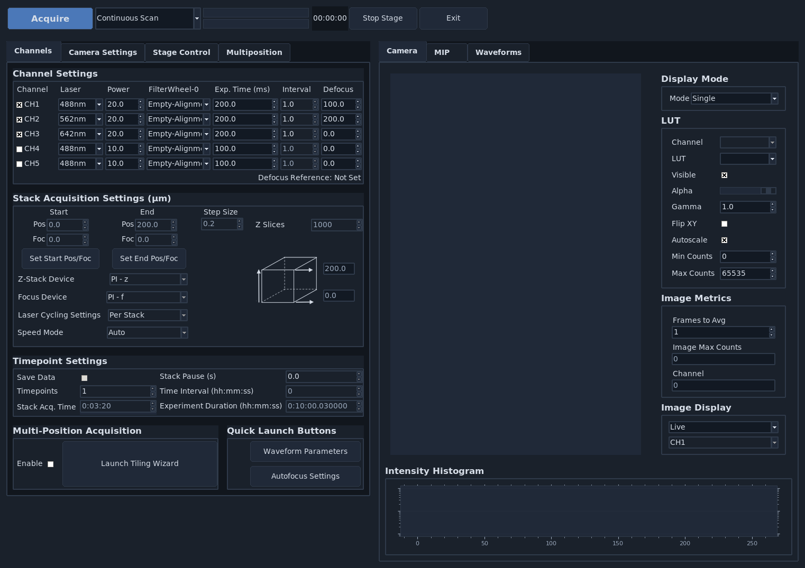
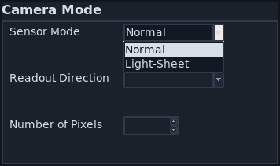

.. _beginner:

===========================
Acquiring Data
===========================

This guide introduce the basic steps for acquiring data with **navigate**. It assumes that you have already completed:

* :ref:`Software Installation <software_installation>`
* :ref:`Configuring Navigate <configuring_navigate>`

If your microscope hardware is not fully configured yet, you can still complete all
steps below in synthetic hardware mode using Virtual Devices.

---------------------------------------

Launch the Software Package
===========================

1. Activate the same environment you used during installation.
2. Launch **navigate**:

.. code-block:: console

   # Use configured hardware
   navigate

   # Or use Virtual Devices (synthetic hardware mode)
   navigate -sh

---------------------------------------

Configure the Channel Settings
==============================

* Select the :guilabel:`Channels` tab, which is located on the upper left of the main window.  
* Under the :guilabel:`Channel Settings` section, select the number of channels needed for imaging. For each channel selected, you will need to configure the acquisition settings:

    .. image:: ../images/channel-selector.png
       :align: center
       :alt: Channel settings in the **navigate** software package.

    * Select the appropriate :guilabel:`Laser` from the dropdown menu.  
    * Select the appropriate :guilabel:`Power` for the laser.  
    * Select the appropriate emission :guilabel:`Filter` from the dropdown menu.

    .. image:: ../images/channel-selector-filter.png
       :align: center
       :alt: Changing the emission filter in **navigate**.

    * Specify the camera :guilabel:`Exp. Time (ms)`. A good default value is ``100`` or ``200`` ms.  
    * Specify the :guilabel:`Interval` to be ``1.0``. While this feature is not currently implemented, future releases will allow users to image different channels at different time intervals.  
    * Specify the :guilabel:`Defocus` to be ``0`` unless the channel has a measured chromatic focus offset. Defocus is a per-channel focus offset from the zero-defocus focus position. During acquisition, **navigate** infers the zero-defocus focus position from the current focus and the current channel defocus, then moves each channel to zero-defocus focus plus that channel's defocus.

---------------------------------------

Configure the Camera Settings
=============================

* Select the :guilabel:`Camera Settings` tab.  
* For standard imaging applications, select :guilabel:`Normal` in the :guilabel:`Sensor Modes` dropdown menu within the :guilabel:`Camera Modes` section.  
* If you are using the rolling shutter, select :guilabel:`Light-Sheet` and specify its :guilabel:`Readout Direction` and :guilabel:`Number of Pixels`.

.. note:: For more information on how to configure the rolling shutter for ASLM operation, please refer to :ref:`ASLM <setup_aslm>`.

* Choose the size of your camera's field of view.  
    * Specify the :guilabel:`Region of Interest Settings` by entering the appropriate :guilabel:`Number of Pixels` for both the :guilabel:`Width` and :guilabel:`Height` values. Alternatively, one can select from one of several default values in the :guilabel:`Default FOVs` section.

    .. note:: The :guilabel:`FOV Dimensions (microns)` is automatically calculated based on the :guilabel:`Number of Pixels` and the `pixel_size` as specified in the `zoom` section of your ``configuration.yaml`` file.

        .. code-block:: yaml

            zoom:
              pixel_size:
                20x: 0.325 # magnification, and pixel size in microns

    .. image:: ../images/ROI-definition.png
       :align: center
       :alt: Changing the camera region of interest in **navigate**.

.. note:: If multiple channels are selected, each channel will be acquired with the same:

    * :guilabel:`Sensor Mode`
    * :guilabel:`Readout Direction`
    * :guilabel:`Region of Interest Settings`.

---------------------------------------

Acquire in a Continuous Scan Mode
=================================

* Select "Continuous Scan" in the dropdown next to the :guilabel:`Acquire` button in the :ref:`acquisition bar <ui_acquisition_bar>`.

    .. image:: ../images/continuous-scan-dropdown.png
       :align: center
       :alt: Selecting the continuous scan mode in **navigate**.

* Press :guilabel:`Acquire`. This will launch a live acquisition mode.

    .. note:: If multiple channels are selected, each channel will be imaged sequentially. The order of imaging is determined by the order of the channels in the :guilabel:`Channel Settings` section of the :guilabel:`Channels` tab, and will proceed from the top to the bottom of this channel list.

    .. image:: ../images/continuous-scan-acquire.png
       :align: center
       :alt: Launching the continuous scan mode in **navigate**.

* Move the stage to identify the location of the sample.  
    * Select the :guilabel:`Stage Control` tab, and use the graphical user interface to move the stage. This includes buttons for moving the stage in ``X``, ``Y``, ``Z``, ``F``, and ``Theta`` directions.

      * The step size for each axis can be adjusted with the spinbox next to each button.  
      * For stage axes configured as Virtual Devices, buttons will be disabled.  
      * Absolute positions can be entered in the text boxes next to each button.  
      * Check :ref:`Advanced Configuration <configuration_file>` settings for more information.
    * Alternatively, if available, use the manufacturer-provided joystick to position the sample.

    .. note:: The axes for a light-sheet microscope vary in the literature. Here, we define the ``Y`` axis as the direction of the light-sheet propagation, the ``Z`` axis as the direction of the detection objective, and the ``X`` axis as the direction perpendicular to the light-sheet and detection objective axes. The ``F`` axis typically controls the position of the detection objective along the detection axis. The ``Theta`` axis typically controls the rotation of the sample. This is discussed in more detail in the :ref:`coordinate system <coordinate_system>` section.

    .. warning:: One should always be careful when moving the stage. If the stage is moved too quickly, the sample and/or microscope may be damaged. We strongly recommend that you implement stage limits in your configuration file. Please refer to :ref:`configuration settings <configuration_file>` for more information, or open :menuselection:`Stage Control --> Advanced Stage Parameters`.

    .. image:: ../images/stage-movement-panel.png
       :align: center
       :alt: Moving the stage in **navigate**.

* Press the :guilabel:`Stop` button in the acquisition bar to stop acquisition.

    .. image:: ../images/stop-acquisition.png
       :align: center
       :alt: Stopping the continuous scan mode in **navigate**.

---------------------------------------

Acquiring a Single Image
=========================

* Check the :guilabel:`Save Data` box in the :guilabel:`Timepoint Settings` section under the :guilabel:`Channels` tab to save the acquired images. Check this box before acquiring data.

    .. image:: ../images/save-data.png
       :align: center
       :alt: Saving data in **navigate**.

* Select :guilabel:`Single Acquisition` from the dropdown next to the :guilabel:`Acquire` button.

    .. image:: ../images/single-acquisition-dropdown.png
       :align: center
       :alt: Selecting the single acquisition mode in **navigate**.

* Press :guilabel:`Acquire` to open the :guilabel:`File Saving Dialog` interface. Enter the sample parameters, notes, location to save file, and filetype in the :guilabel:`File Saving Dialog` that pops up.

    .. image:: ../images/save-dialog-box.png
       :align: center
       :alt: Saving data in **navigate**.

* Press :guilabel:`Acquire Data` to initiate acquisition. Acquisition will automatically stop once the image is acquired.

    .. note:: Each acquisition will be saved in a separate folder (e.g., ``Cell01``, ``Cell02``, ...) within the directory specified in the :guilabel:`File Saving Dialog` interface. If you prefer a different prefix for the folder names, you can specify this in the :guilabel:`Prefix` field. Data will not be overwritten between acquisitions.

.. _i_want_to_z_stack:

---------------------------------------

Acquiring a Z-Stack
===================

* Using the :guilabel:`Stage Control`, go to the desired z-position in the sample. Make sure that the sample is in focus. To use the autofocus feature, please refer to the :ref:`Autofocus Settings <ui_autofocus>`.

    .. image:: ../images/stage-control-start-pos-zstack.png
       :align: center
       :alt: Adjusting the stage position in **navigate**.

* If the microscope has more than one stage that can move in the Z direction, choose the stage that should perform the stack from :guilabel:`Z-Stack Device` before setting the start and end positions. This selected device is the primary Z-stack stage: :guilabel:`Start`, :guilabel:`End`, and :guilabel:`Step Size` are applied to this stage. Other stack-capable stages can be moved with fixed offsets from the primary Z-stack stage when their offset settings are enabled.

* Under the :guilabel:`Channels` tab, in :guilabel:`Stack Acquisition Settings (μm)` press :guilabel:`Set Start Pos/Foc`.

    .. image:: ../images/press-start-pos.png
       :align: center
       :alt: Adjusting the stage position in **navigate**.

* Using the :guilabel:`Stage Control`, go to a different z-position within the sample. Again, make sure that the sample is in focus.

    .. image:: ../images/stage-control-end-pos-zstack.png
       :align: center
       :alt: Adjusting the stage position in **navigate**.

* Under the :guilabel:`Channels` tab, in :guilabel:`Stack Acquisition Settings (μm)` press :guilabel:`Set End Pos/Foc`.

    .. image:: ../images/press-end-pos.png
       :align: center
       :alt: Adjusting the stage position in **navigate**.

    .. note:: If there is a shift in ``F`` between the start and stop positions, the ``F`` axis will be ramped synchronously with ``Z`` to maintain focus. Check :ref:`configuration settings <configuration_file>` for more information to determine if focus is enabled in hardware. Refer to :ref:`Imaging on a mesoSPIM BT <acquire_mesospimbt>` section for an example of how to acquire a z-stack with a focus ramp.

* Type the desired step size in microns in the :guilabel:`Step Size` dialog box in :guilabel:`Stack Acquisition Settings (μm)`.

    .. note:: The minimum step size, and increment between steps, are graphical user interface defaults that are specified in the ``configuration.yaml`` file. More information can :ref:`configuration settings <configuration_file>`.

        .. code-block:: yaml

            gui:
              stack_acquisition:
                step_size:
                  min: 0.100
                  max: 1000
                  step: 0.1

    .. image:: ../images/define-step-size.png
       :align: center

* If using multiple channels for imaging, select either :guilabel:`Per Z` or :guilabel:`Per Stack` under :guilabel:`Laser Cycling Settings` in the :guilabel:`Stack Acquisition Settings (μm)` section under the :guilabel:`Channels` tab.

    * :guilabel:`Per Z` acquires all channels before moving the stage to a new position.  
    * :guilabel:`Per Stack` acquires all images in a stack acquisition for a single channel before moving the stage back to the start position and restarting acquisition for the subsequent channel until all channels are imaged.

    .. image:: ../images/laser-cycling-settings.png
       :align: center

* Select :guilabel:`Z-Stack` from the dropdown next to the :guilabel:`Acquire` button. Press :guilabel:`Acquire`.

    .. image:: ../images/z-stack-acquisition.png
       :align: center

* Enter the sample parameters, notes, location to save file, and filetype in the :guilabel:`File Saving Dialog` that pops up.  
* Press :guilabel:`Acquire Data` to initiate acquisition. Acquisition will automatically stop once the image series is acquired.
