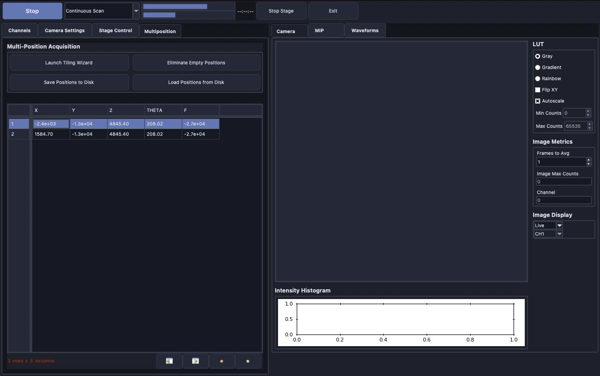
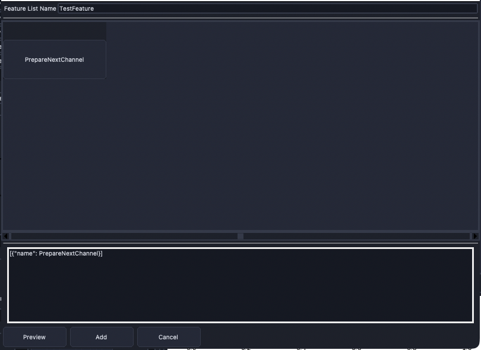
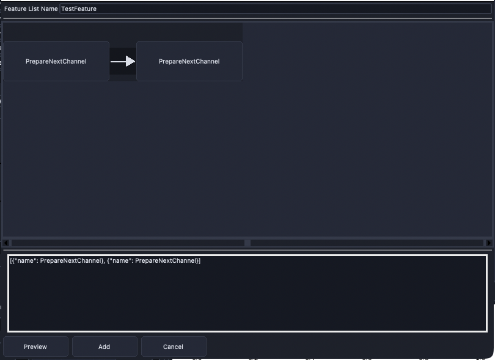
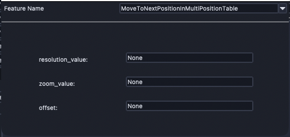
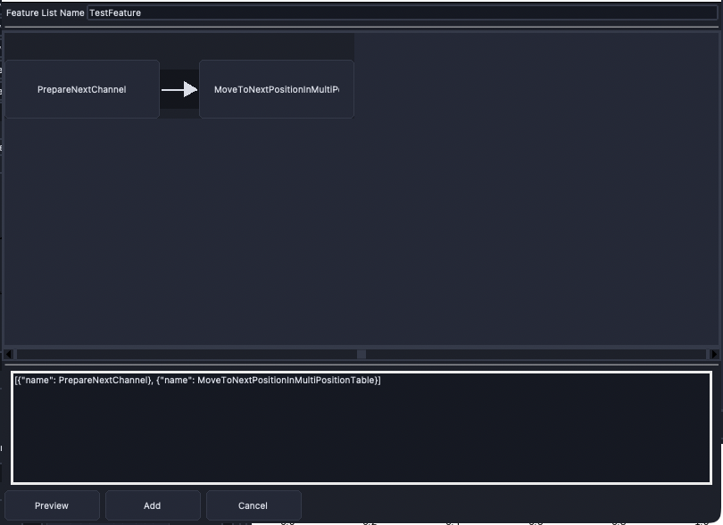
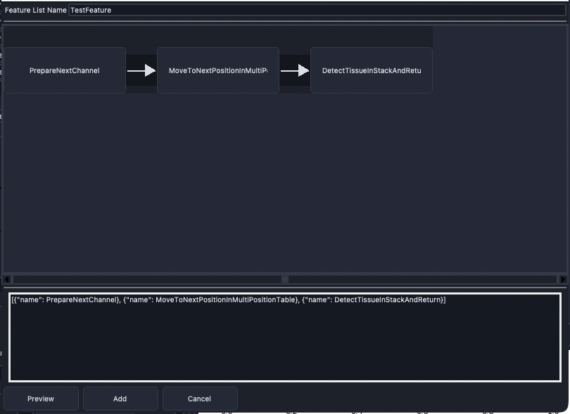
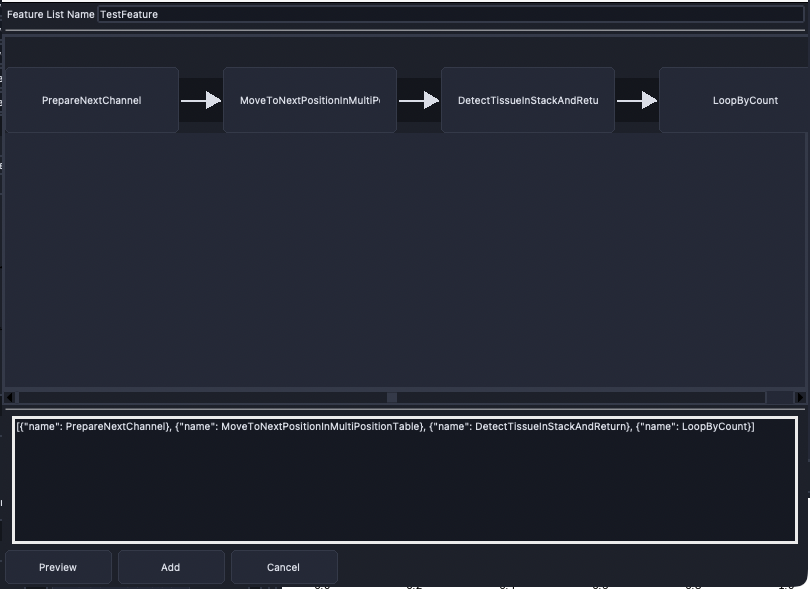
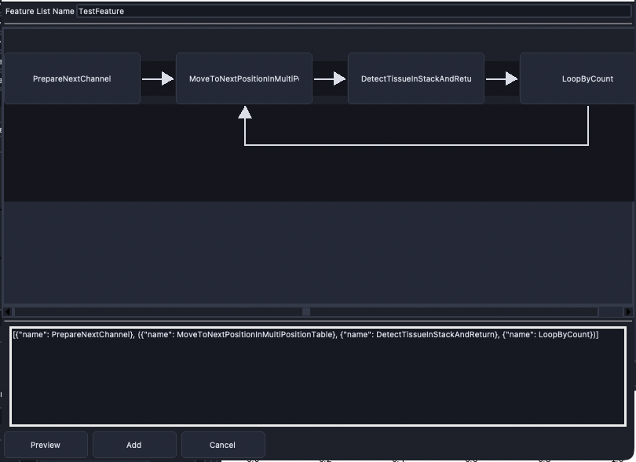
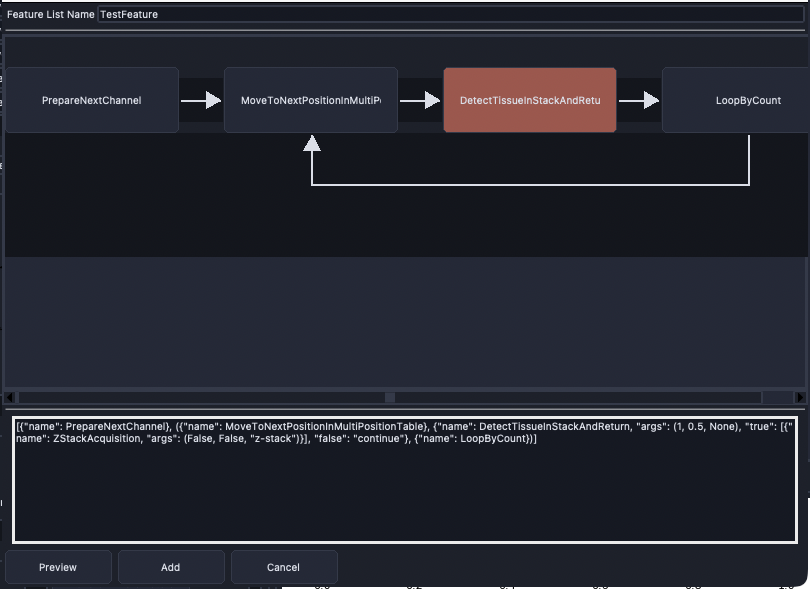

.. _intermediate:
.. _smart_routines:

==========================
Smart Acquisition Routines
==========================

**navigate**'s :ref:`feature container <user_guide_features>` lets you build acquisition routines by chaining existing :ref:`features <user_guide_features>` into lists. See :ref:`Currently Implemented Features <currently_implemented_features>` for the complete list. You can also build additional features as :ref:`plugins <plugin>`.

One common problem in light-sheet microscopy is wasting time acquiring z-stacks in empty space. With the feature container, you can build a routine that checks for tissue at each position and only acquires z-stacks where tissue is detected. This section walks through building such a routine.

Prerequisites
=============

Before starting this guide:

1. Complete :ref:`Software Installation <software_installation>`.
2. Complete :ref:`Configuring navigate <configuring_navigate>`, or launch with :command:`navigate -sh` to use virtual devices.
3. Add at least two entries in the :ref:`multiposition table <ui_multiposition>` so one can represent tissue and one can represent empty space.

Example Setup
=============

The example below assumes two positions in the multiposition table: one with tissue and one without tissue.

Step 1: Create the Base Feature List
====================================

1. Go to :menuselection:`Features --> Add Customized Feature List`.
2. In the :guilabel:`Add New Feature List` window, enter ``TestFeature`` in the name field.
3. In the lower editor, enter:

.. code-block:: python

    [{"name": PrepareNextChannel}]

4. Click :guilabel:`Preview`.

.. tip::

   Checkpoint: the preview should show one node, ``PrepareNextChannel``.

Step 2: Add Position Traversal
==============================

1. Right-click ``PrepareNextChannel`` and select :guilabel:`Insert After`.
2. Confirm a second placeholder node appears after ``PrepareNextChannel``.
3. Click the new node and choose ``MoveToNextPositionInMultiPositionTable``.

4. Configure the new node. Here, one can set the resolution_value, zoom_value, and offset.

.. todo::
   Add more informationa bout the fields in this popup, including resolution_value, zoom_value, and offset.

5. Close the node selection popup.

.. tip::

   Checkpoint: the routine should now take one image per multiposition entry in the first selected color channel.

Step 3: Add Tissue Detection
============================

1. Right-click ``MoveToNextPositionInMultiPositionTable`` and select :guilabel:`Insert After`.
2. Set the new node to ``DetectTissueInStackAndReturn``.

3. Configure the ``DetectTissueInStackAndReturn`` node with the following parameters:

    1. :guilabel:`planes`: number of z-planes checked for tissue.
    2. :guilabel:`percentage`: required image fraction containing tissue to return ``true``.
    3. :guilabel:`detect_func`: tissue detection function from :doc:`remove_empty_tiles </05_reference/_autosummary/navigate.model.features.remove_empty_tiles>`. If set to ``None``, **navigate** uses ``detect_tissue()``.

.. tip::

   Checkpoint: the routine now evaluates each position for tissue before deciding what to acquire.

Step 4: Add Loop Control
========================

1. Right-click ``DetectTissueInStackAndReturn`` and select :guilabel:`Insert After`.
2. Set the new node to ``LoopByCount``.
3. Set ``steps`` to ``experiment.MicroscopeState.multiposition_count``.
4. Group the repeated section in parentheses ``()`` and click :guilabel:`Preview`.

5. Confirm that the displayed routine shows the looped section in the graphical user interface.

.. tip::

   Checkpoint: the repeated segment should be visually grouped as a loop in preview.

Step 5: Convert Tissue Detection to a Decision Node
===================================================

1. Add ``true`` and ``false`` branches to the ``DetectTissueInStackAndReturn`` node:

.. code-block:: python

    {
        "name": DetectTissueInStackAndReturn,
        "args": (1, 0.5, None),
        "true": [{"name": ZStackAcquisition, "args": (False, False, "z-stack")}],
        "false": "continue",
    }

2. Click :guilabel:`Preview`.
3. Click the node to open the decision editor and verify both branches.

.. tip::

   Checkpoint: ``DetectTissueInStackAndReturn`` should have a red border, indicating decision-node behavior.

Step 6: Save and Run the Routine
================================

1. Click :guilabel:`Add` in :guilabel:`Add New Feature List`.
2. Select :menuselection:`Features --> TestFeature`.
3. Set acquisition mode to :guilabel:`Customized`.
4. Click :guilabel:`Acquire`.

For the two example positions above, the software should acquire a z-stack at the tissue position and skip z-stack acquisition at the empty position.

Complete Example
================

The snippet below is a full, copy-ready template that matches this workflow:

.. code-block:: python

    [
        {"name": PrepareNextChannel},
        (
            {"name": MoveToNextPositionInMultiPositionTable},
            {
                "name": DetectTissueInStackAndReturn,
                "args": (1, 0.5, None),
                "true": [
                    {"name": ZStackAcquisition, "args": (False, False, "z-stack")}
                ],
                "false": "continue",
            },
            {"name": LoopByCount},
        ),
    ]

.. note::

   Depending on your feature editor version, the exact argument serialization for ``LoopByCount`` may differ. If needed, set the ``steps`` field in the GUI to ``experiment.MicroscopeState.multiposition_count`` after loading the template.

You can now use this routine directly or adapt it to your microscope's needs.
