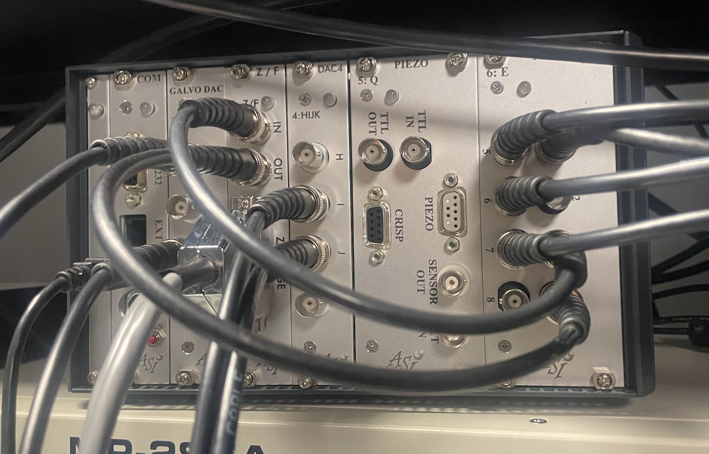
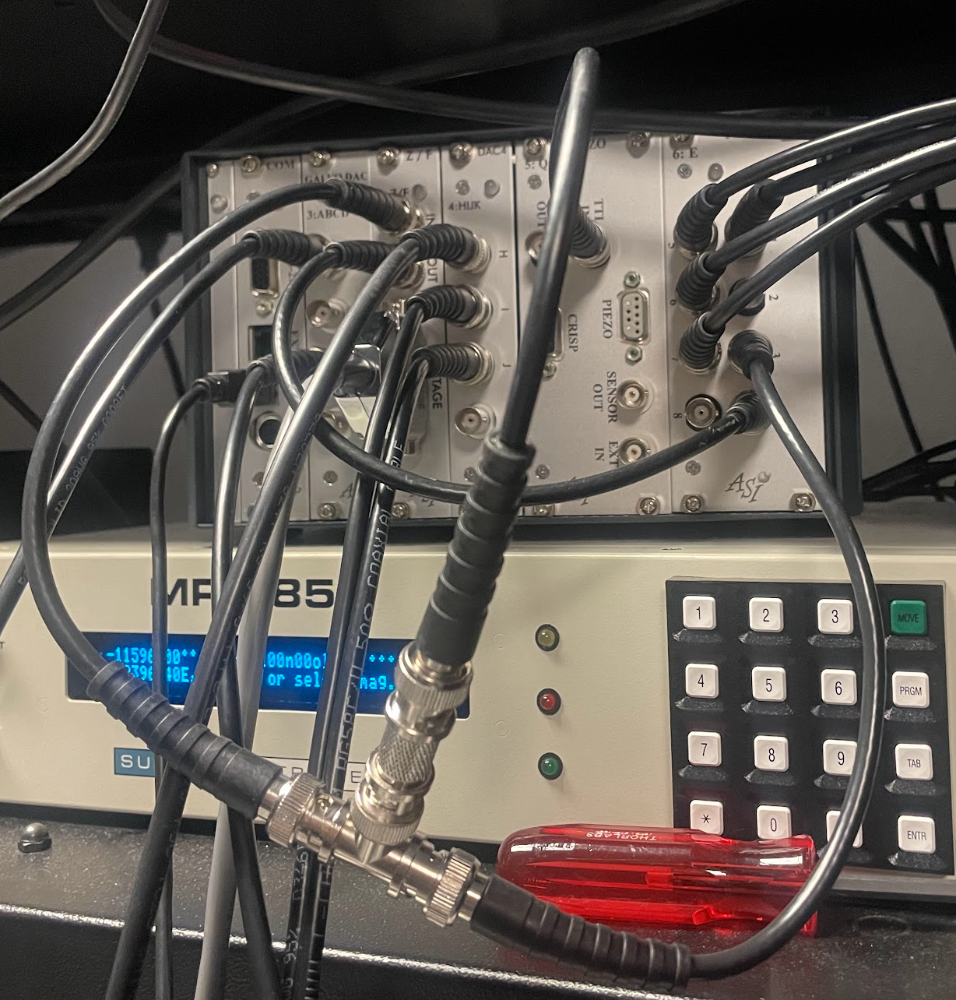
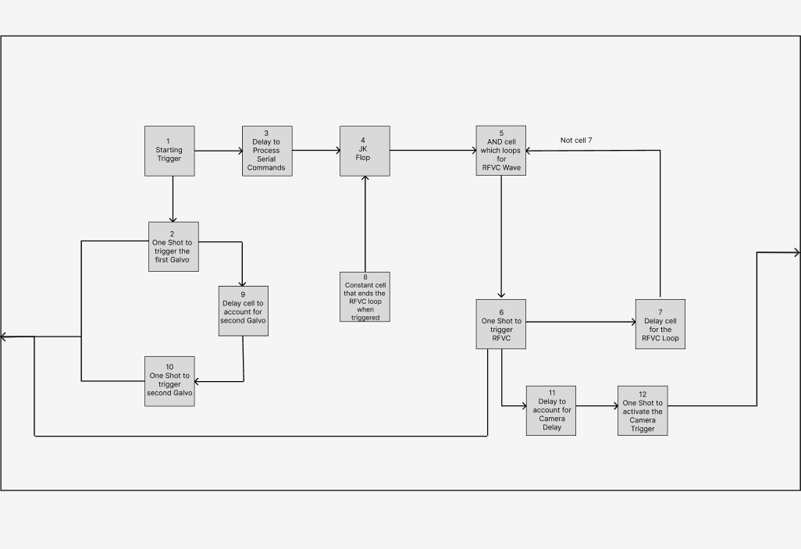

.. _asi_logic:

=================
ASI Control Logic
=================

Z-Stack Acquisition
-------------------

The diagrams in this section describe the ASI Tiger PLC logic only. They show how
the logic card sequences triggers between the backplane and the front connectors
during acquisition; waveform generation itself remains on the TGDAC.

In the standard Z-stack workflow shown below, the sequence is:

1. Software asserts cell 1 (``Starting Trigger``), which starts the stack cycle.
2. Cell 2 (``First Galvo Trigger``) issues the first galvo trigger through the
   backplane. Cell 9 adds the programmed phase offset, and cell 10 issues the
   second galvo trigger. Together, these cells align the galvo timing with the
   upcoming exposure.
3. In parallel, cell 3 (``Start Delay``) inserts the common startup delay, while
   cell 4 (``One Shot``) stays on for ``numZSteps`` clock pulses, one pulse for each
   axial position in the stack.
4. Cell 5 gates cell 4 with the inverted stage-sync input. A
   trigger is released only when the stage indicates that the next exposure can
   proceed.
5. In the default configuration, cell 6 drives the camera and lasers through the
   Tiger front connectors. The same event also feeds cells 11 and 12, which
   apply the camera-to-remote-focus delay before sending the remote-focus trigger
   through the backplane.
6. Cell 7 waits for the configured ``Sweep Time`` and then issues the next stage
   trigger through the front connectors, advancing to the next Z position.

This loop repeats until cell 4 receives all ``numZSteps`` pulses. At that
point, the PLC sequence completes and software regains control. Because the PLC
owns the timing within the stack, inter-frame timing remains deterministic and
software intervention is limited to stack boundaries or an operator stop command.

All backplane triggers are received by the TGDAC. The TGDAC can be configured to
emit one waveform per trigger or to begin continuous waveform output on the first
trigger and continue until software stops it.

.. image:: ../../images/plc_control_loop.png
   :align: center
   :alt: ASI Tiger PLC control logic for standard Z-stack acquisition.

The second Z-stack workflow is used when the remote-focus waveform must be issued
before the camera exposure. In this version, cell 6 triggers remote focus first,
cell 11 inserts the required camera-delay offset, and cell 12 then drives the
camera and lasers. The galvo timing path, the ``numZSteps`` counter, the
stage-ready gate, and the ``Sweep Time`` stage advance are otherwise unchanged.

.. image:: ../../images/plc_control_loop_2.png
   :align: center
   :alt: ASI Tiger PLC control logic for Z-stack acquisition with remote focus preceding camera trigger.
   
To complete the loop, BNC cables must be connected to trigger the stage, and to receive
the stage sync signal. PLC connection 3 triggers the stage, and PLC connection 4 receives 
the sync signal. This is pictured below:

In some cases, both the focus stage and z-stage are incremented together during a Z-stack.
In this case, the stage sync signal must be taken from the slowest-moving stage (Standard 
stages are slower than piezo stages). The stage trigger must be split between the two stages, as shown below:

Continuous Acquisition
----------------------

Continuous acquisition uses a related PLC pattern, but replaces the finite
``numZSteps`` stack counter with a free-running loop. Cell 1 starts the sequence,
cells 2, 9, and 10 generate the paired galvo triggers, and cell 3 inserts the 
common startup delay before cell 4 latches the continuous state. Cells 5, 6, and 7 
then form the repeating RFVC (remote focus voice coil) loop: cell 5 enables the next 
RFVC trigger while cell 7 is inactive, cell 6 issues that trigger, and cell 7 delays
the next loop iteration. From cell 6, cells 11 and 12 apply the camera delay and
then assert the camera trigger output. The loop continues until software clears
the continuous-acquisition state.

The same dynamic allocation of cells 11 and 12 shown in the Z-stack mode diagram is used 
to swap the camera and remote-focus timing paths, but is not shown in the diagram below.

