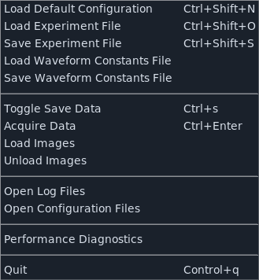
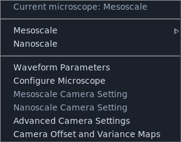
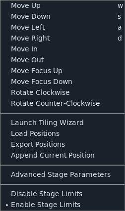
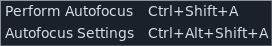
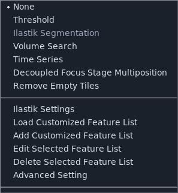
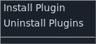
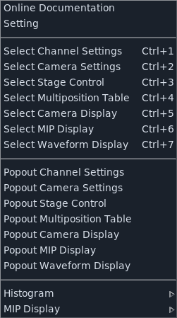

========
Menu Bar
========

.. _ui_menu_bar:

The menu bar is an entry point for much of **navigate**.

For actions that support keyboard shortcuts, the required keystrokes are shown directly in the menu entry.

.. _ui_file_menu:

File
----

The :guilabel:`File` menu is used to:

1. :guilabel:`Load Default Configuration`: load a configuration file.
2. :guilabel:`Load Experiment File`: load a previously saved experiment state and restore microscope settings exactly as they were. The experiment file is also saved automatically with each acquisition.
3. :guilabel:`Save Experiment File`: save the current microscope settings to an experiment file.
4. :guilabel:`Load Waveform Constants File` / :guilabel:`Save Waveform Constants File`: load or save waveform settings used for devices such as galvos and remote focus hardware. Waveform constants are also saved automatically with each acquisition.
5. :guilabel:`Toggle Save Data`: toggle the :ref:`Save Data <ui_timepoint_settings>` checkbox.
6. :guilabel:`Acquire Data`: start acquisition (same action as :guilabel:`Acquire` in the :ref:`Acquisition Bar <ui_acquisition_bar>`).
7. :guilabel:`Load Images`: load image data into the display. This is useful for feature-development and testing when not running on a microscope.
8. :guilabel:`Unload Images`: remove loaded images from the display.
9. :guilabel:`Open Log Files`: open the log directory in Finder. Logs are useful for debugging and for reporting issues on GitHub.
10. :guilabel:`Open Configuration Files`: open the directory containing configuration files in Finder.
11. :guilabel:`Performance Diagnostics`: open a popup with timing metrics (for example, image display and data-saving timing) to help diagnose performance bottlenecks.

.. _ui_microscope_configuration:

Microscope Configuration
------------------------

This menu allows users to:

1. Select between microscope instances listed at the top of the menu.
2. Choose microscope magnifications from the submenu shown to the right when multiple magnifications are available.
3. Open :ref:`Waveform Parameters <ui_waveform_parameters>`.
4. Open :menuselection:`Microscope Configuration --> Configure Microscope` to
   launch :ref:`Configure Microscopes <ui_configure_microscopes>`.
5. Open :guilabel:`Advanced Camera Settings` for camera cooling controls, trigger settings, and camera flip flags that control display orientation.

When operating a multi-microscope system, camera settings can be configured independently for each microscope.

.. _stage_control_menu:

Stage Control Menu
------------------

This menu groups stage and positioning actions:

1. Direct stage movement for ``X``, ``Y``, ``Z``, ``focus``, and ``Theta``.
2. Multiposition utilities, including :ref:`Tiling Wizard <ui_multiposition_tiling_wizard>` launch and :guilabel:`Append Current Position` to add the current stage coordinates to the :ref:`multi-position table <ui_multiposition_table>`. Positions can then be removed from the table using its row context menu.
3. :guilabel:`Export Positions` saves the current multi-position table to disk.
4. :guilabel:`Load Positions` imports multi-position entries from ``.csv``, ``.yml``, or ``.txt`` files.
5. :guilabel:`Advanced Stage Parameters` opens stage-level controls for flip flags and stage limits for each configured stage axis.
6. :guilabel:`Disable Stage Limits` / :guilabel:`Enable Stage Limits` toggle stage-limit enforcement.

.. _ui_autofocus_menu:

Autofocus
---------

The autofocus menu provides:

1. :guilabel:`Perform Autofocus`.
2. :guilabel:`Autofocus Settings` to open :ref:`ui_autofocus`.

.. _ui_features_menu:

Features
--------

This menu manages acquisition feature lists. See :ref:`Reconfigurable Acquisitions Using Features <user_guide_features>`.

.. _ui_plugins_menu:

Plugins
-------

This menu opens installed plugins that provide popup GUIs.

.. _ui_window_menu:

Window
------

This menu is used to:

1. Switch between major settings notebooks.
2. Move the camera display to a popup window.
3. Open the online documentation via :guilabel:`Help`.
