==================================
Acquisition And Settings Notebooks
==================================

.. _ui_acquisition_bar:

Acquisition Bar
===============

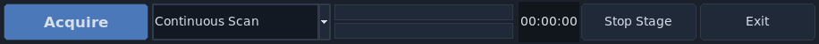

Left to right, the acquisition bar provides:

1. :guilabel:`Acquire` to start acquisition.
2. Acquisition mode selector.
3. Current-stack and overall progress bars.
4. Acquisition time estimate.
5. :guilabel:`Stop Stage` emergency stop.
6. :guilabel:`Exit` to close the software.

.. _ui_settings_notebooks:

Settings Notebooks
==================

The settings notebooks control acquisition parameters and hardware behavior.

.. _ui_channels_notebook:

Channels
--------

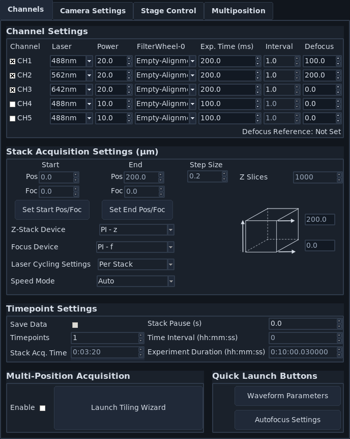

The :guilabel:`Channels` notebook is split into:

1. :ref:`Channel Settings <ui_channel_settings>`
2. :ref:`Stack Acquisition Settings <ui_stack_settings>`
3. :ref:`Timepoint Settings <ui_timepoint_settings>`
4. :ref:`Multi-Position Acquisition <ui_multiposition_settings>`
5. :ref:`Quick Launch Buttons <ui_quick_launch_buttons>`

.. _ui_channel_settings:

Channel Settings
^^^^^^^^^^^^^^^^

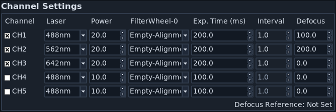

Use this section to define active imaging channels and per-channel acquisition values.

1. :guilabel:`Laser`: configured laser source.
2. :guilabel:`Power`: laser power (percent).
3. :guilabel:`Filter`: detection filter.
4. :guilabel:`Exp. Time (ms)`: camera exposure time.
5. :guilabel:`Interval`: channel cadence relative to other channels.
6. :guilabel:`Defocus`: channel-specific focus offset from the zero-defocus focus position. During acquisition, **navigate** infers the zero-defocus focus position from the current focus and the current channel defocus, then moves each channel to zero-defocus focus plus that channel's defocus.

.. _ui_stack_settings:

Stack Acquisition Settings
^^^^^^^^^^^^^^^^^^^^^^^^^^

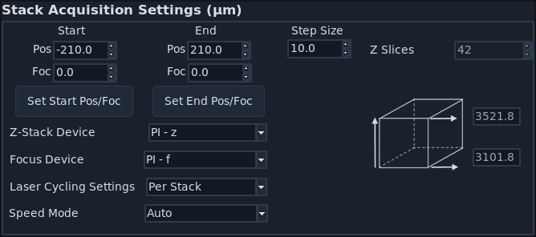

This section defines Z-stack geometry and sequencing.

1. :guilabel:`Start` / :guilabel:`End` are relative stack bounds.
2. :guilabel:`Set Start Pos/Foc` and :guilabel:`Set End Pos/Foc` read current stage values.
3. :guilabel:`Step Size` sets spacing in microns; :guilabel:`# slices` updates automatically.
4. :guilabel:`Z-Stack Device` selects the primary Z-stack stage. When multiple stages can move along the Z direction, this is the stage that steps through the planes of the stack.
5. :guilabel:`Focus Device` selects the focus stage that is ramped with the primary Z-stack stage when the start and end focus values differ.
6. Additional stack-device offset controls, when present, move secondary stack stages at fixed offsets from the primary Z-stack stage.
7. :guilabel:`Laser Cycling Settings` selects Per Stack or Per Z channel ordering.

.. _ui_timepoint_settings:

Timepoint Settings
^^^^^^^^^^^^^^^^^^

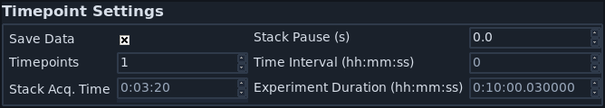

Use this section for repeated acquisitions and save behavior.

1. :guilabel:`Save Data` controls whether acquisition is written to disk.
2. :guilabel:`Timepoints` sets repeat count.
3. :guilabel:`Stack Pause (s)` sets wait time between stack steps.
4. :guilabel:`Time Interval` and :guilabel:`Experiment Duration` estimate total timing.

.. note::

   Timing estimates do not fully account for stage-move latency on all hardware.

.. _ui_multiposition_settings:

Multi-Position Acquisition
^^^^^^^^^^^^^^^^^^^^^^^^^^

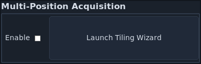

1. :guilabel:`Enable` runs acquisition across the :ref:`Multi-Position table <ui_multiposition_table>`.
2. :guilabel:`Launch Tiling Wizard` opens :ref:`ui_multiposition_tiling_wizard`.

.. _ui_quick_launch_buttons:

Quick Launch Buttons
^^^^^^^^^^^^^^^^^^^^

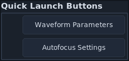

These buttons provide direct access to:

1. :ref:`Waveform Parameters <ui_waveform_parameters>`
2. :ref:`Autofocus Settings <ui_autofocus>`

.. _ui_camera_settings:

Camera Settings
---------------

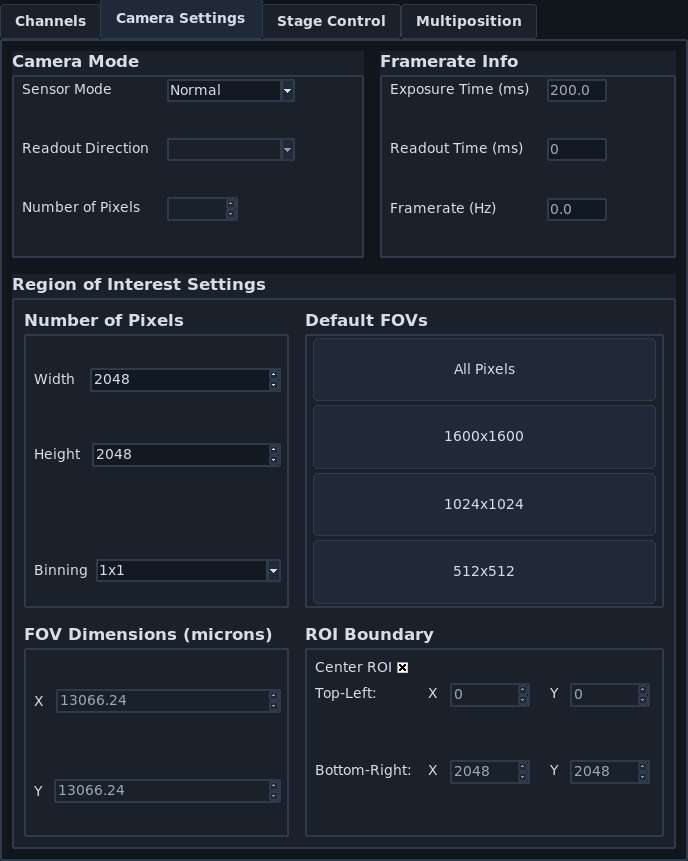

The :guilabel:`Camera Settings` notebook is split into camera modes, framerate information, and ROI settings.

.. _ui_camera_modes:

Camera Modes
^^^^^^^^^^^^

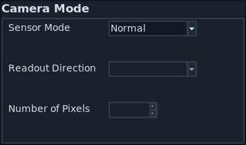

1. :guilabel:`Sensor Mode`: switch between Normal and Light-Sheet modes.
2. :guilabel:`Readout Direction`: rolling-shutter direction.
3. :guilabel:`Number of Pixels`: rolling-shutter width.

.. _ui_framerate_info:

Framerate Info
^^^^^^^^^^^^^^

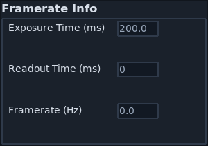

This section reports acquisition-speed metrics.

1. :guilabel:`Exposure Time (ms)` and :guilabel:`Readout Time (ms)`.
2. :guilabel:`Framerate (Hz)` based on internal frame timing.
3. :guilabel:`Images to Average` (future-facing behavior).

.. _ui_region_of_interest:

Region Of Interest Settings
^^^^^^^^^^^^^^^^^^^^^^^^^^^

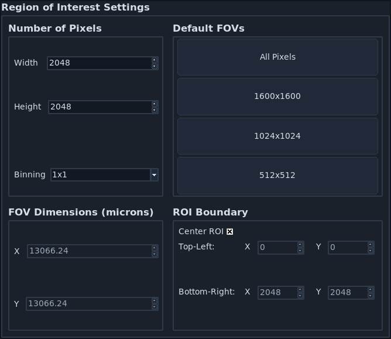

Use this section to define camera ROI and binning.

1. Pixel dimensions set ROI size.
2. :guilabel:`Default FOVs` applies preset ROI sizes.
3. :guilabel:`ROI center` controls crop center.
