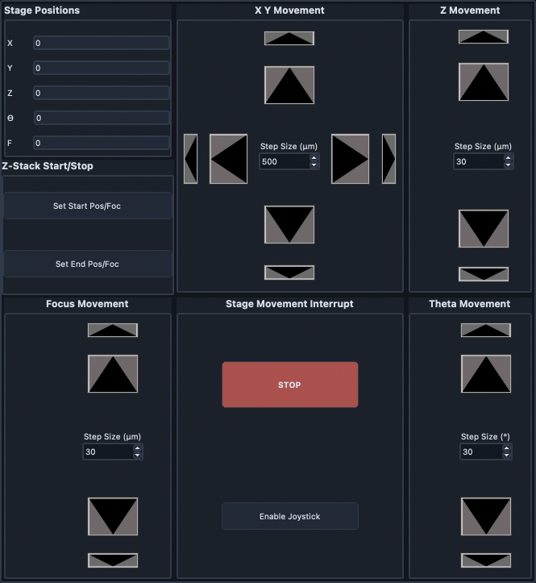
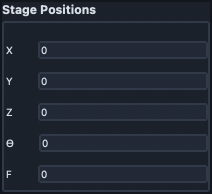
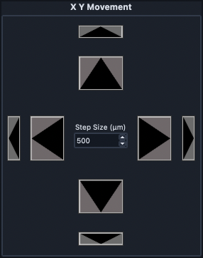
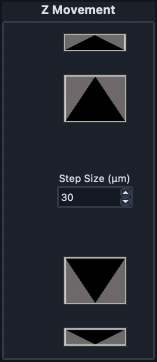
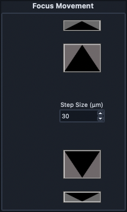
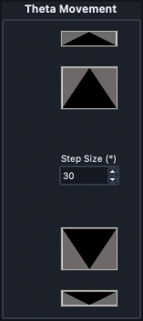
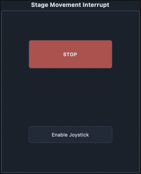
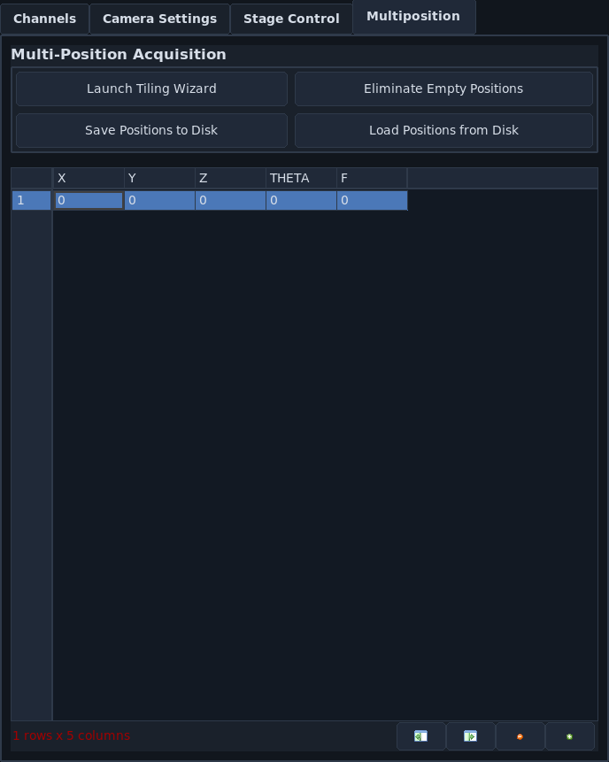
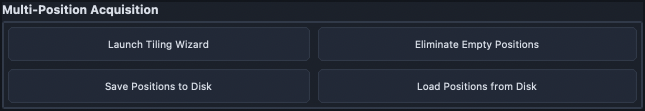

=======================
Stage And Multiposition
=======================

.. _stage_control_notebook:

Stage Control
=============

The :guilabel:`Stage Control` notebook provides movement controls for ``X``, ``Y``, ``Z``, ``focus``, and ``Theta``, plus emergency stop and joystick controls.

.. note::

   Stage axes loaded as synthetic devices appear with disabled motion buttons.

.. _ui_stage_positions:

Stage Positions
---------------

Entry boxes display live stage coordinates. Editing a value moves that axis to the entered coordinate.

.. warning::

   Editing position values can move hardware immediately. Keep stage limits enabled and verify clearance before movement.

XY Movement
-----------

Arrow buttons move ``X`` and ``Y``. The center entry sets step size in microns.

Z Movement
----------

Controls ``Z`` movement and its step size.

Focus Movement
--------------

Controls ``focus`` movement and its step size.

Theta Movement
--------------

Controls ``Theta`` (rotation) movement and its step size.

Buttons
-------

1. :guilabel:`STOP` halts all stage axes.
2. :guilabel:`Enable Joystick` / :guilabel:`Disable Joystick` toggles software control ownership for mapped joystick axes.

.. tip::

   On large displays, right-click a notebook tab and choose :guilabel:`Popout Tab` to create a detached stage-control panel.

.. _ui_multiposition:

Multi-Position
==============

The :guilabel:`Multi-Position` notebook defines stage coordinates for tiled and multi-region acquisition.

1. Double-click a row index to move the stage to that row.
2. Double-click a cell to edit a coordinate value.
3. Right-click a row index to insert, add, or delete positions.

.. _ui_multiposition_buttons:

Multi-Position Buttons
----------------------

1. :guilabel:`Launch Tiling Wizard` opens :ref:`ui_multiposition_tiling_wizard`.
2. :guilabel:`Eliminate Empty Positions` (currently unimplemented)
3. :guilabel:`Save Positions To Disk`
4. :guilabel:`Load Positions From Disk`

Popup details for the tiling workflow are documented in :ref:`ui_multiposition_tiling_wizard`.
