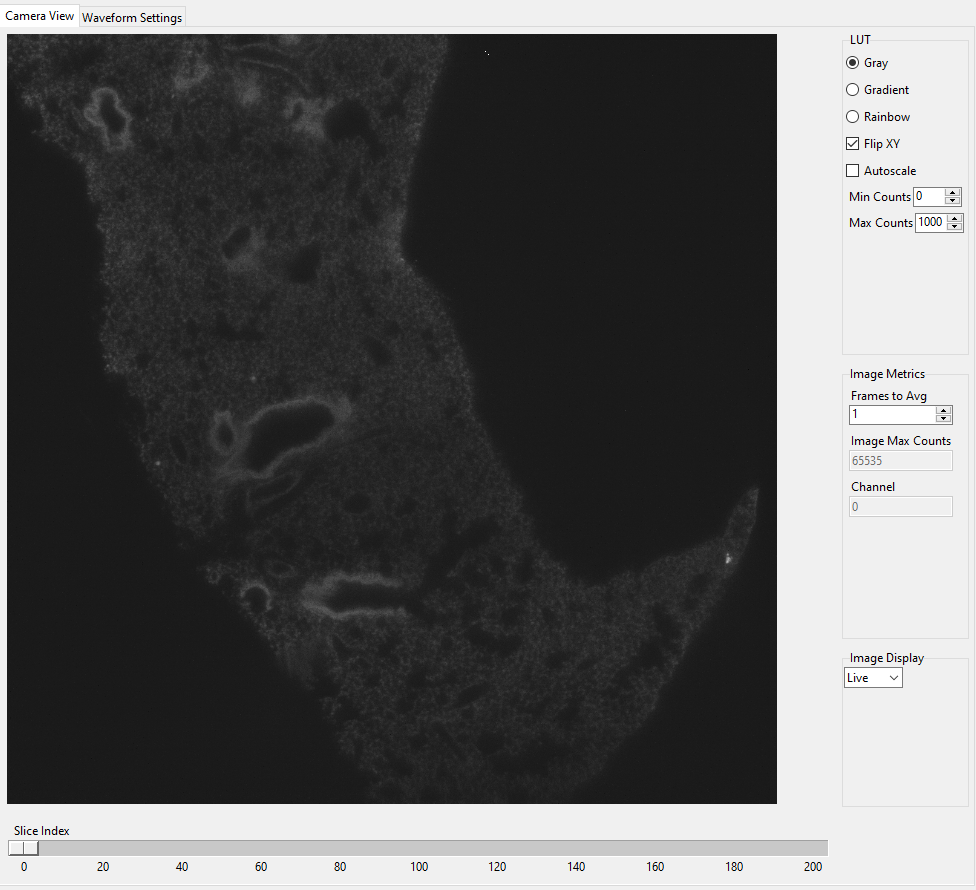
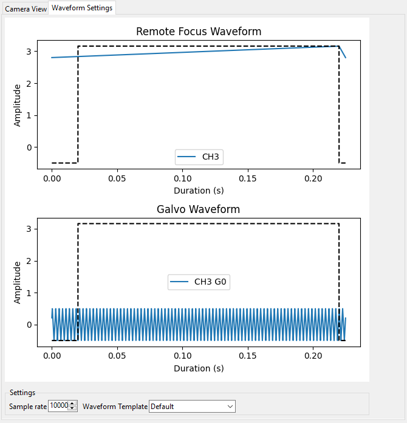

=================
Display Notebooks
=================

The display notebooks provide visual feedback for image and waveform data during acquisition.

Camera View
===========

The :guilabel:`Camera View` notebook shows the current image and display controls.

1. Left-clicking the image toggles crosshairs.
2. The right panel includes :ref:`LUT <ui_lut>`, image metrics, and display mode controls.

.. _ui_lut:

LUT
---

1. Select :guilabel:`Gray`, :guilabel:`Gradient`, or :guilabel:`Rainbow` display LUT.
2. :guilabel:`Flip XY` transposes display axes.
3. :guilabel:`Autoscale` toggles automatic min/max display scaling.
4. :guilabel:`Min Counts` and :guilabel:`Max Counts` are used when autoscale is disabled.

Image Metrics
-------------

1. :guilabel:`Frames to Avg` is currently a placeholder for averaging behavior.
2. :guilabel:`Image Max Counts` reports maximum image intensity.
3. :guilabel:`Channel` indicates which selected acquisition channel is being displayed.

Image Display
-------------

This section switches between live and projection display modes.

.. _ui_waveform_settings:

Waveform Settings
=================

:guilabel:`Waveform Settings` shows generated waveforms and DAQ timing alignment.

Waveform Display
----------------

The top panel shows remote-focus waveforms and the lower panel shows galvo waveforms. The dotted black line indicates camera timing relative to waveform output.

Settings
--------

1. :guilabel:`Sample Rate` controls DAQ sample frequency.
2. :guilabel:`Waveform Template` selects the active :ref:`waveform template <configure_waveform_templates>`.
