================
Popups And Tools
================

This page documents popup windows and utility dialogs used across **navigate**.

.. _ui_file_save_dialog:

File Saving Dialog (Misc. Notes Tab)
====================================

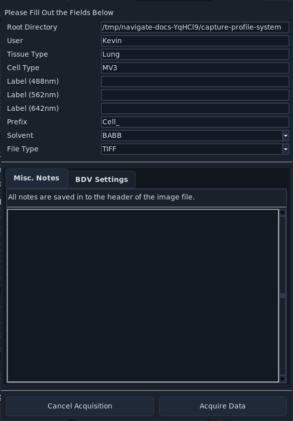

This dialog appears when acquisition starts in a save-enabled mode (non-continuous) with :ref:`Save Data <ui_timepoint_settings>` enabled. You can provide text in the :guilabel:`Misc. Notes` field to be saved alongside acquisition metadata.

.. _ui_file_save_dialog_bdv:

File Saving Dialog (BDV Settings Tab)
=====================================

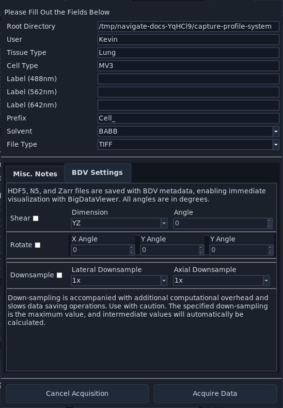

Use this tab to configure BDV-related shear, rotation, and downsampling metadata. This information will be saved in the BDV XML file alongside acquired data when :ref:`Save Data <ui_timepoint_settings>` is enabled, enabling the correct spatial interpretation of your data in BDV and compatible tools. More about BDV can be found on the ImageJ website: https://imagej.net/plugins/bdv/.

.. _ui_autofocus:

Autofocus Settings
==================

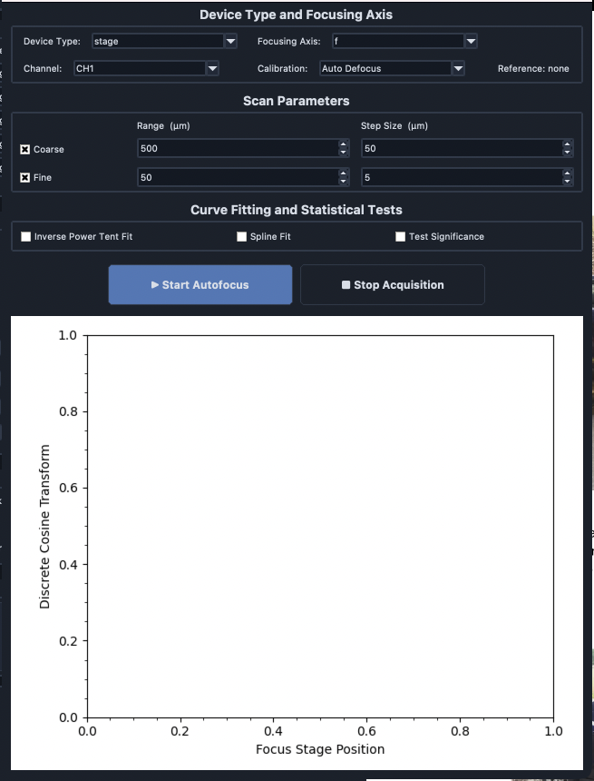

This popup configures autofocus behavior used by :ref:`features <user_guide_features>`.
You can open it from :ref:`Quick Launch Buttons <ui_quick_launch_buttons>` or
from the :menuselection:`Autofocus` menu.

By default, autofocus runs in two passes: one coarse and one fine. The coarse
pass uses larger step sizes to locate the best focus region, and the fine pass
searches locally around that coarse peak. If the peak lies outside the defined
search range, the routine currently does not expand the range automatically.
The routine can run on different focusing axes when compatible stage hardware
is available.

To run autofocus, press :guilabel:`Start Autofocus`. The focus metric is the
Shannon entropy of the discrete cosine transform, which is used to find the
region of highest contrast (best focus). Spline-fit and test-significance
buttons are already present in preparation for additional intelligent autofocus
functionality in future updates.

While an acquisition is active, press :guilabel:`Stop Acquisition` to cancel
autofocus or the acquisition in which it is running. This uses **navigate**'s
standard acquisition shutdown to stop acquisition threads and hardware before
returning the controls to their idle state.

:guilabel:`Start Autofocus` is disabled while an autofocus routine is starting
or running and is restored when autofocus completes. During a Continuous Scan,
it remains available between autofocus routines so autofocus can be injected
without stopping the live acquisition.

The :guilabel:`Channel` must be active in Channel Settings. Choose a
:guilabel:`Calibration` action before pressing :guilabel:`Start Autofocus`:

* :guilabel:`Regular` focuses the selected channel without calculating a channel
  offset.
* :guilabel:`Capture Reference` focuses the selected channel, makes it the
  zero-defocus calibration channel, and retains its best-focus position for the
  current calibration sequence.
* :guilabel:`Populate Defocus` focuses the selected channel and writes the
  difference from the previously captured reference into that channel's
  :guilabel:`Defocus` value. Capture a reference first.
* :guilabel:`Auto Defocus` uses the selected channel as the reference, focuses
  every other active channel, and populates all active channel offsets in one
  sequence. Stop any acquisition before starting it.

The popup's :guilabel:`Reference` status reports the calibration reference.
:guilabel:`Populate Defocus` requires the captured focus retained by the current
popup session. The resulting per-channel :guilabel:`Defocus` values are stored
with the experiment settings and are used during acquisition.

.. _ui_waveform_parameters:

Waveform Parameters
===================

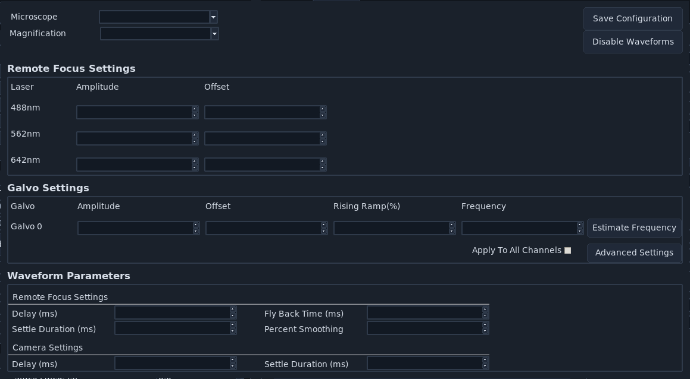

Use this popup to configure waveform amplitudes, offsets, timing, and smoothing
used by :ref:`Waveform Settings <ui_waveform_settings>`. The
:guilabel:`Camera Delay` value is measured in milliseconds and is saved in
``waveform_constants.yml``. It is shared by all microscope modes in the active
configuration.

Advanced Galvo Setting
======================

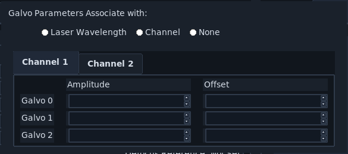

This advanced popup is opened from Waveform Parameters and provides channel-specific galvo amplitude and offset settings. When more than one channel is configured, each channel's settings are shown on a separate tab.

.. _ui_configure_microscopes:

Configure Microscopes
=====================

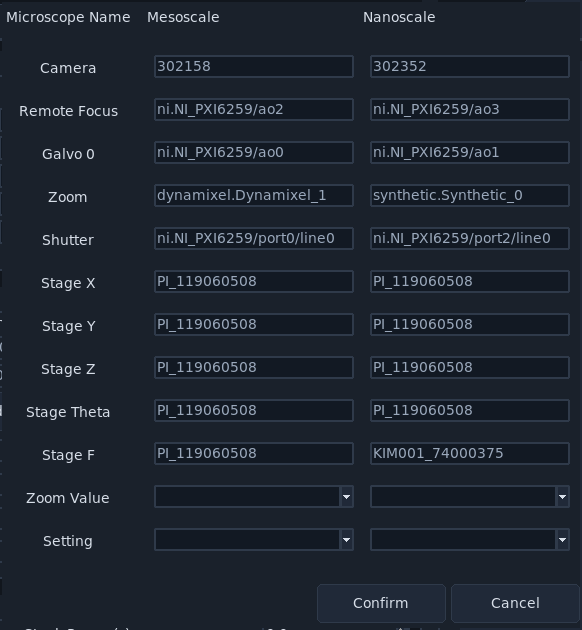

Open this popup from :menuselection:`Microscope Configuration --> Configure Microscope`
in :ref:`ui_microscope_configuration`.
This window selects the primary microscope and helps inspect multi-microscope
hardware assignments.

Advanced Stage Parameters
=========================

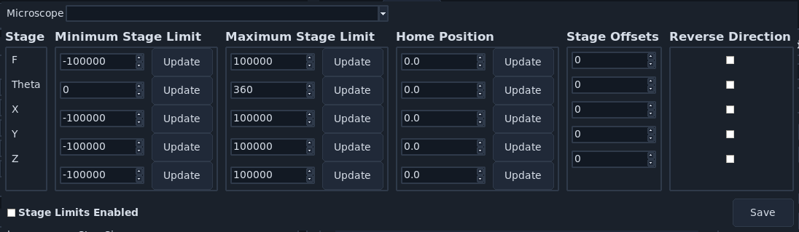

Open this popup from :menuselection:`Stage Control --> Advanced Stage Parameters`.
It is useful for configuring stage limits, stage home/offset values, and axis
flip flags used to align microscope coordinate behavior.

For coordinate-system setup guidance, see :ref:`coordinate_system`.

.. _ui_multiposition_tiling_wizard:

Tiling Wizard
=============

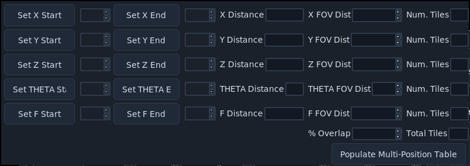

The tiling wizard calculates tiled position grids from start/end coordinates, field-of-view size, and overlap.
Open it from :ref:`ui_multiposition_buttons` in :ref:`ui_multiposition`.

1. Set axis start and end positions.
2. Confirm FOV distance and overlap.
3. Click :guilabel:`Populate Multi-Position Table`.

Advanced Camera Settings
========================

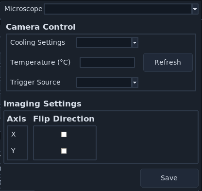

Use this popup for advanced camera control options, including microscope selection and image-direction settings.

Camera Map Settings
===================

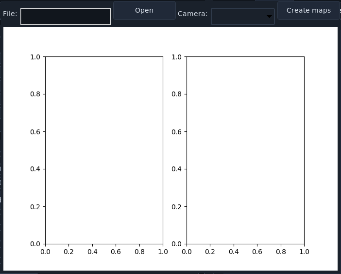

This popup supports loading dark-frame stacks and generating camera offset/variance maps. More information can be found in the :ref:`SNR Visualization Mode <snr_mode>` section of the developer deep dive.

.. _ui_performance_diagnostics:

Performance Diagnostics
=======================

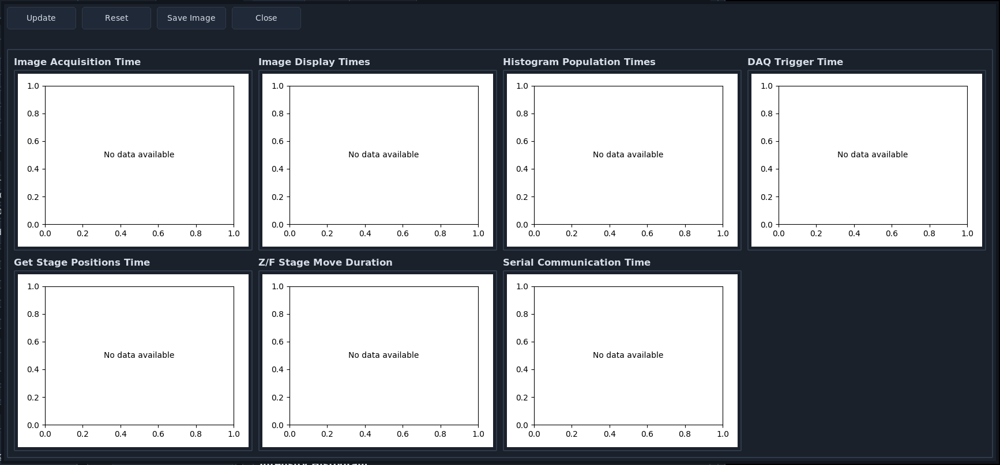

Open from :menuselection:`File --> Performance Diagnostics` to inspect acquisition, display, and histogram timing behavior.

Adaptive Optics
===============

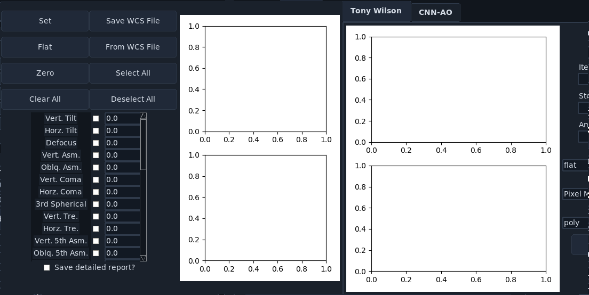

This tab contains iterative optimization controls and mode selection for adaptive optics routines.

Adaptive Optics (CNN-AO Tab)
============================

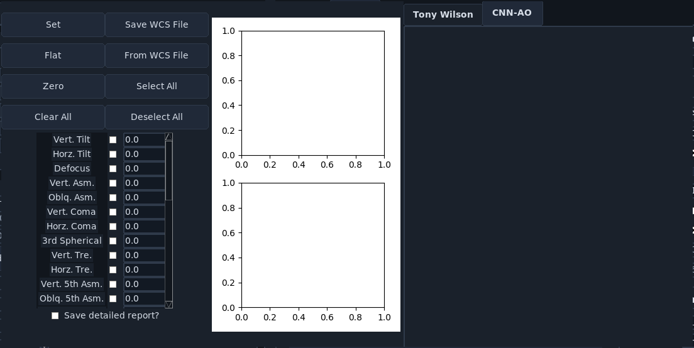

The CNN-AO tab provides model-based adaptive optics controls within the same popup.

Feature List Popup
==================

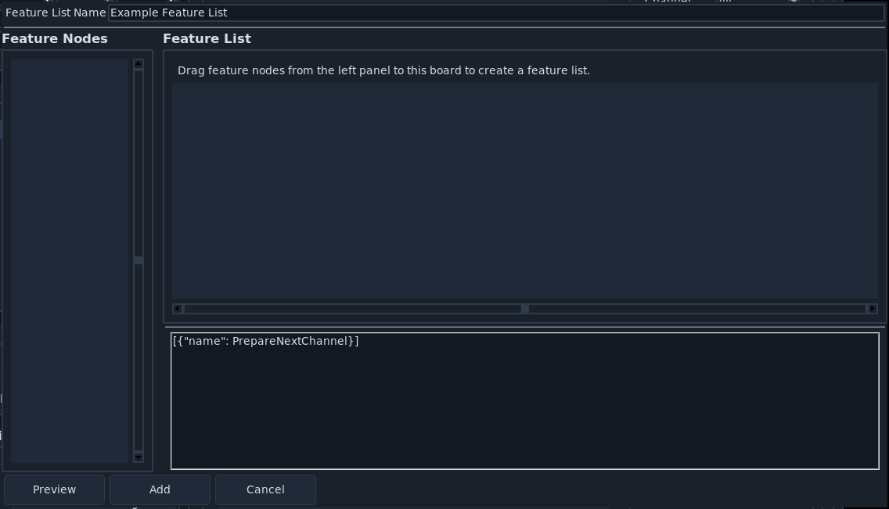

Use this popup to create feature lists, preview graph layout, and edit serialized feature content.

Feature Config Popup
====================

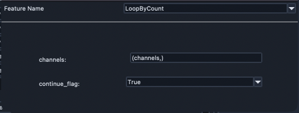

This popup configures the selected feature node and its arguments.

Feature Advanced Settings Popup
===============================

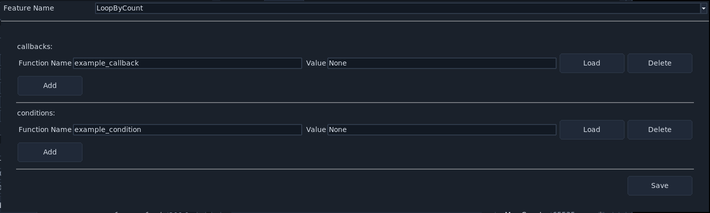

Use this popup to define and save advanced parameter mappings for feature arguments.

Ilastik Settings
================

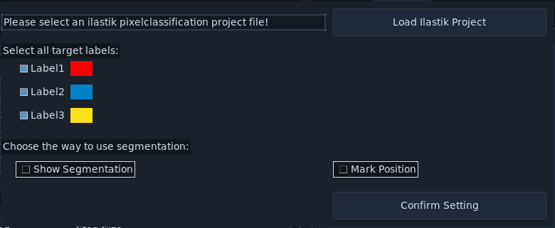

This popup configures ilastik project integration, target labels, and segmentation usage options.

Plugins Popup
=============

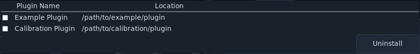

This popup lists installed plugins and supports uninstall operations.
