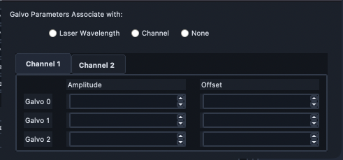
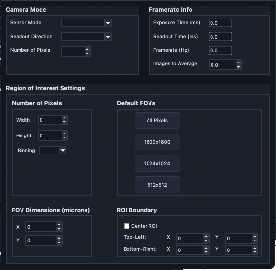
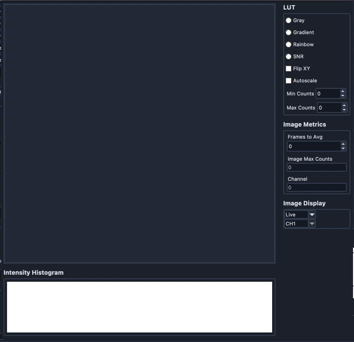

================
Popups And Tools
================

This page documents popup windows and utility dialogs used across **navigate**.

.. _ui_file_save_dialog:

File Saving Dialog (Misc. Notes Tab)
====================================

.. image:: ../../images/popup_save_dialog_misc_notes.png
   :align: center
   :alt: File Saving Dialog popup showing the Misc. Notes tab.

This dialog appears when acquisition starts in a save-enabled mode (non-continuous) with :ref:`Save Data <ui_timepoint_settings>` enabled.

.. _ui_file_save_dialog_bdv:

File Saving Dialog (BDV Settings Tab)
=====================================

.. image:: ../../images/popup_save_dialog_bdv_settings.png
   :align: center
   :alt: File Saving Dialog popup showing the BDV Settings tab.

Use this tab to configure BDV-related shear, rotation, and downsampling metadata.

.. _ui_autofocus:

Autofocus Settings
==================

.. image:: ../../images/popup_autofocus_settings.png
   :align: center
   :alt: Autofocus Settings popup.

This popup configures autofocus behavior used by :ref:`features <user_guide_features>`.

.. _ui_waveform_parameters:

Waveform Parameters
===================

.. image:: ../../images/popup_waveform_parameters.png
   :align: center
   :alt: Waveform Parameter Settings popup.

Use this popup to configure waveform amplitudes, offsets, timing, and smoothing used by :ref:`Waveform Settings <ui_waveform_settings>`.

Advanced Galvo Setting (Channel 1 Tab)
======================================

.. image:: ../../images/popup_advanced_waveform_channel_1.png
   :align: center
   :alt: Advanced Galvo Setting popup showing the Channel 1 tab.

This advanced popup is opened from Waveform Parameters and provides channel-specific galvo amplitude and offset settings.

Advanced Galvo Setting (Channel 2 Tab)
======================================

When multiple factors are configured, each channel/factor is shown on a separate tab.

.. _ui_configure_microscopes:

Configure Microscopes
=====================

.. image:: ../../images/popup_configure_microscopes.png
   :align: center
   :alt: Configure Microscopes popup.

This window selects the primary microscope and helps inspect multi-microscope hardware assignments.

Advanced Stage Parameters
=========================

.. image:: ../../images/popup_advanced_stage_parameters.png
   :align: center
   :alt: Advanced Stage Parameters popup.

Use this popup to review and edit per-axis min/max/home limits, offsets, and axis direction flips.

.. _ui_multiposition_tiling_wizard:

Tiling Wizard
=============

.. image:: ../../images/popup_tiling_wizard.png
   :align: center
   :alt: Multi-Position Tiling Wizard popup.

The tiling wizard calculates tiled position grids from start/end coordinates, field-of-view size, and overlap.
Open it from :ref:`ui_multiposition_buttons` in :ref:`ui_multiposition`.

1. Set axis start and end positions.
2. Confirm FOV distance and overlap.
3. Click :guilabel:`Populate Multi-Position Table`.

Camera Settings Popup
=====================

This window exposes camera settings in a detached popup format for the selected microscope.

Advanced Camera Settings
========================

.. image:: ../../images/popup_advanced_camera_settings.png
   :align: center
   :alt: Advanced Camera Settings popup.

Use this popup for advanced camera control options, including microscope selection and image-direction settings.

Additional Camera View
======================

This popup provides an extra camera display window for side-by-side viewing workflows.

Camera Map Settings
===================

.. image:: ../../images/popup_camera_map_settings.png
   :align: center
   :alt: Camera Map Settings popup.

This popup supports loading dark-frame stacks and generating camera offset/variance maps.

.. _ui_performance_diagnostics:

Performance Diagnostics
=======================

.. image:: ../../images/popup_performance_diagnostics.png
   :align: center
   :alt: Performance Diagnostics popup window.

Open from :menuselection:`File --> Performance Diagnostics` to inspect acquisition, display, and histogram timing behavior.

Adaptive Optics (Tony Wilson Tab)
=================================

.. image:: ../../images/popup_adaptive_optics_tony_wilson.png
   :align: center
   :alt: Adaptive Optics popup showing the Tony Wilson tab.

This tab contains iterative optimization controls and mode selection for adaptive optics routines.

Adaptive Optics (CNN-AO Tab)
============================

.. image:: ../../images/popup_adaptive_optics_cnn_ao.png
   :align: center
   :alt: Adaptive Optics popup showing the CNN-AO tab.

The CNN-AO tab provides model-based adaptive optics controls within the same popup.

Feature List Popup
==================

.. image:: ../../images/popup_feature_list.png
   :align: center
   :alt: Feature List popup for creating or editing feature lists.

Use this popup to create feature lists, preview graph layout, and edit serialized feature content.

Feature Config Popup
====================

.. image:: ../../images/popup_feature_config.png
   :align: center
   :alt: Feature Configuration popup for editing feature node parameters.

This popup configures the selected feature node and its arguments.

Feature Advanced Settings Popup
===============================

.. image:: ../../images/popup_feature_advanced_settings.png
   :align: center
   :alt: Feature Advanced Settings popup.

Use this popup to define and save advanced parameter mappings for feature arguments.

Ilastik Settings
================

.. image:: ../../images/popup_ilastik_settings.png
   :align: center
   :alt: Ilastik Settings popup.

This popup configures ilastik project integration, target labels, and segmentation usage options.

Plugins Popup
=============

.. image:: ../../images/popup_plugins.png
   :align: center
   :alt: Plugins popup used for plugin uninstall management.

This popup lists installed plugins and supports uninstall operations.
