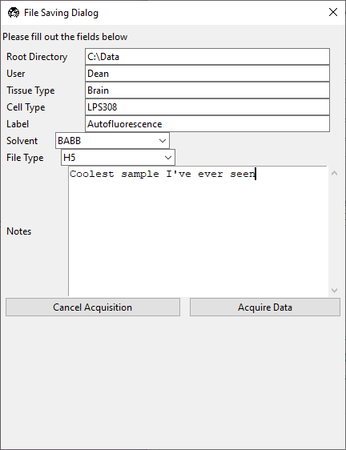
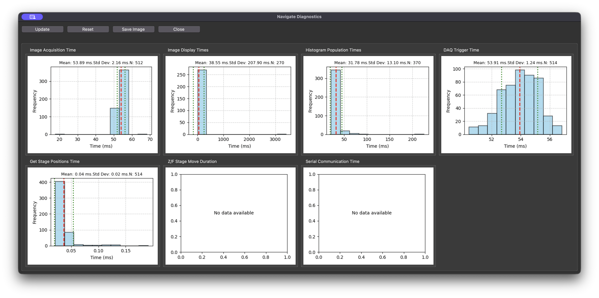
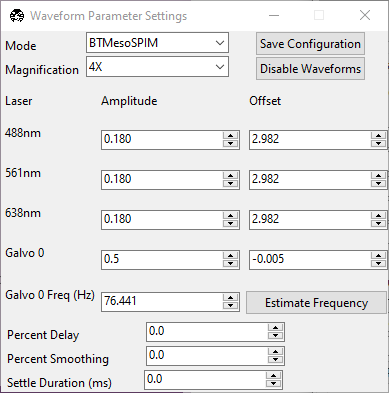
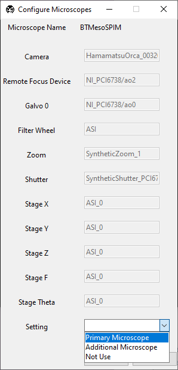
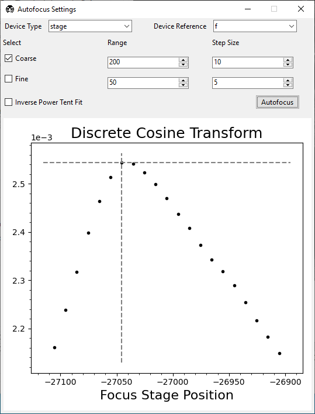

================
Popups And Tools
================

This page covers popup windows and utility dialogs outside the main notebook layout.

.. _ui_file_save_dialog:

File Saving Dialog
==================

This dialog appears when acquisition is started in a saving-enabled mode (non-continuous) with :ref:`Save Data <ui_timepoint_settings>` enabled.

1. :guilabel:`Root Directory` sets output location.
2. :guilabel:`User`, :guilabel:`Tissue Type`, :guilabel:`Cell Type`, :guilabel:`Label`, :guilabel:`Solvent` store metadata.
3. :guilabel:`File Type` selects output format.
4. :guilabel:`Notes` adds free-text metadata.

.. _ui_performance_diagnostics:

Performance Diagnostics
=======================

Open from :menuselection:`File --> Performance Diagnostics`.

1. :guilabel:`Update` refreshes histograms from current logs.
2. :guilabel:`Reset` clears plot history.
3. :guilabel:`Save Image` exports a screenshot.
4. :guilabel:`Close` dismisses the popup.

.. _ui_waveform_parameters:

Waveform Parameters
===================

Use this popup to configure waveform amplitudes, offsets, timing, and smoothing used by :ref:`Waveform Settings <ui_waveform_settings>`.

1. Laser and galvo amplitude/offset parameters are device-specific.
2. :guilabel:`Galvo 0 Frequency (Hz)` and :guilabel:`Estimate Frequency` control galvo scan timing.
3. :guilabel:`Percent Delay`, :guilabel:`Percent Smoothing`, and :guilabel:`Settle Duration (ms)` tune waveform shape and timing.

.. _ui_configure_microscopes:

Configure Microscopes
=====================

This window selects the primary microscope and helps inspect multi-microscope hardware assignments.

.. _ui_autofocus:

Autofocus Settings
==================

This popup configures autofocus behavior used by :ref:`features <user_guide_features>`.

1. Select :guilabel:`Device Type` and :guilabel:`Device Reference`.
2. Configure coarse and fine search ranges and step sizes.
3. Optionally enable :guilabel:`Inverse Power Tent Fit`.
4. Click :guilabel:`Autofocus` to run with current settings.
