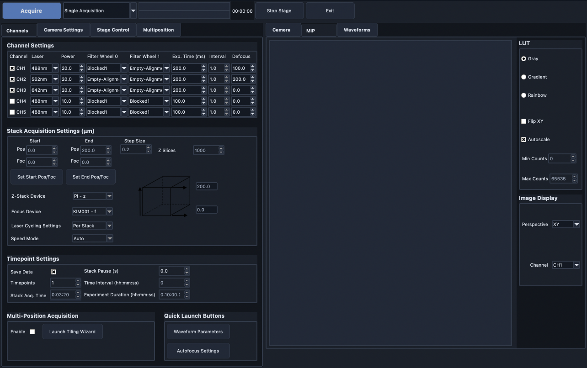

==========================
User Interface Walkthrough
==========================

**navigate** has a modular interface organized into a menu bar, acquisition controls, settings notebooks, display notebooks, and task-specific popup windows.

Use this section as a UI reference index.

.. toctree::
   :maxdepth: 1

   01_ui_overview
   02_menu_bar
   03_acquisition_and_settings_notebooks
   04_stage_and_multiposition
   05_display_notebooks
   06_popups_and_tools
