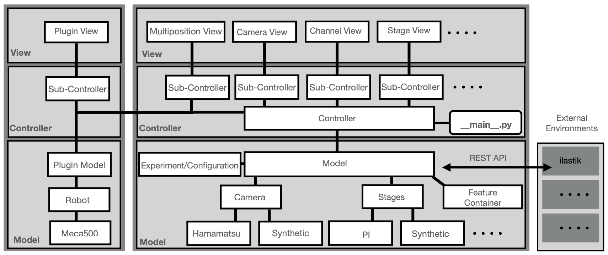

.. _software-architecture-section:

=====================
Software Architecture
=====================

Model-View-Controller (MVC)
===========================

The architecture of **navigate** follows the Model-View-Controller (MVC) pattern. In this structure:

- **Model**: Runs in its own subprocess and is responsible for hardware communication and image handling. Communication with the controller is managed through event queues.
- **View**: Displays the graphical user interface (GUI) and communicates with the controller. Each GUI area (for example, camera display and autofocus) is managed by a dedicated sub-controller.
- **Controller**: Coordinates data flow between model and view. It relays user input to the model and routes model output (images, status, metrics) back to the view.

Extensibility
=============

To maximize extensibility, **navigate** includes:

- **REST API layer**: A REST interface allows **navigate** to exchange data with external tools through an HTTP server, without forcing intermediate file saves.
- **Plugin layer**: Plugins provide a supported path to add new devices, features, and workflows.

Data Acquisition and Processing
===============================

**navigate** employs a feature container for running acquisition routines, characterized by:

- **Reconfigurable workflows**: Custom acquisition workflows can include computer-vision feedback.
- **Threading and parallelization**: Large data objects and acquisition tasks are handled with concurrency where needed.
- **Tree data structure**: Acquisition, imaging, and analysis steps are represented as a reconfigurable tree of operations.
- **Image analysis routines**: Custom analysis can run at runtime on in-memory NumPy arrays.

Feature Lists
=============

Feature lists are highly versatile, capable of:

- **Sequential execution**: Acquisition routes can run in a predefined order.
- **Logic integration**: Conditional branches and loop structures can be embedded in the workflow.
- **Non-imaging processes**: Hardware operations such as solvent exchange can be integrated with imaging tasks.

Microscope Objects
==================

**navigate** supports multiple microscope objects defined in :file:`configuration.yaml`. Each microscope object:

- **Independent or shared hardware**: A microscope can own its hardware or share components with other microscope definitions.
- **Multi-modal imaging**: Different imaging modalities can coexist in one system.
- **Custom acquisition routines**: Each microscope can map to different acquisition routines and switch at runtime.

This architecture allows for highly adaptable and reconfigurable imaging systems tailored to complex experimental needs.

Developer Deep Dive
===================

For implementation-level details that are useful when editing the codebase, see :doc:`Developer Architecture Concepts <software_architecture_developer_concepts>`.
