===========================
Acquire an Image (Beginner)
===========================

This guide will describe how to acquire a single image, and z-stack image series using the
navigate sofware package. Please see refer to :ref:`multiposition table <user_guide/gui_walkthrough:multiposition>` for imaging a multiposition series or :doc:`case studies <user_guide/case_studies/case_studies_home>` for specialized examples using device-specific microscope configurations.

Loading and finding the sample
==============================

#. Load the sample into the microscope chamber.
#. open navigate software by opening an anaconda prompt, activating navigate by entering the command ``conda activate navigate`` into the command window, press :guilabel:`Enter` and subsequently typing ``navigate`` and press :guilabel:`Enter` into the anaconda command window.

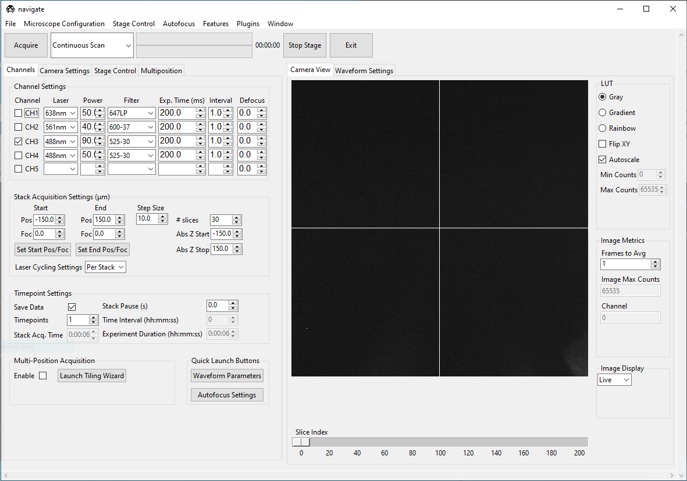

#. Using the :guilabel:`Channel` checkbox in the :guilabel:`Channel Settings` section, under the :guilabel:`Channels` tab, select the desired laser for imaging. (Note: multiple channels can be selected but channels will be imaged sequentially).

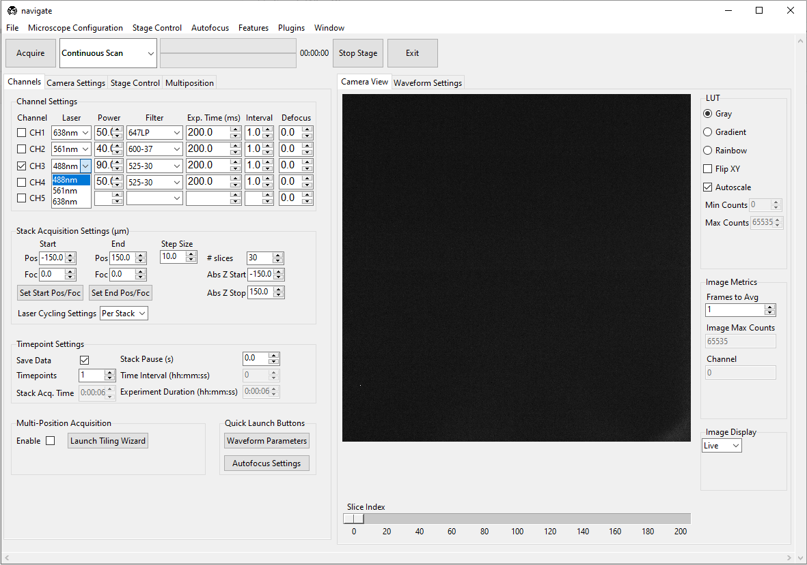

#. Select the appropriate filter using the :guilabel:`filter dropdown menu` for the selected channel.

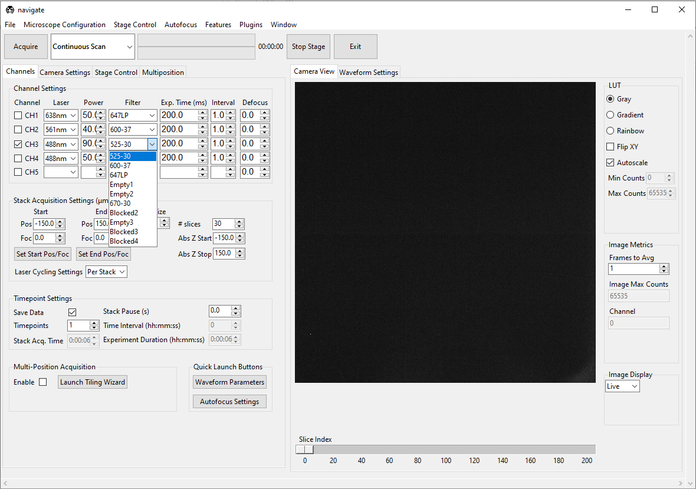

#. Specify the :guilabel:`Power` for that laser and specifc :guilabel:`Filter` for that laser.
#. Under the :guilabel:`Exp. Time (ms)` tab, specify the camera exposure time in milliseconds.
#. Set the :guilabel:`Interval` to ``1.0`` for each channel.
#. Set the :guilabel:`Defocus` to  ``0`` for each channel.
#. Select "Continuous Scan" in the dropdown next to the :guilabel:`Acquire` button in the Acquire Bar.

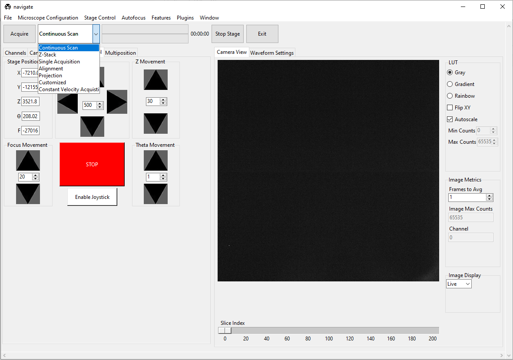

#. Press :guilabel:`Acquire`. This will launch a live acquisition mode.

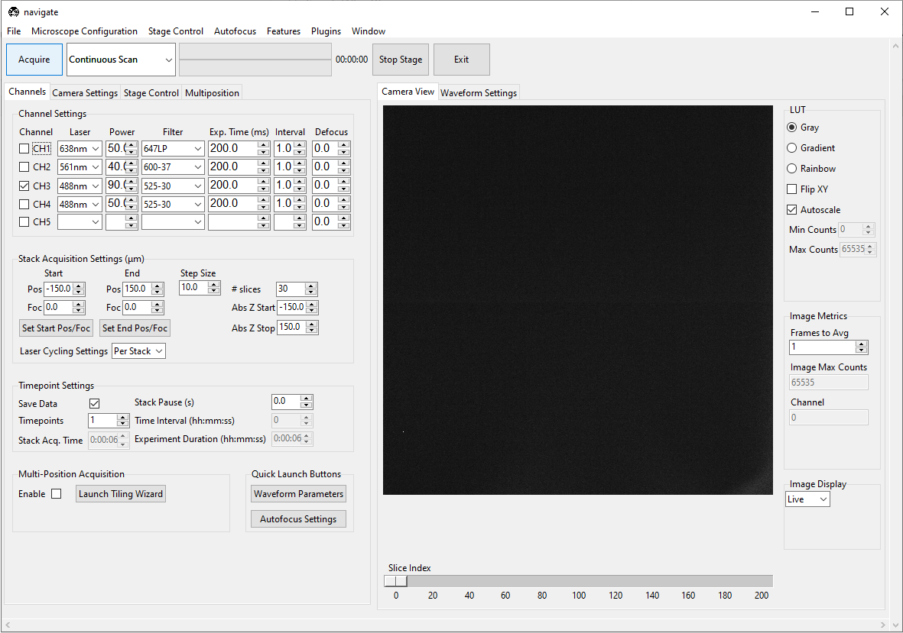

#. Move the stage either via joystick or using the :guilabel:`X Y movement` and/or :guilabel:`Z movement` controls in the
   :guilabel:`Stage Control` tab until the sample comes into view and is in focus with the camera.

.. image:: images/beginner/stage-movement-panel.png

#. If enabled in the hardware, use the :guilabel:`Focus Movement` controls to adjust the detection objective position relative to the camera to adjust the focus. Check :doc:`configuration settings <user_guide/software_configuration>` for more information.

#. Press the :guilabel:`Stop` button in the acquisition bar to Stop Acquisition

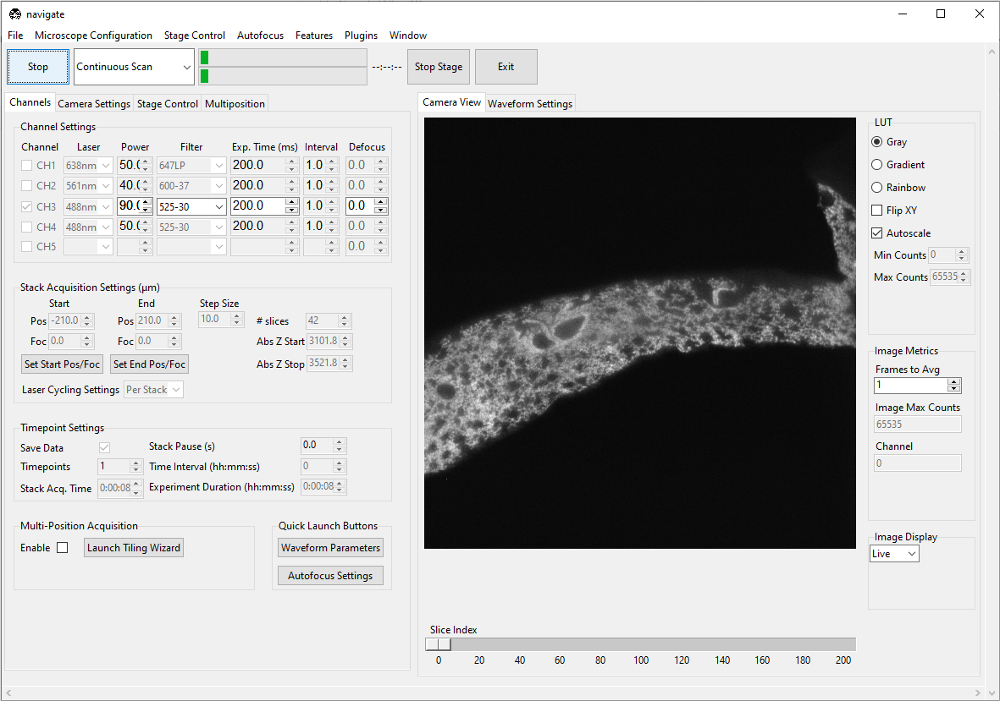

Acquiring a single image
======================

#. Using the :guilabel:`Channel` boxes in the :guilabel:`Channel Settings` section, under the :guilabel:`Channels` tab, select the desired laser(s) for imaging.
#. Select "Continuous Scan" from the dropdown next to the :guilabel:`Acquire` button.
   Press :guilabel:`Acquire`. This will launch a live acquisition mode.

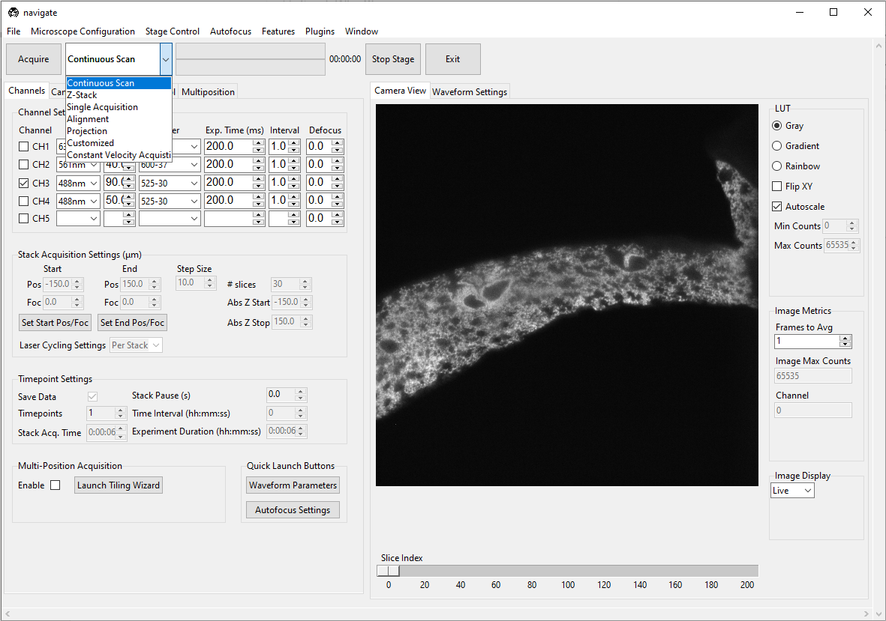

#. Similar to loading and finding the sample, move the stage via joystick or using the controls in the
   :guilabel:`Stage Control` tab to find the desired region of the sample to image.
#. Once desired imaging region is found, Select the number of color channels needed imaging in the :guilabel:`Channel tab`
   under :guilabel: `Channel Settings`. Select the correct filter for each channel by
   using the dropdown menu after each channel under the :guilabel:`Filter`. (Note, if multiple channels are selected, channels will be acquired sequentially)
#. Change the camera exposure time by changing number in the :guilabel:`Exp. Time (ms)` for
   each channel.
#. Set :guilabel:`Interval` to be ``1.0`` for each channel.
#. Set :guilabel:`Defocus` to be ``0`` for each channel.
#. Select :guilabel:`Normal` in the :guilabel:`Readout Direction` dropdown menu under the :guilabel:`Camera Modes` section in the :guilabel:`Camera settings` tab to acquire all pixels at once. Select :guilabel:`Light-Sheet` if using a rolling shutter. Refer to :doc:`ASLM <user_guide/case_studies/setup_voodoo>` for more information.

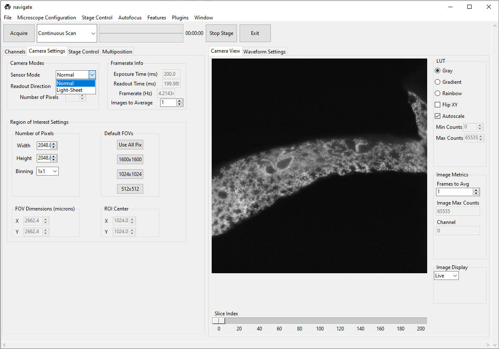

#. Define imaging region across camera chip in the :guilabel:`Region of Interest Settings` section under the :guilabel:`Camera Settings` tab.

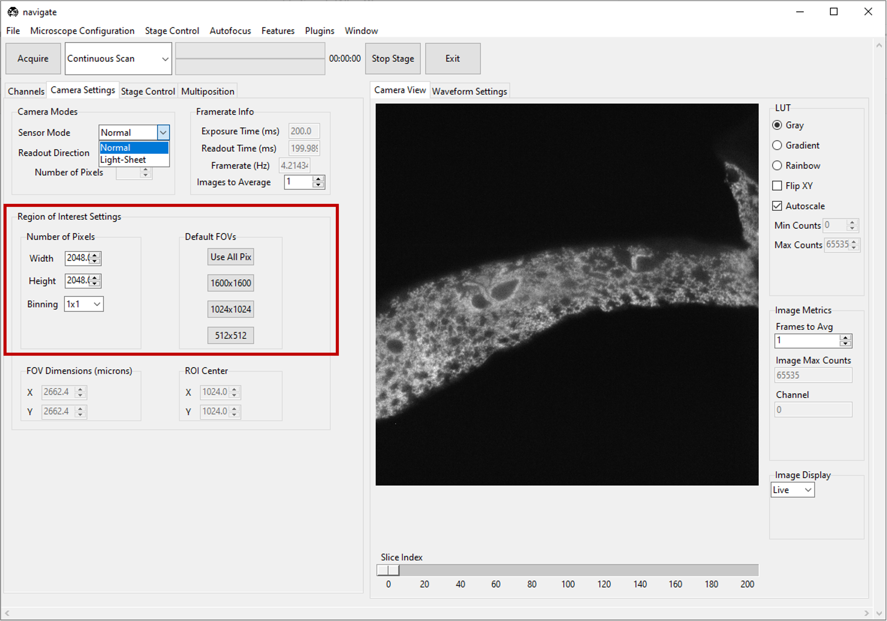

#. Check the :guilabel:`Save Data` box in the :guilabel:`Timepoint Settings` section under the :guilabel:`Channels` tab to save the acquired images. Check this box before acquiring data.

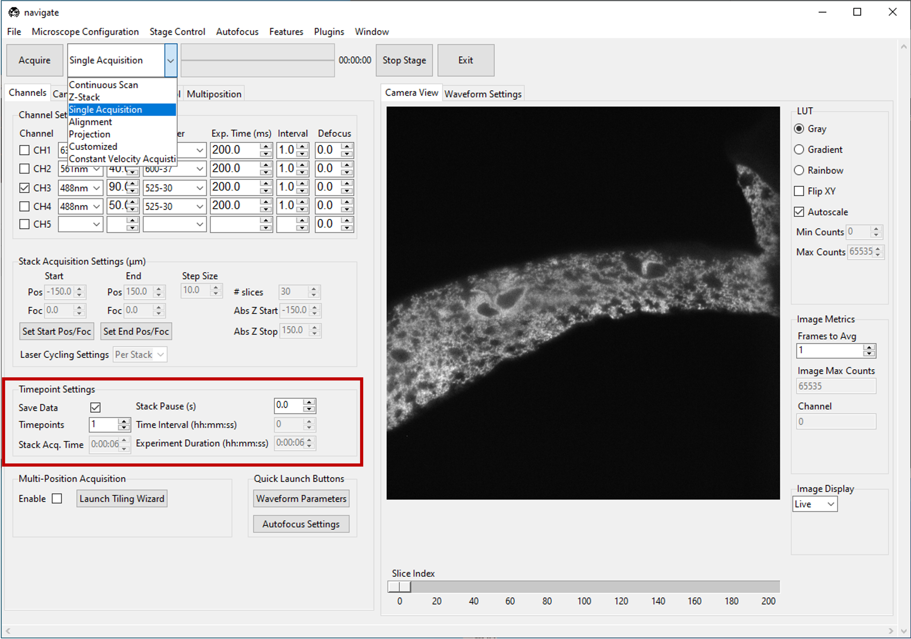

#. Select "Single Acquisition" from the dropdown next to the :guilabel:`Acquire` button.

#. Press :guilabel:`Acquire` to open dialog saving box

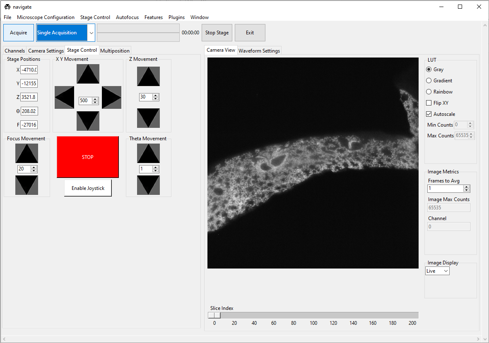

#. Enter the sample parameters, notes, location to save file, and filetype in the :guilabel:`File Saving Dialog` that pops up.

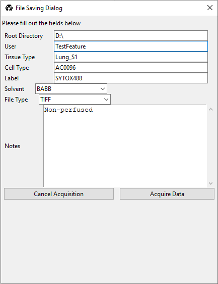

#. Press :guilabel:`Acquire Data` to initiate acquisition. Acquisition will automatically stop once the image is acquired.

.. image:: images/beginner/save-dialog-box-acquire.png

Acquiring a z-stack
=================

#. Using the :guilabel:`Channels` in the :guilabel:`Channel Settings` section, under the :guilabel:`Channels` tab, select the desired laser for imaging.
#. Select "Continuous Scan" from the dropdown next to the :guilabel:`Acquire` button.
   Press :guilabel:`Acquire`. This will launch a live acquisition mode.
#. Using the :guilabel:`Stage Control`, go to the desired start z-position in the sample.

.. image:: images/beginner/stage-control-start-pos-zstack.png

#. Under the :guilabel:`Channels` tab, in :guilabel:`Stack Acquistion Settings (um)`
   press :guilabel:`Set Start Pos`.

.. image:: images/beginner/press-start-pos.png

#. Using the :guilabel:`Stage Control`, go to a deep z-position within the sample.

.. image:: images/beginner/stage-control-end-pos-zstack.png

#. Under the :guilabel:`Channels` tab, in :guilabel:`Stack Acquistion Settings (um)`
   press :guilabel:`Set End Pos`.

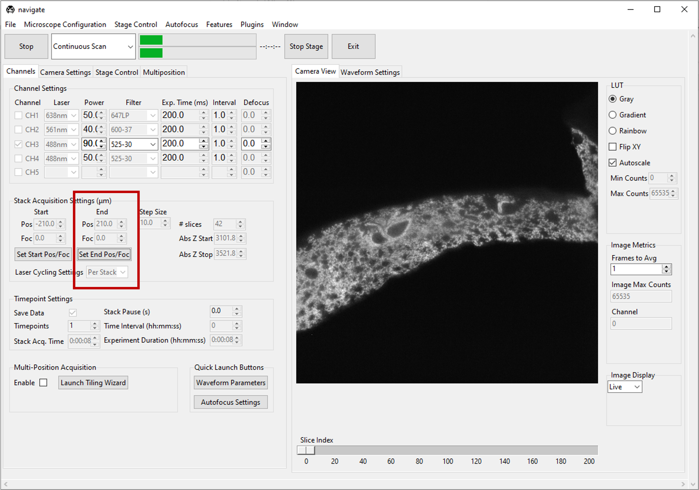

#. Make sure :guilabel:`Set Foc` is ``0`` for both the :guilabel:`Set Start Pos` and
   :guilabel:`End Pos` if focus movement is not enabled. Check :doc:`configuration settings <user_guide/software_configuration>` for more information.

#. Type the desired step size (units um) in the :guilabel:`Step Size` dialog box in
   :guilabel:`Stack Acquistion Settings (um)`. The minimum step size and step increments are defined in stage section in the :guilabel:`experiment.yaml` file. More information can be found in :doc:`configuration settings <user_guide/software_configuration>`

.. image:: images/beginner/define-step-size.png

#. Select the number of color channels needed imaging in the :guilabel:`Channel tab`
   under :guilabel: `Channel Settings`. Select the correct filter for each channel by
   using the dropdown menu after each channel under the :guilabel:`Filter`.
#. Change the exposure time by changing number in the :guilabel:`Exp. Time (ms)` for
   each channel.
#. Set :guilabel:`Interval` to be ``1.0`` for each channel.
#. Set :guilabel:`Defocus` to be ``0`` for each channel.
#. Select :guilabel:`Normal` in the :guilabel:`Readout Direction` dropdown menu under the :guilabel:`Camera Modes` section in the :guilabel:`Camera settings` tab. Select :guilabel:`Light-Sheet` if using rolling shutter. Refer to :doc:`ASLM <user_guide/case_studies/setup_voodoo>` for more information.
#. Define imaging region across camera chip in the :guilabel:`Region of Interest Settings` section under the :guilabel:`Camera Settings` tab.
#. If using channels for imaging, Select either :guilabel:`Per Z` or :guilabel:`Per Stack` under :guilabel:`Laser Cycling Settings` in the :guilabel:`Stack Acquisition Settings (um)` section under the :guilabel:`Channels` tab. :guilabel:`Per Z` acquires each channel before moving the stage to a new position and :guilabel:`Per Stack` acquires all images in a stack acquistion for a single channel before moving back to the start position restarting acquistion for the subsequent channel until all channels are imaged.

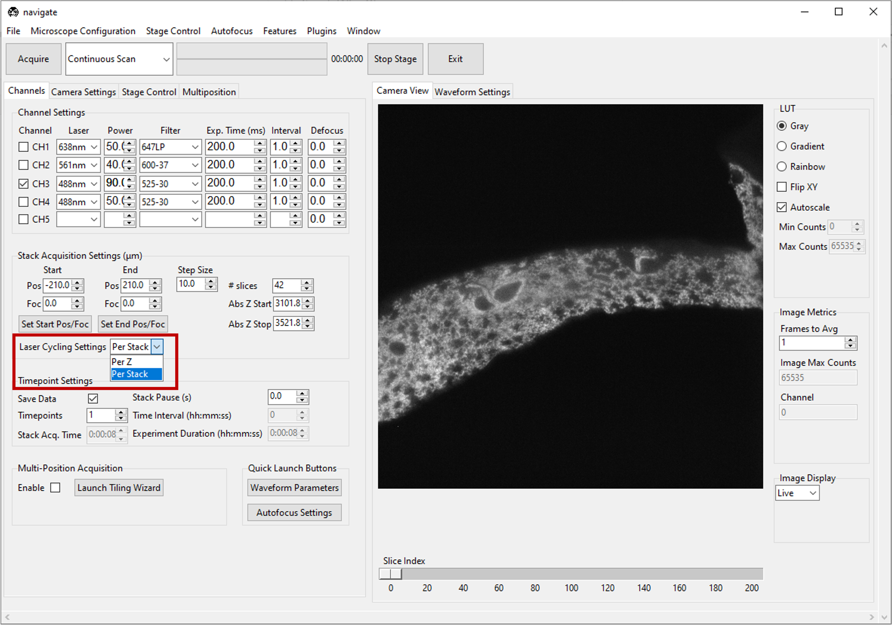

#. Check the :guilabel:`Save Data` box in the :guilabel:`Timepoint Settings` section under the :guilabel:`Channels` tab to save the acquired images. Check this box before acquiring data.
#. Select "Z-Stack" from the dropdown next to the :guilabel:`Acquire` button.

   Press :guilabel:`Acquire`.
#. Enter the sample parameters, notes, location to save file, and filetype in the :guilabel:`File Saving Dialog` that pops up.
#. Press :guilabel:`Acquire Data`.

Acquiring a multi-position z-stack
================================

#. Please refer to :ref:`multiposition table <user_guide/gui_walkthrough:multiposition>` documentation on how to image a multiposition z-stack.
