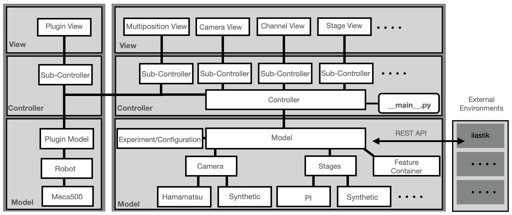

=======================
Software Architecture
=======================

.. _software-architecture-section:

Model View Controller (MVC)
============================

The architecture of **navigate** is designed following the industry-standard Model-View-Controller (MVC) pattern. In this structure:

- **Model**: The model operates in its own subprocess and is responsible for communicating
  with hardware and performing image handling and processing tasks.
  Communication with the controller is managed through event queues, ensuring efficient data handling.
- **View**: The view is responsible for displaying the user interface and communicating
  with the controller. Each graphical user interface (GUI) window, such as the camera
  display and autofocusing module, is controlled by a dedicated sub-controller.
  These sub-controllers are responsible for relaying information back to the main controller,
  maintaining a clear separation of functionality.
- **Controller**: Acts as the central unit that manages the flow of data between the model
  and the view components, coordinating the application's overall functionality.
  It relays user input in the form of traces and commands to the model and relays model
  output in the form of images and data to the view.

Communication Enhancements
----------------------------

To maximize the extendability of **navigate**, it incorporates:

- **REST-API Level**: A RESTful API layer is included to facilitate communication with external
  libraries, ensuring compatibility and extendability. Data is exchanged to the external
  environment through a http server, allowing for rapid and seamless integration with other systems.
  Data does not need to be saved locally to be loaded by the external system.
- **Plugin Layer**: Offers the flexibility to integrate non-supported devices through
  plugins, enhancing the system's adaptability to various hardware.

Data Acquisition and Processing
--------------------------------

**navigate** employs a feature container for running acquisition routines, characterized by:

- **Reconfigurable Workflows**: Supports custom data acquisition workflows, which are
  adaptable and can integrate computer vision feedback mechanisms for enhanced functionality.
- **Threading and Parallelization**: To optimize performance, threading and parallelization
  techniques are extensively utilized, allowing for efficient handling of large objects and data processing.
- **Tree Data Structure**: The system's backbone for alignment, imaging, and image
  analysis is a reconfigurable tree data structure. This enables the creation of
  customizable acquisition "recipes" tailored to specific specimens.
- **Image Analysis Routines**: Custom routines for image analysis can also be loaded into
  **navigate** during run-time. Image analysis is performed on images in memory that are
  stored as numpy arrays, ensuring rapid processing.

Feature Lists
-------------------

Feature lists are highly versatile, capable of:

- **Sequential Execution**: Acquisition routes can be executed in a predefined order, ensuring
  systematic data collection.
- **Logic Gates Integration**: Incorporates conditional logic (e.g., if/then, try/except)
  and loop structures (while, for-loops), providing flexibility in data acquisition and processing.
- **Non-Imaging Processes**: Supports the inclusion of non-imaging-based processes,
  such as solvent exchange, broadening the application scope of the system.
