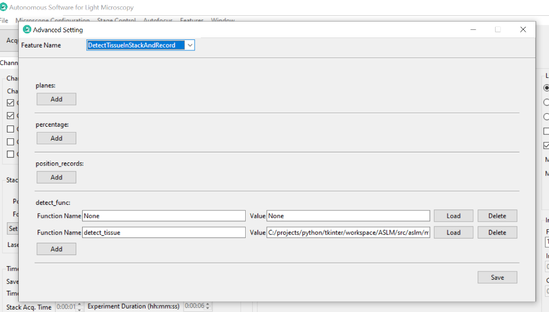
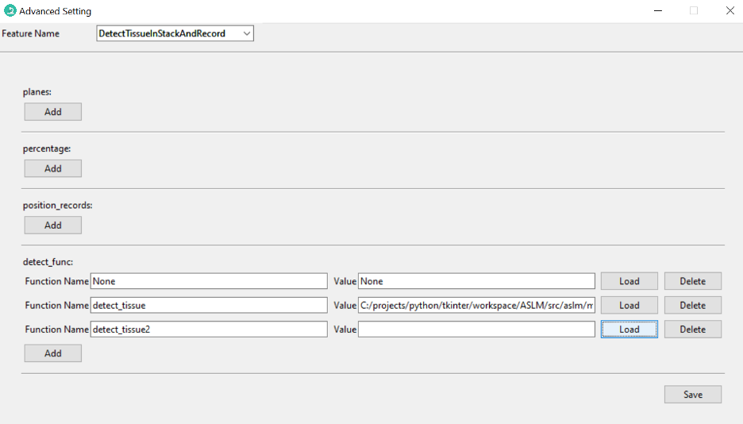
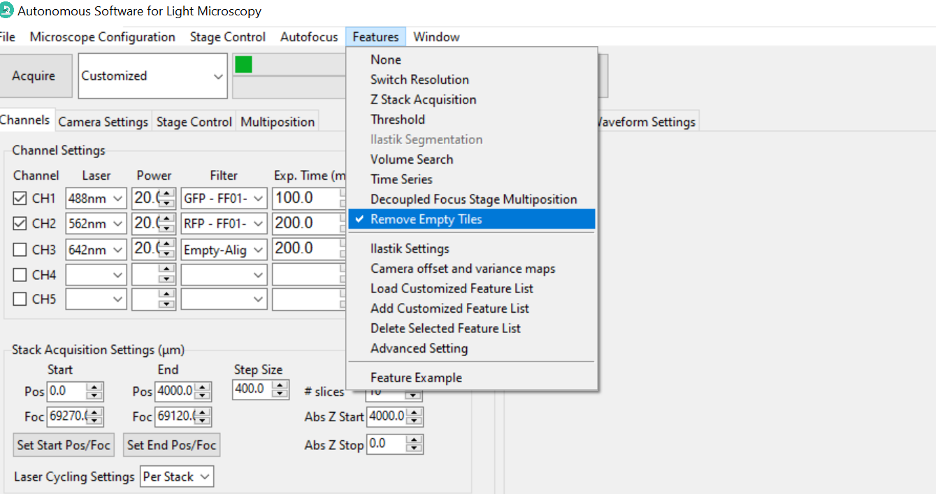
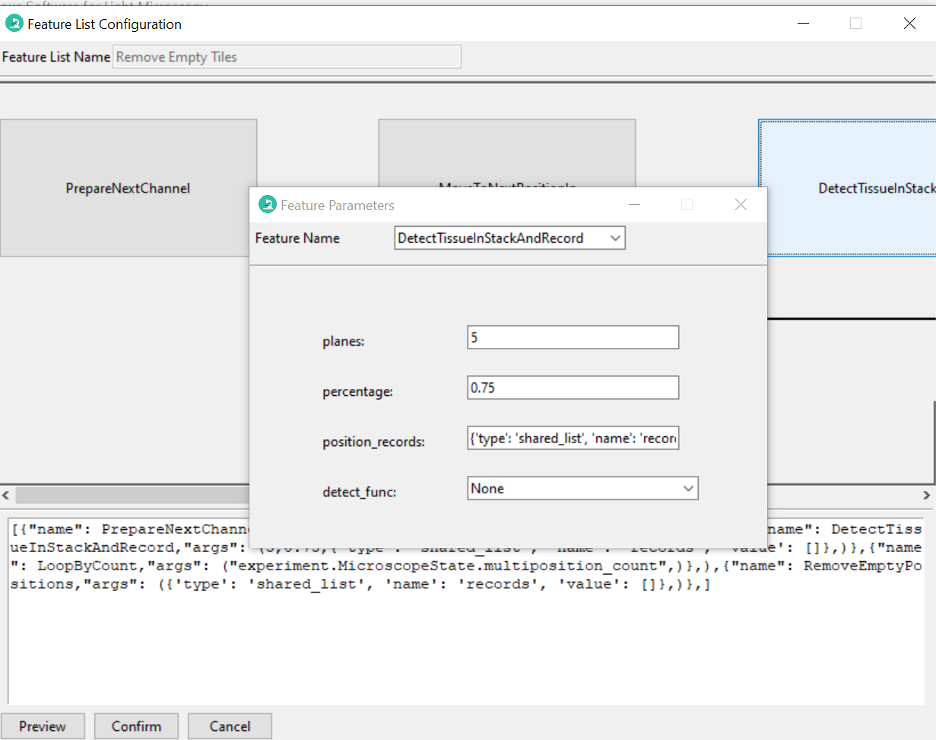
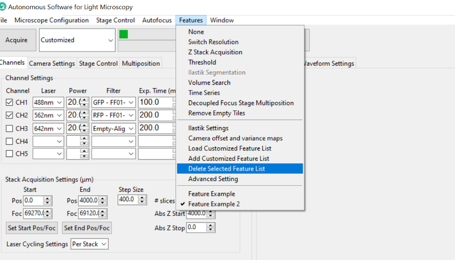

.. _features:

Feature Container
========================
To make Navigate as powerful as possible, we want to encourage users to contribute code and
engage in the software collaboratively.

Introduction
-------------------------------------

The Navigate **feature container** allows for reconfigurable acquisition and
analysis. The feature container runs a tree of **features**, where each
feature may perform a *signal* operation, where it modifies the state of
microscope hardware, a *data* operation, where it performs an analysis on
acquired image data, or both.

Once a feature is executed, any features dependent on this feature's execution
will execute (for example, move the stage, then snap a picture). Following
this, the next set of features in sequence will be executed.

Examples of some existing features include
``navigate.model.features.common_features.ZStackAcquisition``, which acquires a
z-stack, and ``navigate.model.features.autofocus.Autofocus``, which finds the
ideal plane of focus of a sample using a Discrete Cosine Transform.

Currently Implemented Features
-------------------------------------

- VolumeSearch
- IlastikSegmentation
- DetectTissueInStack
- DetectTissueInStackAndRecord
- RemoveEmptyPositions
- ImageWriter
- ConstantVelocityAcquisition
- ChangeResolution
- ConProAcquisition
- FindTissueSimple2D
- LoopByCount
- MoveToNextPositionInMultipositionTable
- PrepareNextChannel
- Snap
- StackPause
- WaitToContinue
- ZStackAcquisition

The Feature Object
------------------

Each feature is an object that accepts a pointer to ``navigate.model.model`` in its
``__init__()``  arguments and contains a configuration dictionary that dictates
feature behavior in its ``__init__()`` function. A complete configuration
dictionary is shown below. As few or as many of these options can be specified
as needed.

.. code-block:: python

    self.config_table = {'signal': {'init': self.pre_func_signal,
                                    'main': self.in_func_signal,
                                    'end': self.end_func_signal,
                                    'cleanup': self.cleanup_func_signal},
                             'data': {'init': self.pre_func_data,
                                      'main': self.in_func_data,
                                      'end': self.end_func_data,
                                      'cleanup': self.cleanup_func_data},
                             'node': {'node_type': 'multi-step',
                                      'device_related': True,
                                      'need_response': True },
                            }

Both ``signal`` and ``data`` configuration entries are themselves
dictionaries that can contain ``init``, ``main``, ``end`` and/or
``cleanup`` entries.

- ``init`` entries dictate pre-processing steps that must be run before the
  main function of the feature starts.
- ``main`` entries dictate the primary operation of the feature, to be once per
  acqusition step
- ``end`` entries describe any closing operations that must be performed when
  exiting the node
- ``cleanup`` entries dictate what happens if the node fails. This is for
  failsafe controls such as "turn off all lasers"

The ``node`` configuration dictionary contains general properties of feature
nodes. ``node_type`` can be ``one-step`` or ``multi-step``, the latter indicating
we have an ``init``, a ``main`` and an ``end``. ``device_related`` is set to
``True`` if we have a ``multi-step`` signal container. ``need_response`` is set
to true if the signal node waits on hardware (e.g. waits for a stage to confirm
it has indeed moved) before proceeding.

Each of the functions that are the value entries in ``self.config_table``
dictionaries are methods of the feature object.

Creating Custom Feature Object
---------------------------------

Each Feature Object is defined as a class, there is a step-by-step example feature
that moves the stage to a specific position listed in the multi-position table in the GUI,
snap an image and calculate its Shannon entropy.

1. How to create a custom feature class?

Creating a new feature is the same as a normal new class. However, there is some requires.
The first parameter of the ``__init__`` function must be ``model``, which gives the feature
object full access to the model. All the other parameters are keyword arguments and must have default values.
There should always have a config_table attribute (see `above <../../html/feature_container/feature_container_home.html#the-feature-object>`_ for a description of the config_table)

.. code-block:: python

  from navigate.model.analysis.image_contrast import fast_normalized_dct_shannon_entropy

  Class FeatureExample:

      def __init__(self, model, position_id=0):
          self.model = model
          self.position_id = position_id

          self.config_table = {
              "signal": {
                      "init": self.pre_func_signal,
                      "main": self.in_func_signal,
              },
              "data": {
                      "main": self.in_func_data,
              },
              "node": {
                  "device_related": True,
              }
          }

2. How to get parameters from GUI?

All the GUI parameters are in the ``model.configuration["experiment"]`` during
runtime. Here is an example that get positions from the multi-position table
in the GUI.

.. code-block:: python

    def pre_func_signal(self):
        positions = self.model.configuration["experiment"]["MultiPositions"]
        if self.position_id < len(positions):
            self.target_position = positions[self.position_id]
        else:
            current_position = self.model.get_stage_position()
            self.target_position = dict([(axis[:-4], value) for axis, value in current_position.items()])

More GUI parameters can be found in `experiment.yml <https://github.com/TheDeanLab/navigate/blob/develop/src/navigate/config/experiment.yml>`_

3. How to interact with stage?

Now, we move stage to the target_position.

.. code-block:: python

    def in_func_signal(self):
        pos = dict([(f"{axis}_abs", value) for axis, value in self.target_position.items()])
        self.model.move_stage(pos, wait_until_done=True)

4. How to get an image and deal with it?

The image captured by the camara will be stored in the data buffer.
You should add your code to deal with the image in the main data function.
Here is an example that calculates the Shannon entropy of the image.

.. code-block:: python

      def in_func_data(self, frame_ids):
          for id in frame_ids:
              image = self.model.data_buffer[id]
              entropy = fast_normalized_dct_shannon_entropy(image,
                  psf_support_diameter_xy=3)
              print("entropy of image:", id, entropy)

Now, you've create a whole new feature and can use it as you wish.

* How to interact with other devices?

You could interact with all devices through ``self.model.active_microscope``.
Here is an example to open shutter:

.. code-block:: python

  self.model.active_microscope.shutter.open_shutter()

* How to pause and resume data threads in the model

The image data acquired from the camara are handled in an indepandant thread.
Some devices need more time to get ready or move. In this case, you may need to pause
the data thread until the device is ready.

Here is an example to pause and resume the data thread:

.. code-block:: python

  self.model.pause_data_thread()
  # ...
  self.model.resume_data_thread()

* Frequently used APIs in the model are:

- `configuration["experiment"] <https://github.com/TheDeanLab/navigate/blob/develop/src/navigate/config/experiment.yml>`_ has all the GUI settings
- `pause_data_thread() <../../html/_autosummary/navigate.model.model.Model.html#navigate.model.model.Model.pause_data_thread>`_
- `resume_data_thread() <../../html/_autosummary/navigate.model.model.Model.html#navigate.model.model.Model.resume_data_thread>`_

* Frequently used APIs in the Microscope are:

- `prepare_next_channel() <../../html/_autosummary/navigate.model.microscope.Microscope.html#navigate.model.microscope.Microscope.prepare_next_channel>`_
- `move_stage() <../../html/_autosummary/navigate.model.microscope.Microscope.html#navigate.model.microscope.Microscope.move_stage>`_
- `get_stage_position() <../../html/_autosummary/navigate.model.microscope.Microscope.html#navigate.model.microscope.Microscope.get_stage_position>`_
- `update_stage_limits() <../../html/_autosummary/navigate.model.microscope.Microscope.html#navigate.model.microscope.Microscope.update_stage_limits>`_
- `move_remote_focus() <../../html/_autosummary/navigate.model.microscope.Microscope.html#navigate.model.microscope.Microscope.move_remote_focus>`_

Please visit `Model APIs <../../html/_autosummary/navigate.model.model.Model.html#navigate.model.microscope.Microscope.calculate_all_waveform>`_ and `Microscope APIs <../../html/_autosummary/navigate.model.microscope.Microscope.html>`_ for more details.

Creating A Custom Feature List
--------------------------------

The Navigate Software allows you to build a custom feature that implements new
functionality, or a new feature list that builds an intelligent acquisition workflow
from existing features. This documentation explains how to create and load
a customized feature list within the Navigate software. The first step is to create a
Python function, and decorating it as a "FeatureList." .

To create a customized feature, follow these steps:

1. Import the necessary modules:

  .. code-block:: python

    from navigate.tools.decorators import FeatureList
    from navigate.model.features.feature_related_functions import *

    @FeatureList
    def feature_example():
        return [
            (
                {"name": PrepareNextChannel},
                {
                    "name": LoopByCount,
                    "args": ("experiment.MicroscopeState.selected_channels",),
                },
            )
        ]

  Once you've created a feature, you can load it into the Navigate software using these steps:

2. Open Navigate.
3. Go to the `Features` menu.

.. image:: images/step_1.png

4a. Import the customized feature. Select `Add Custom Feature List` from the
`Features` menu. A dialog box will appear, allowing you to select the Python file
containing your customized feature list function.

.. image:: images/step_2.png

5. Choose the Python file containing your customized feature list function. Navigate will
load the specified feature list, making it available for use in your experiments and
analyses. It will appear at the bottom of the `Features` menu.

Combining Features
---------------------------------------------------

Once you have loaded your feature list, the next step is to use it in combination with
other features to create an intelligent acquisition workflow. To do this, you will
need to create a new feature list that combines your custom feature with other
features:

1. Navigate back to the `Features` menu, and select `Add Customized Feature List`.
You could add a new feature list directly in the software, by selecting the menu
“Features->Add Customized Feature List”. This will open a new dialog box that allows
you to create a new feature list.

2. Provide the feature list with a `Feature List Name` of your choice, and type the
feature list content (which must be a list object). The feature list content could be
the whole feature list or just a simple feature name. In this example, the feature
list name is `Feature Example 2`, and the content is a simple feature name: [{“name”:
PrepareNextChannel}]. Once you select `Preview`, the feature list will be displayed
in the `Preview` window. If you are satisfied with the feature list, select `OK` to
save it.

.. image:: images/step_3.png

3. You could edit the list of features directly by modifying the text, or through a
popup menu that is available by right clicking the feature name. The popup menu
allows you to add a new feature, delete a feature, or edit a feature. In this
example, click “Insert After”, and a new feature “PrepareNextChannel”
will be inserted by default.

.. image:: images/step_4.png

.. image:: images/step_5.png

4. To change the identity of the inserted feature, you can select a different feature
form the drop-down menu. For example, the feature can be changed from
PrepareNextChannel to LoopByCount. The parameters of the feature can be changed
automatically in the popup window.

.. image:: images/step_6.png

5. If you click the preview button, a graphical representation of the feature list will
be displayed.

.. image:: images/step_7.png

6. If you want a loop structure, type a pair of parentheses around the features, then
click “Preview”. Given this design, you can loop through arbitrary features in a
user-selected format.

.. image:: images/step_8.png
   :alt: How to create a custom feature list.

7. After editing the feature list, click “Add”. The new feature list will show up
under the “Features” menu.

Loading Custom Functions
-----------------------------------------------------
1. You could load customized functions in the software by selecting the menu
“Features->Advanced Setting”.

.. image:: images/step_10.png

2. In the popup window, choose the feature name with which you want to use the
dynamic customized functions as feature parameters.

.. image:: images/step_11.png

3. Click “Add”, A new line will appear and allow you to edit the parameter options.
Type the function name which is defined in your python file.

4. Then click “Load” to choose your python file.

.. image:: images/step_14.png

5. When you run a feature list containing the feature you just set, the new function
name will appear and you can choose the one you just added.

.. image:: images/step_15.png

Editing Function Parameters
-----------------------------------------------------
1. Select the feature list you want to run, choose “Customized” acquisition mode, and
then click “Acquire”. A feature edit popup window will show up. In this popup window,
you can see the structure of the selected feature list.

.. image:: images/step_17.png

.. image:: images/step_18.png

2. Click one feature in the preview window, a parameter window will show up. Then you
could set the parameter you want. Close the parameter window.

3. Click “Confirm”. The feature list will start to run.

.. image:: images/step_20.png

Deleting Features
---------------------------------------------------

1. Select the feature list you want to delete in the `Features` menu.

2. Then, navigate back to the `Features` menu and select `Delete Selected Feature`
List”. The feature list will be removed from the menu and the software.

