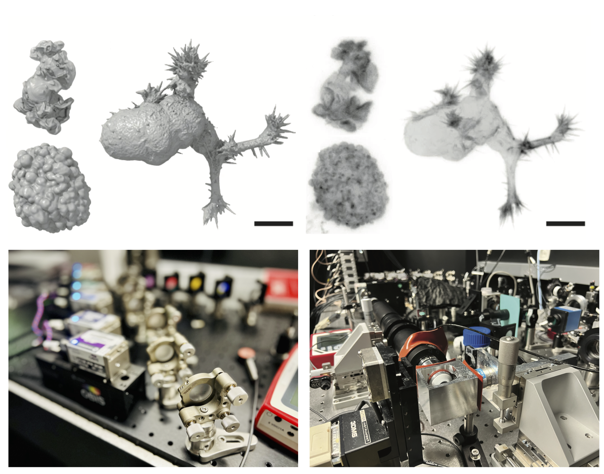
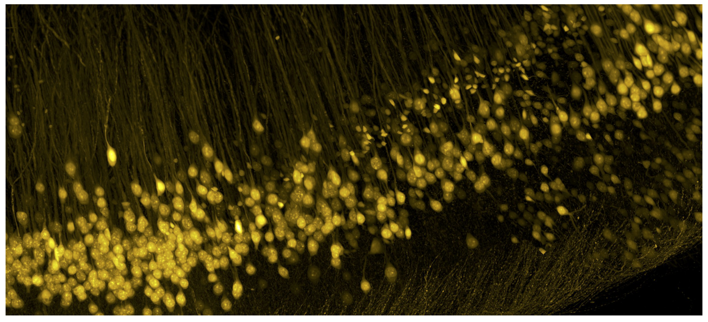
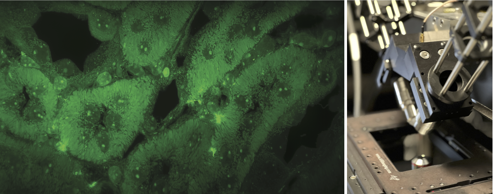
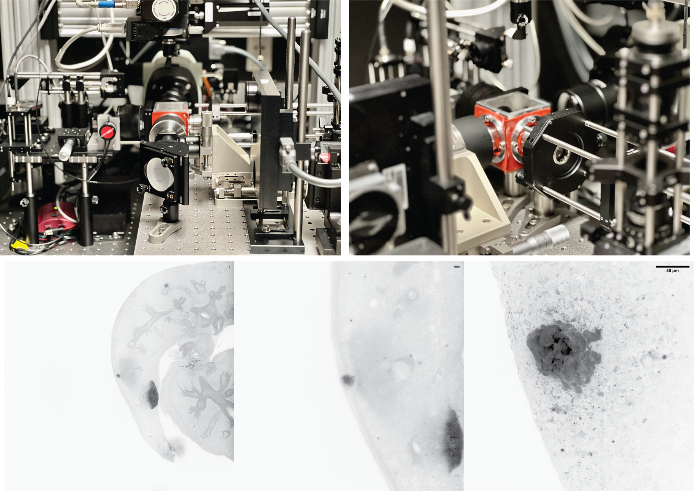
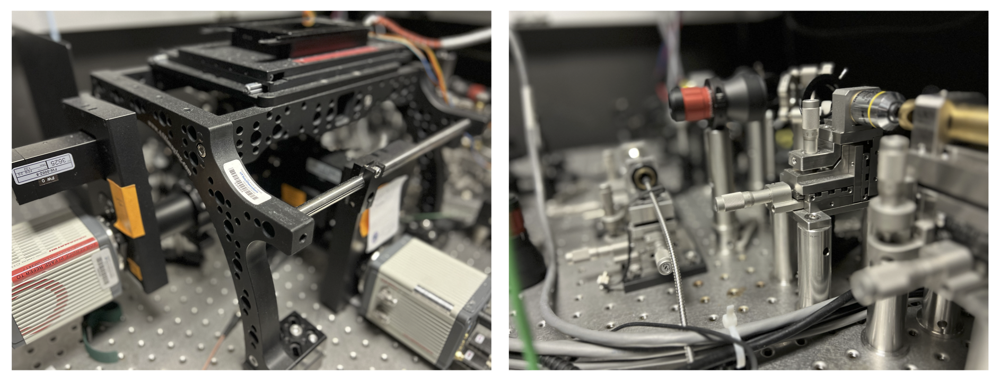

===========================================
Implemented Microscopes
===========================================

As an example of the flexibility of the **navigate** software, we describe several
microscope implementations that are currently in use with the software. Each of these
implementations is described in the following sections, including a list of the equipment
used and the configuration file used to operate the microscope. While this list does not
aim to be comprehensive, it does show the diversity of microscopes that can be controlled
using the **navigate** software. For example, this includes single and multi-camera systems,
microscopes with different illumination and detection schemes, and microscopes with different
sample geometries and scan mechanisms.

For more information on how to build these microscopes, as well as their performance,
please refer to the publications listed in the relevant sections.

------------------

ASLM
****

*(Top) Collagen-embedded cells imaged with ASLM. Segmented cells shown on the left, and
the corresponding raw data shown on the right. Data from Driscoll et al, Nat. Methods. 2019. Scale bars, 10 microns.
(Bottom) images of the live-cell ASLM implementation.*

Axially Swept Light-Sheet Microscope (ASLM) is designed specifically to achieve
high-resolution imaging throughout large fields of view. This custom-built system offers unparalleled resolution
of 300-380 nm isotropically across extensive imaging volumes measuring up to
200x200x200 microns, employing one-photon excitation techniques.

The ASLM system features a Special Optics 28.5X/NA 0.67 illumination objective
and a Nikon 25X/NA 1.1 detection objective. It is equipped with a diverse array of
laser wavelengths including 445, 488, 514, 561, and 642 nm, enabling versatile multicolor
imaging capabilities. The system leverages aberration-free remote focusing to scan the
illumination beam in sync with the rolling shutters of two Hamamatsu Flash 4.0 sCMOS cameras.
Because ASLM does not depend upon diffractive optics, such as spatial light modulators,
it is capable of simultaneous multicolor imaging.

Unique to ASLM, the system maintains diffraction-limited and isotropic resolution over
arbitrarily large volumes. The resulting point spread function (PSF) is isotropic,
devoid of side lobes or significant blurring,  obviating the need for deconvolution.
Moreover, ASLM achieves significantly higher illumination uniformity compared to
traditional Gaussian or Bessel beam approaches. This uniformity translates to a
consistent signal-to-noise ratio (SNR) throughout the imaging volume, greatly enhancing
quantitative imaging applications such as fluorescence resonance energy transfer and
single particle tracking. This combination of features makes ASLM an exceptional tool
for detailed, quantitative imaging across large sample volumes.

**Instrument Location**:

The University of Texas Southwestern Medical Center, Dallas, TX

**Relevant Publications**:

* `Deconvolution-free subcellular imaging with axially swept light sheet microscopy
  <https://www.cell.com/biophysj/pdf/S0006-3495(15)00498-1.pdf>`_
* `Diagonally scanned light-sheet microscopy for fast volumetric imaging of adherent cells
  <https://www.cell.com/biophysj/pdf/S0006-3495(16)00139-9.pdf>`_
* `u-track3D: Measuring, navigating, and validating dense particle trajectories in three dimensions <https://www.cell.com/cell-reports-methods/pdf/S2667-2375(23)00326-0.pdf>`_
* `Robust and automated detection of subcellular morphological motifs in 3D microscopy images <https://www.nature.com/articles/s41592-019-0539-z>`_

.. collapse:: Technical Information

    .. list-table::
       :widths: 25 75
       :header-rows: 1

       * - Equipment
         - Description
       * - Lasers
         - Coherent Obis with emission at 405, 457, 488, 514, 561, and 642 nm.
       * - Stages
         - MP-285, PI P-726 PIFOC High-Load piezo, and a galvo for acquisition of z-stacks.
       * - Stage Controllers
         - Sutter MP-285 and PI E-709
       * - Cameras
         - 2x Hamamatsu Flash 4.0
       * - Filter Wheel
         - Sutter Lambda 10-3 with 1x 25mm Filter Wheels
       * - Remote Focusing Units
         - Equipment Solutions LFA-2010 Linear Focus Actuator
       * - Data Acquisition Cards
         - National Instruments PCIe-6738
       * - Galvo
         - Novanta CRS 4 KHz Resonant Galvo
       * - Zoom
         - N/A
       * - Other
         - NA

    .. collapse:: Configuration File

        .. literalinclude:: ../user_guide/hardware/configurations/configuration_voodoo.yaml
           :language: yaml

        |
------------------

Optical Tiling OPM
******************

.. image:: tiling_opm.png
   :width: 100%
   :align: center

*(Left) Image of a monolayer of keratinoctyes imaged with the Optical Tiling OPM.
Region shown with a red box is magnified and shown through time below.
(Right, top and bottom) Images of the Optical Tiling OPM system.*

The Oblique Plane Microscope (OPM) described here is engineered for high-resolution, fast volumetric imaging of large fluorescent
samples, such as cell monolayers, spheroids, and zebrafish embryos. This system
addresses the common challenge of achieving high spatiotemporal resolution throughout a large field of view,
which is often restricted in OPM setups due to optics associated with the tertiary imaging system.

To overcome these constraints, the microscope incorporates a novel dual-axis scan unit,
enabling rapid, high-resolution imaging across a volume of 800 × 500 × 200 microns.
Furthermore, the system integrates a multi-perspective projection imaging technique, which
significantly enhances the volumetric interrogation rate to over 10 Hz.
This feature facilitates quick scanning across a large field of view in a dimensionally reduced format,
allowing for the swift identification and detailed imaging of specific regions of interest.

The custom-built oblique plane microscope is built in an inverted geometry.
Illumination is provided obliquely at a 40-degree angle using an Olympus 20X/NA 1.05 water
immersion objective, and fluorescence is captured in an epi-fluorescence format by the same objective.
The fluorescence signal is then relayed through an Olympus 20x/NA 0.8 secondary objective
and redirected by a custom glass-tipped tertiary objective set at a 40-degree angle.
Images are captured using a Hamamatsu Flash 4.0 sCMOS camera. Multi-well plate plate imaging
is available through mechanical sample scanning.

**Instrument Location**:

The University of Texas Southwestern Medical Center, Dallas, TX

**Relevant Publications**:

* `Increasing the field-of-view in oblique plane microscopy via optical tiling
  <https://opg.optica.org/abstract.cfm?uri=boe-13-11-5616>`_
* `A versatile oblique plane microscope for large-scale and high-resolution imaging of subcellular dynamics
  <https://elifesciences.org/articles/57681>`_

.. collapse:: Technical Information

    .. list-table::
       :widths: 25 75
       :header-rows: 1

       * - Equipment
         - Description
       * - Lasers
         - Coherent Galaxy with 488, 561, and 642 nm lasers.
       * - Stages
         - ASI FTP-2000 with MS-2000 XY stage, and a Galvo for acquisition of z-stacks.
       * - Stage Controllers
         - ASI Tiger Controller
       * - Cameras
         - Hamamatsu Flash 4.0
       * - Filter Wheel
         - 2x ASI 6-Position 32 mm Filter Wheels
       * - Remote Focusing Units
         - Optotune Electrotunable Lens (EL-16-40-TC-VIS-5D-1-C)
       * - Data Acquisition Cards
         - National Instruments PCIe-6738
       * - Galvo
         - Novanta CRS 4 KHz Resonant Galvo, and 2x Novanta Linear Galvos for shearing and tiling.
       * - Zoom
         - N/A
       * - Other
         - NA

    .. collapse:: Configuration File

        .. literalinclude:: ../user_guide/hardware/configurations/configuration_OPMv2.yaml
           :language: yaml

    |
------------------

AO OPM
*******

.. image:: ao_opm.png
   :width: 100%
   :align: center

*(Left) Images of zebrafish vasculature before and after application of sensorless adaptive optics.
(Right) image of the OPM equipped with adaptive optics.*

Adaptive optics (AO) significantly enhances the performance of microscopes
by restoring diffraction-limited imaging capabilities, particularly beneficial in
light-sheet fluorescence microscopy (LSFM) where optical aberrations can vary significantly
between the illumination and detection paths. To overcome these challenges,
this oblique plane microscope includes a singular deformable mirror that effectively corrects
aberrations in both the illumination and detection paths simultaneously.
Aberrations are measured in a sensorless format on projection images, which stabilizes and refines
wavefront corrections.

The custom-built OPM is optimized for zebrafish studies and incorporates a VAST BioImager Platform
that automates zebrafish loading and positioning. Illumination is provided obliquely at 40 degrees using a
Nikon 25X/NA 1.1 water immersion objective, and the collected fluorescence is processed using the same
objective in an epi-fluorescence format. The signal is then relayed through an Olympus 20x/NA 0.8 secondary
objective, directed by a custom glass-tipped tertiary objective at a 40-degree angle, and
finally captured on a Hamamatsu Flash 4.0 sCMOS camera.

**Instrument Location**:

The University of Texas Southwestern Medical Center, Dallas, TX

**Relevant Publications**:

* `Adaptive optics in an oblique plane microscope <https://www.biorxiv.org/content/10.1101/2024.03.21.586191v1>`_
* `Increasing the field-of-view in oblique plane microscopy via optical tiling <https://opg.optica.org/abstract.cfm?uri=boe-13-11-5616>`_
* `A versatile oblique plane microscope for large-scale and high-resolution imaging of subcellular dynamics <https://elifesciences.org/articles/57681>`_

.. collapse:: Technical Information

    .. list-table::
       :widths: 25 75
       :header-rows: 1

       * - Equipment
         - Description
       * - Lasers
         - Omicron LightHUB Ultra with 488 and 561 nm lasers.
       * - Stages
         - A piezo for adjusting the position of the tertiary objective, and a galvo for acquisition of z-stacks.
       * - Stage Controllers
         - N/A
       * - Cameras
         - Hamamatsu Flash 4.0
       * - Filter Wheel
         - N/A
       * - Remote Focusing Units
         - N/A
       * - Data Acquisition Cards
         - National Instruments PCIe-6738
       * - Galvo
         - Two Novanta galvos for shearing and lateral sweeping of the illumination beam.
       * - Zoom
         - N/A
       * - Other
         - VAST large object flow cytometry system and Imagine Optics deformable mirror for wavefront correction.
       * - Other
         - NA

    .. collapse:: Configuration File

        .. literalinclude:: ../user_guide/hardware/configurations/configuration_OPMv3.yaml
           :language: yaml

    |
------------------

CT ASLM - v1
************

*Image of a CLARITY-cleared mouse hippocampus imaged with the CT ASLM. Specimen was placed
in glycerol, which results in slight swelling of the specimen, thereby improving the
imaging resolution.*

The Cleared Tissue Axially Swept Light-Sheet Microscope (CT ASLM) - Version 1 combines
subcellular detail with tissue-scale anatomical views. This microscope provides an
isotropic resolution of ~700 nm, which is provides insight into complex 3D morphologies
in large tissue contexts. It achieves a field of view of 870 x 870 microns in water and
737 x 737 microns in BABB, and is equipped with NA 0.4 multi-immersion objectives from Applied
Scientific Instrumentation. Illumination is provided with Coherent OBIS solid-state
lasers with wavelengths of 405 nm, 488 nm, 561 nm, and 637 nm. Images are acquired
with a Hamamatsu ORCA Flash 4.0 sCMOS camera. It is also equipped with a fast filter
wheel and 3D motorized stage from Sutter Instruments, which enables tiling of large volumes.
For acquisition of Z-stacks, the microscope uses a piezo stage from Mad City Labs.

**Instrument Location**:

The University of Texas Southwestern Medical Center, Dallas, TX

**Relevant Publications**:

* `Isotropic imaging across spatial scales with axially swept light-sheet microscopy <https://www.nature.com/articles/s41596-022-00706-6>`_
* `Light-sheet microscopy of cleared tissues with isotropic, subcellular resolution <https://www.nature.com/articles/s41592-019-0615-4>`_

.. collapse:: Technical Information

    .. list-table::
       :widths: 25 75
       :header-rows: 1

       * - Equipment
         - Description
       * - Lasers
         - Coherent Obis lasers with emission at 488, 561, and 642 nm.
       * - Stages
         - MP-285 and Piezo Jena 200-micron piezo for acquisition of z-stacks via sample scanning.
       * - Stage Controllers
         - Sutter MP-285
       * - Cameras
         - Hamamatsu Flash 4.0
       * - Filter Wheel
         - Sutter Lambda 10-3 with 1x 25mm Filter Wheel
       * - Remote Focusing Units
         - Equipment Solutions LFA-2010 Linear Focus Actuator
       * - Data Acquisition Cards
         - National Instruments PCIe-6738
       * - Galvo
         - Novanta CRS 4 KHz Resonant Galvo
       * - Zoom
         - N/A
       * - Other
         - NA

    .. collapse:: Configuration File

        .. literalinclude:: ../user_guide/hardware/configurations/configuration_ctaslmv1.yaml
           :language: yaml

    |
------------------

CT ASLM - v2
************

.. image:: ctaslmv2.png
   :width: 100%
   :align: center

*Image of the peripheral nervous system in the hematopoietic stem cell niche. Nerves are
shown in green, and hematopoietic progenitor cells in magenta.*

This microscope is engineered to achieve an isotropic resolution of 300 nm
throughout a field of view of ~340 x 340 microns. It includes high-performance
Coherent OBIS solid-state lasers at wavelengths of 488 nm, 561 nm, and 637 nm.
Imaging is performed with a Hamamatsu ORCA Flash 4.0 sCMOS camera and a fast filter wheel
from Sutter Instruments. The microscope is equipped with 2x NA 0.7 multi-immersion objectives
from Applied Scientific Instrumentation. Sample positioning is handled by a Sutter
Instruments 3D motorized stage, which supports the tiling of large volumes. Z-stacks
are acquired with a 200-micron Piezosystem Jena stage.

**Instrument Location**:

The University of Texas Southwestern Medical Center, Dallas, TX

**Relevant Publications**:

* `Isotropic imaging across spatial scales with axially swept light-sheet microscopy <https://www.nature.com/articles/s41596-022-00706-6>`_
* `Light-sheet microscopy of cleared tissues with isotropic, subcellular resolution <https://www.nature.com/articles/s41592-019-0615-4>`_

.. collapse:: Technical Information

    .. list-table::
       :widths: 25 75
       :header-rows: 1

       * - Equipment
         - Description
       * - Lasers
         - Coherent Obis lasers with emission at 405, 488, 561, and 642 nm.
       * - Stages
         - Sutter MP-285 and Mad City Lab 500-micron piezo for acquisition of z-stacks via sample scanning.
       * - Stage Controllers
         - Sutter MP-285
       * - Cameras
         - Hamamatsu Flash 4.0
       * - Filter Wheel
         - Sutter Lambda 10-3 with 1x 25mm Filter Wheel
       * - Remote Focusing Units
         - Equipment Solutions LFA-2010 Linear Focus Actuator
       * - Data Acquisition Cards
         - National Instruments PCIe-6738
       * - Galvo
         - Novanta CRS 4 KHz Resonant Galvo
       * - Zoom
         - N/A
       * - Other
         - NA

    .. collapse:: Configuration File

        .. literalinclude:: ../user_guide/hardware/configurations/configuration_ctaslmv2.yaml
           :language: yaml

    |
------------------

Expansion ASLM
**************

*(Left) Image of an expanded liver section imaged with the Expansion ASLM. (Right) Image of
the Expansion ASLM system.*

This upright variant of Axially Swept Light-Sheet Microscopy (ASLM) boasts a field of
view that is 3.2 times larger than its predecessors, measuring 774 x 435 microns with a
raw and isotropic resolution of approximately 420 nm. The upright sample geometry is
advantageous for imaging fragile, expanded tissues, as well as samples that have large
lateral extents. The system is equipped with an
Omicron LightHub Ultra laser launch that features multiple fiber outputs and provides
emission wavelengths at 405, 488, 561, and 642 nm. The microscope utilizes a
high-sensitivity back-thinned Hamamatsu Lightning sCMOS camera and includes a fast filter wheel.
Imaging is performed with 0.7 NA multi-immersion objectives and a FTP-2000 motorized
stage from Applied Scientific Instrumentation. The microscope supports multiple imaging
modes to accommodate different research needs.
These include the classical step-and-settle routine, where the stage moves between
image acquisitions. For large samples, the stage can operate at a constant velocity,
with images captured at predetermined intervals, minimizing the latency typically
associated with the step-and-settle method and improving throughput. Lastly, the
microscope can operate in a mechanically sheared acquisition format, where two stages
are scanned simultaneously. This  approach aligns data automatically in its correct
spatial context, significantly reducing the need for computational post-processing and
eliminating data interpolation and duplication.

**Instrument Location**:

The University of Texas Southwestern Medical Center, Dallas, TX

**Relevant Publications**:

* `Mechanically sheared Axially Swept Light-Sheet Microscopy <https://www.biorxiv.org/content/10.1101/2024.04.10.588892>`_
* `The mesoSPIM initiative: open-source light-sheet microscopes for imaging cleared tissue <https://www.nature.com/articles/s41592-019-0554-0>`_.
* `Isotropic imaging across spatial scales with axially swept light-sheet microscopy <https://www.nature.com/articles/s41596-022-00706-6>`_
* `Light-sheet microscopy of cleared tissues with isotropic, subcellular resolution <https://www.nature.com/articles/s41592-019-0615-4>`_.

.. collapse:: Technical Information

    .. list-table::
       :widths: 25 75
       :header-rows: 1

       * - Equipment
         - Description
       * - Lasers
         - Omicron LightHUB Ultra with 405, 488, 561, and 642 nm lasers.
       * - Stages
         - ASI FTP-2000 with Linear Encoders in X and Y, and 3x LS-50 Linear Stages
       * - Stage Controllers
         - ASI Tiger Controller
       * - Cameras
         - Hamamatsu Lightning and Photometrics Iris15
       * - Filter Wheel
         - 2x ASI 6-Position 32 mm Filter Wheels
       * - Remote Focusing Units
         - ThorLabs BLINK
       * - Data Acquisition Cards
         - National Instruments PXIe-1073 chassis equipped with PXI6733 and PXI6259
       * - Galvo
         - Novanta CRS 4 KHz Resonant Galvo
       * - Zoom
         - N/A
       * - Other
         - NA

    .. collapse:: Configuration File

        .. literalinclude:: ../user_guide/hardware/configurations/configuration_upright.yaml
           :language: yaml

    |
------------------

MCT-ASLM
********

*(Top) Two different perspectives of the multiscale cleared tissue Axially Swept Light-Sheet
Microscope (MCT-ASLM). (Bottom) A mouse lung imaged at 1x, 6x, and 37x magnification.
Automatic event-driven switching between the low-resolution and high-resolution modes.
Scale bars, 50 microns.*

The Multiscale Cleared Tissue Axially Swept Light-Sheet Microscope (MCT-ASLM) is a
sophisticated imaging system designed to investigate rare processes within large,
chemically cleared multicellular samples. This advanced microscope incorporates dual
imaging systems, termed the macroscale and nanoscale modules, which are uniquely aligned
in a 4-axis geometry to optimize observation and analysis.

The macroscale module utilizes a single-sided illumination technique adapted from
mesoSPIM, featuring a modified Nikon AF-S 50mm camera lens that projects light in
a digitally scanned light-sheet format. This design minimizes shadows and enhances
image clarity. Illumination control is achieved through an electro-tunable lens that
synchronizes the laser beam's movement with the rolling shutter of a CMOS camera,
specifically a Hamamatsu Flash 4.0 V3. This setup allows for low numerical aperture
axial light-sheet microscopy (ASLM) and supports variable magnification via an Olympus
MVX-10 macro microscope for effective detection.

In contrast, the nanoscale module is designed for high-resolution imaging with a
numerical aperture (NA) of 0.7 and uses multi-immersion objectives suitable for
various solvents with refractive indices between 1.33 and 1.56. These objectives
are engineered to be free from spherical and chromatic aberrations, and they maintain
a significant working distance of 10mm. Aberration-free focusing is managed by a
voice coil, and shadow reduction is enhanced with a resonant galvanometer that provides
multidirectional illumination.

Central to its operation, the specimen is precisely positioned at the intersection of
both imaging modules using high-precision translation and rotation stages that offer
extensive travel distances (approximately 50-200 mm). This configuration enables rapid
switching between macroscale and nanoscale imaging modes. The MCT-ASLM is adept at
quickly producing detailed scans of large cleared tissues (up to 20 x 20 x 20 mm in size)
at a resolution of 5 microns. Furthermore, it integrates advanced computer vision techniques
to automatically identify biological features of interest and allows for detailed
analysis with isotropic resolution up to 300 nm. A publication describing the MCT-ASLM
system is currently in preparation.

**Instrument Location**:

The University of Texas Southwestern Medical Center, Dallas, TX

**Relevant Publications**:

* `The mesoSPIM initiative: open-source light-sheet microscopes for imaging cleared tissue <https://www.nature.com/articles/s41592-019-0554-0>`_.
* `Isotropic imaging across spatial scales with axially swept light-sheet microscopy <https://www.nature.com/articles/s41596-022-00706-6>`_
* `Light-sheet microscopy of cleared tissues with isotropic, subcellular resolution <https://www.nature.com/articles/s41592-019-0615-4>`_.

.. collapse:: Technical Information

    .. list-table::
       :widths: 25 75
       :header-rows: 1

       * - Equipment
         - Description
       * - Lasers
         - Omicron LightHUB Ultra with 488, 561, and 642 nm lasers.
       * - Stages
         - PI L-509.20DG10, L-509.40DG10, L-509.20DG10, M-060.DG, M-406.4PD, PI P726.1CD
       * - Stage Controllers
         - C-884, E-709
       * - Cameras
         - Hamamatsu Flash 4.0, Hamamatsu Fusion
       * - Filter Wheel
         - Sutter Lambda 10-3 with 2x 32mm High-Speed Filter Wheels
       * - Remote Focusing Units
         - Optotune Electrotunable Lens (EL-16-40-TC-VIS-5D-1-C) and Equipment Solutions LFA-2004
       * - Data Acquisition Cards
         - National Instruments PXIe-1073 chassis equipped with PXI6733 and PXI6259
       * - Galvo
         - Novanta CRS 4 KHz Resonant Galvo and Thorlabs GVS112 Linear Galvo
       * - Zoom
         - Dynamixel MX-28R
       * - Other
         - NA

    .. collapse:: Configuration File

        .. literalinclude:: ../user_guide/hardware/configurations/configuration_multiscale.yaml
           :language: yaml

------------------

Spectral TIRF
*************

*Images of the custom-built ring-TIRF microscope.*

This custom-built ring-TIRF microscope is designed for spectrally multiplexed imaging of
intracellular targets, utilizing a combination of spectral discrimination and linear
unmixing techniques. It features a comprehensive 7-line laser launch, emitting at 445 nm,
488 nm, 514 nm, 532 nm, 561 nm, 594 nm, and 640 nm. Ring-TIRF provides uniform
illumination across the field of view and allows for rapid, wavelength-dependent
switching between epi-illumination and TIRF modes. This microscope supports FRET detection,
expanding its utility in live cell imaging applications. Imaging is executed using an
Olympus NA 1.7 TIRF lens (APON100XHOTIRF) paired with two Hamamatsu Flash 4.0 v3 cameras,
enabling high-resolution and high-sensitivity imaging. A publication describing the
spectral TIRF system is currently in preparation.

**Instrument Location**:

The University of Texas Southwestern Medical Center, Dallas, TX

**Relevant Publications**:

* `Effective elimination of laser interference fringing in fluorescence microscopy by Spinning azimuthal incidence angle <https://analyticalsciencejournals.onlinelibrary.wiley.com/doi/10.1002/jemt.20334>`_.
* `Spinning-spot shadowless TIRF microscopy <https://journals.plos.org/plosone/article?id=10.1371/journal.pone.0136055>`_

.. collapse:: Technical Information

    .. list-table::
       :widths: 25 75
       :header-rows: 1

       * - Equipment
         - Description
       * - Lasers
         - Omicron LightHUB Ultra with 405, 457, 488, 514, 532, 561, and 642 nm lasers.
       * - Stages
         - ASI LS-50 linear stage and MS-2000 XY stage.
       * - Stage Controllers
         - ASI Tiger Controller
       * - Cameras
         - 2x Hamamatsu Flash 4.0
       * - Filter Wheel
         - 2x ASI 6-Position 32 mm Filter Wheels, and 1x motorized ASI dichroic slider.
       * - Remote Focusing Units
         - N/A
       * - Data Acquisition Cards
         - National Instruments PCIe-1073 chassis equipped with PCIe-6259 and PCIe-6738
       * - Galvo
         - 2x Novanta Linear Galvos.
       * - Zoom
         - N/A
       * - Other
         - NA

    .. collapse:: Configuration File

        .. literalinclude:: ../user_guide/hardware/configurations/configuration_spectral_tirf.yaml
           :language: yaml

        |
------------------

Robotic MesoSPIM
****************

.. image:: robot.png
   :width: 100%
   :align: center

*A CAD image of the single sided variant of the benchtop mesoSPIM equipped with a Meca500
robotic arm and a Thorlabs rotary stage for automatic sample loading and unloading.*

This single-sided illumination benchtop mesoSPIM features an Oxxius L4Cc laser launch
equipped with 488, 561, and 638 nm lasers, Applied Scientific Instrumentation stages for
positioning in X, Y, Z, Theta, and Focus. The microscope uses an
XLFLUOR4X/340 NA 0.28 illumination objective, which is well-suited for larger field views
and deeper penetration into the samples. Imaging is performed with a Hamamatsu Flash 4.0
camera and an 8-position emission filter wheel. A galvanometer provides digitally
scanned illumination and an electrotunable lens facilitates scanning of the illumination
beam along its propagation direction, enabling Axially Swept Light-Sheet Imaging. Additionally,
the setup includes a Meca500 robotic arm, which automates the loading and unloading of
samples, significantly enhancing experimental throughput. A publication describing the
robotic mesoSPIM system is currently in preparation.

**Instrument Location**:

The University of Texas Southwestern Medical Center, Dallas, TX

**Relevant Publications**:

* `Benchtop mesoSPIM: a next-generation open-source light-sheet microscope for cleared samples
  <https://www.nature.com/articles/s41467-024-46770-2>`_
*  `The mesoSPIM initiative: open-source light-sheet microscopes for imaging cleared tissue <https://www.nature.com/articles/s41592-019-0554-0>`_

.. collapse:: Technical Information

    .. list-table::
       :widths: 25 75
       :header-rows: 1

       * - Equipment
         - Description
       * - Lasers
         - Oxxius L4Cc-CSB-1211-488-561-638-300
       * - Stages
         - ASI stages for benchtop mesoSPIM. Provides control in X, Y, Z, Theta, and F.
       * - Stage Controllers
         - ASI Tiger Controller
       * - Cameras
         - Hamamatsu Flash 4.0
       * - Filter Wheel
         - ASI 8-Position 25 mm Filter Wheel
       * - Remote Focusing Units
         - Optotune Electrotunable Lens (EL-16-40-TC-VIS-5D-1-C)
       * - Data Acquisition Cards
         - National Instruments PCIe-6723
       * - Galvo
         - Thorlabs GVS112 Linear Galvo
       * - Zoom
         - N/A
       * - Other
         - Meca500 robotic arm for sample loading and unloading.

----------------

BioFrontiers OPM
****************

The BioFrontiers Institute, a designated Beckman Center for Advanced Light-Sheet Microscopy and Data Science,
is developing an Oblique Plane Microscopy (OPM) system. This system features a high
numerical aperture (NA) water dipping objective specifically designed for cutting-edge
research on stem cell-derived organoids and live imaging of mammalian embryonic neural tube closure.
Stem cell-derived organoids are increasingly recognized as superior in vitro models of
human organ development and disease. They offer significant potential in the realms of
drug discovery and tissue repair, owing to their ability to mimic the complex
architecture and functionality of human tissues. These organoids are produced
through self-organization processes that replicate the intricate structural and
functional characteristics of natural organs, making them invaluable in medical and biological research.
Additionally, the OPM system will be instrumental in studying neural tube development—an
embryonic structure that eventually forms the brain and spinal cord.
Understanding the mechanisms of neural tube closure is crucial, as its failure leads to
neural tube defects such as spina bifida.

**Instrument Location**:

The University of Colorado, Boulder, CO

**Relevant Publications**:

* `A versatile oblique plane microscope for large-scale and high-resolution imaging of subcellular dynamics
  <https://elifesciences.org/articles/57681>`_

.. collapse:: Technical Information

    .. list-table::
       :widths: 25 75
       :header-rows: 1

       * - Equipment
         - Description
       * - Lasers
         - 3i LaserStack with 405, 488, 561, and 642 nm lasers.
       * - Stages
         - ASI FTP-2000 with MS-2000 XY stage, and a Galvo for acquisition of z-stacks.
       * - Stage Controllers
         - ASI Tiger Controller
       * - Cameras
         - Hamamatsu Flash 4.0
       * - Filter Wheel
         - ASI 8-Position 25 mm Filter Wheel
       * - Remote Focusing Units
         - N/A
       * - Data Acquisition Cards
         - National Instruments PCIe-6723
       * - Galvo
         - Thorlabs GVS112 Linear Galvo
       * - Zoom
         - N/A
       * - Other
         - NA

    .. collapse:: Configuration File

        .. literalinclude:: ../user_guide/hardware/configurations/configuration_biofrontiers.yaml
           :language: yaml

        |

------------------

Shepherd Lab MesoSPIM
**********************

More coming soon.

**Instrument Location**:

Arizona State University, Tempe, AZ

**Relevant Publications**:

* `The mesoSPIM initiative: open-source light-sheet microscopes for imaging cleared tissue <https://www.nature.com/articles/s41592-019-0554-0>`_.
* `Isotropic imaging across spatial scales with axially swept light-sheet microscopy <https://www.nature.com/articles/s41596-022-00706-6>`_
* `Light-sheet microscopy of cleared tissues with isotropic, subcellular resolution <https://www.nature.com/articles/s41592-019-0615-4>`_.

.. collapse:: Technical Information

    .. list-table::
       :widths: 25 75
       :header-rows: 1

       * - Equipment
         - Description
       * - Lasers
         - TBD
       * - Stages
         - TBD
       * - Stage Controllers
         - TBD
       * - Cameras
         - TBD
       * - Filter Wheel
         - TBD
       * - Remote Focusing Units
         - TBD
       * - Data Acquisition Cards
         - TBD
       * - Galvo
         - TBD
       * - Zoom
         - TBD
       * - Other
         - TBD

------------------

Shepherd Lab OPM
**********************

More coming soon.

**Instrument Location**:

Arizona State University, Tempe, AZ

**Relevant Publications**:

* `Increasing the field-of-view in oblique plane microscopy via optical tiling
  <https://opg.optica.org/abstract.cfm?uri=boe-13-11-5616>`_
* `A versatile oblique plane microscope for large-scale and high-resolution imaging of subcellular dynamics
  <https://elifesciences.org/articles/57681>`_

.. collapse:: Technical Information

    .. list-table::
       :widths: 25 75
       :header-rows: 1

       * - Equipment
         - Description
       * - Lasers
         - TBD
       * - Stages
         - TBD
       * - Stage Controllers
         - TBD
       * - Cameras
         - TBD
       * - Filter Wheel
         - TBD
       * - Remote Focusing Units
         - TBD
       * - Data Acquisition Cards
         - TBD
       * - Galvo
         - TBD
       * - Zoom
         - TBD
       * - Other
         - TBD
