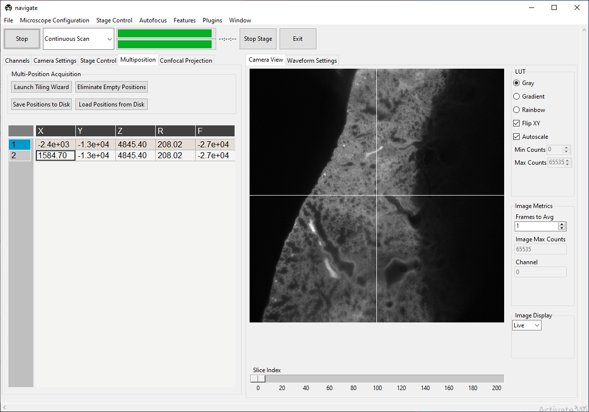
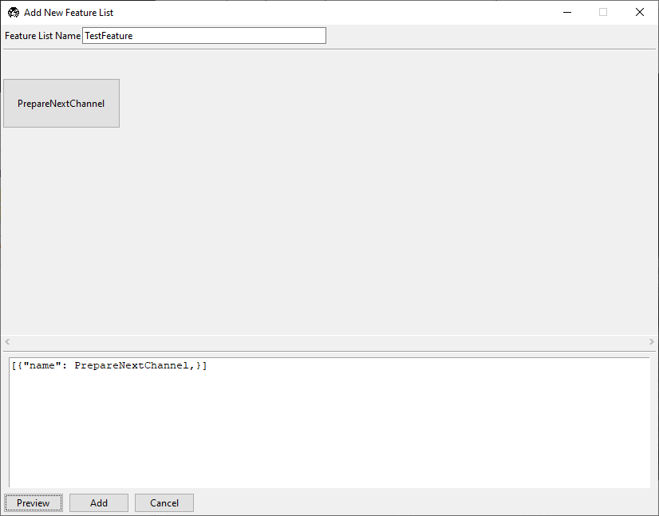
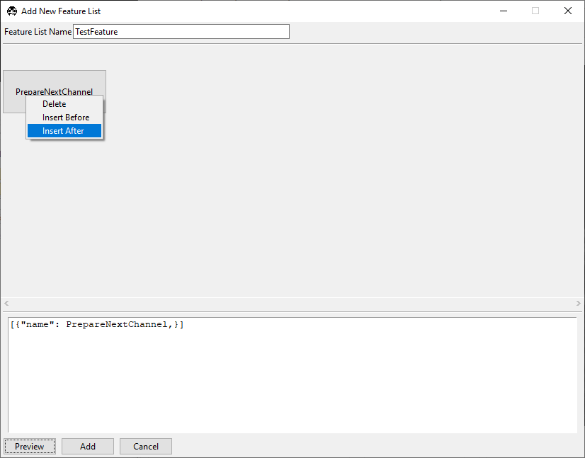
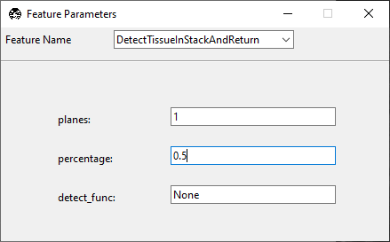
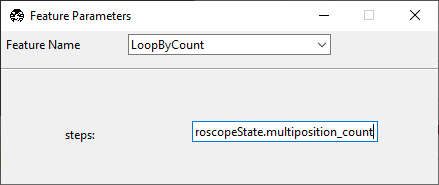
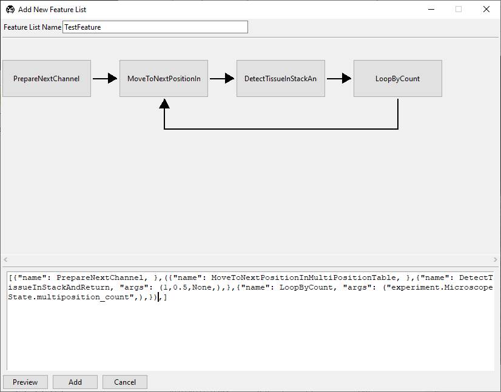
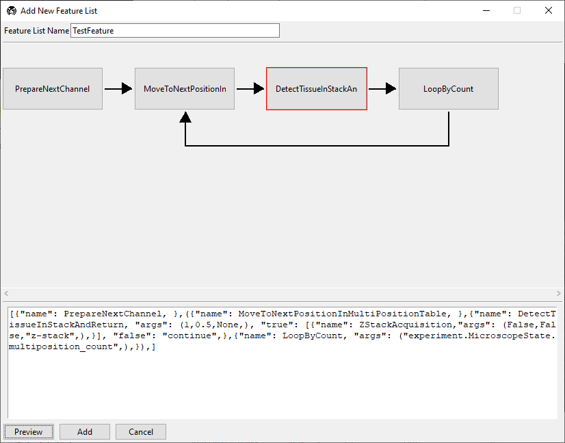

================================================
Write A Smart Acquisition Routine (Intermediate)
================================================

**navigate**'s :doc:`feature container <contributing/feature_container>` enables us to
write acquisition routines on the fly by chaining existing 
:doc:`features <user_guide/features>` into lists. Please see
:ref:`Currently Implemented Features <contributing/feature_container:currently implemented features>`
for a complete list of features. Users can build additionals feature within :doc:`plugins <plugin/plugin_home>`.

In this guide, we will use existing features to write a routine that scans through an 
imaging chamber and takes z-stacks only where it finds the sample.

Suppose there are two positions listed in the 
:ref:`multiposition table <user_guide/gui_walkthrough:multiposition>`, one containing
tissue and one empty, as shown below.

.. image:: images/multiposition_empty.png

We will build a feature that scans both positions, but only takes a z-stack at the one
containing tissue. To access the GUI feature list editor, navigate to
:menuselection:`Features --> Add Customized Feature List`. A window titled "Add New
Feature List" will pop up. Enter ``TestFeature`` in the text box at the top of the 
popup. Enter

.. code-block:: python

    [{"name": PrepareNextChannel}]

in the text box at the bottom of this popup and press :guilabel:`Preview`. The window
should appear as below.

The square brackets ``[]`` create a sequence of events to run in the feature container.
The ``{}`` braces contain features. In this case, we have a single feature,
``PrepareNextChannel``, which will set up the next color channel for acquisition. The
complete sequence (as it stands) will take an image in the first 
:ref:`selected color channel <user_guide/gui_walkthrough:channel settings>`.

We can build much of the rest of our desired acquisition in the GUI. Right-click on the
``PrepareNextChannel`` tile to reveal the editing menu.

Select :guilabel:`Insert After`. A second copy of ``PrepareNextChannel`` will appear in
the feature list. 

.. image:: images/feature_gui_3.png

Left-click on this second tile to reveal a popup that allows us to 
select which feature we want to use in this tile.

.. image:: images/feature_gui_4.png

Select ``MoveToNextPositionInMultiPositionTable`` and then close the popup. Your
feature list editing window should now appear as below. 

.. image:: images/feature_gui_5.png

Our feature now takes one image of the first selected color channel at each position
in the multiposition table.

Now, right-click ``MoveToNextPositionInMultiPositionTable`` and press 
:guilabel:`Insert After`. Click the new tile and change it to 
``DetectTissueInStackAndReturn``. There are three options associated with this feature.

* :guilabel:`planes` indicates how many planes of the z-stack
  this feature should check for tissue.

* :guilabel:`percentage` indicates what percent of the total image must contain tissue
  for this feature to return ``true`` that tissue was detected. 1 indicates that the entire
  image contains tissue, 0.5 indicates that half of the image contains tissue, and so on.

* :guilabel:`detect_func` is one of the tissue detection functions in 
  :doc:`remove_empty_tiles <_autosummary/navigate.model.features.remove_empty_tiles>`. 
  If this is set to ``None``, it defaults to ``detect_tissue()``, which states that 
  tissue is present if signal is above the Otsu threshold of the stack of images 
  acquired.

In this example, if any plane meets the desired threshold, the feature will return 
``true`` and it will be acquired. If no plane meets the desired threshold, the feature
will return ``false``

Now, right-click ``DetectTissueInStackAndReturn`` and press
:guilabel:`Insert After`. Click the new tile and change it to 
``LoopByCount``.

We want to iterate over all of the positions in the multi-position table, so we will
set ``steps`` to ``experiment.MicroscopeState.multiposition_count``.

Notice that the acquisition protocol does not appear to loop, but rather still moves
in a sequence. This is because all of the tiles are still in the sequence brackets 
``[]``. We can now enclose the section of the protocol we want to loop in parentheses
``()`` and press :guilabel:`Preview` to see the update.

Now, we set up one color channel to image (``PrepareNextChannel``), and then within
this channel visit every position in the multiposition table, and detect if there is
tissue. However, we do no yet make any decisions of what to do if tissue is found.
To do this, we will convert ``DetectTissueInStackAndReturn`` into a decision node.

To do this, we add ``true`` and ``false`` options within the feature braces:

.. code-block:: python

    {"name": DetectTissueInStackAndReturn, 
     "args": (1, 0.5, None), 
     "true": [{"name": ZStackAcquisition,"args": (False,False,"z-stack",),}], 
     "false": "continue",}

Our ``true`` argument tells the software what to do if tissue is detected. In this
case, we take a z-stack at the positions where tissue is found. The ``false``
argument tells the software how to proceed if no tissue is found. In this case, the
``continue`` option tells the software to keep moving through the loop to the next
position in the multi-position table. Press :guilabel:`Preview` to see the update.

``DetectTissueInStackAndReturn`` now has a red border, indicating it is a decision 
node. Click on it to access the decision node GUI.

.. image:: images/feature_gui_10.png

This contains the same settings for ``DetectTissueInStackAndReturn`` we saw before, but
now also features GUI editing windows for the results of ``true`` and ``false``
decisions arising from this node.

Close the node window and press :guilabel:`Add` in the "Add New Feature List" window.
This feature is now available under :menuselection:`Features --> TestFeature` and 
can be run in "Customized"
:ref:`acquisition mode <user_guide/gui_walkthrough:acquisition bar>`.

Select "Customized" acquisition mode, select :menuselection:`Features --> TestFeature`,
and press :guilabel:`Acquire`. For the positions shown at the start of this guide, the
software will go to the first position in the multi-position table, decide there is
tissue present, and take a z-stack. It will then go to the second position in the 
multi-position table, find there is no tissue, and decide not to take a z-stack. It
will then exit the loop as no more positions are available in the multi-position table.

Now you can use this feature or build another smart acquisition routine suited to your
microscope's needs.