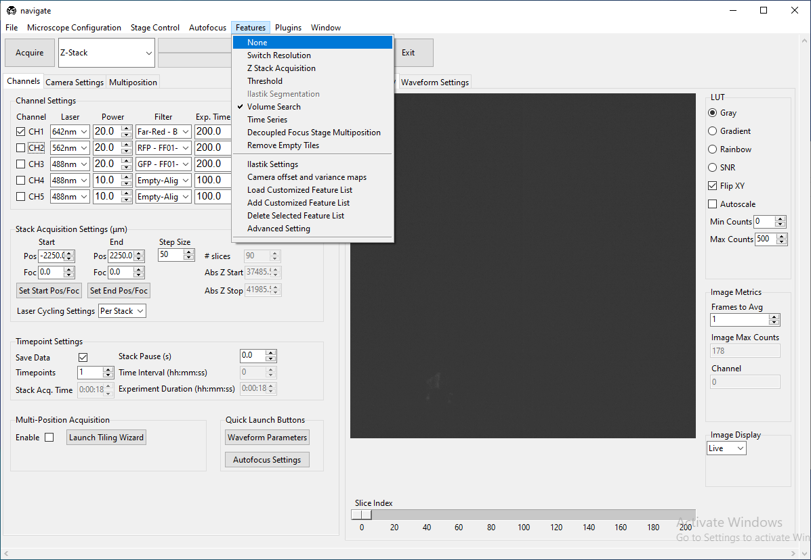
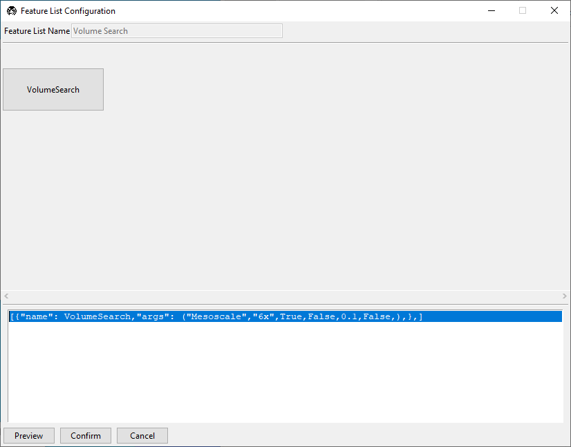
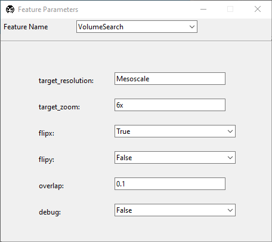
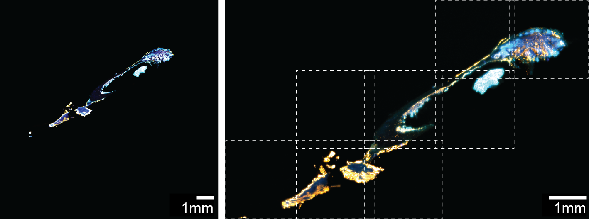

=============
Volume Search
=============

This guide aims to provide a general overview on how to use the `VolumeSearch` feature
in **navigate**.

The `VolumeSearch` feature allows users to image a specimen at low magnification,
automatically segment it, and then image the segmented regions at high magnification.
In this example, we will operate a mesoSPIM microscope which is defined in the
**navigate** software as the `Mesoscale` imaging mode. It will image a specimen at 1x
magnification, segment the specimen, and then image the segmented regions at 6x
magnification in an automatic tiling format. Importantly, the microscope must be
configured to operate at multiple magnifications, which includes a Zoom device, and
stage offsets for each magnification.

- Configure the software to operate at 1x magnification.
- In the continuous acquisition mode, specify the `Start` and `End` z-positions for the
  volume that you want to image as if you were acquiring a normal Z-stack.
- The Z step size will be used to determine the spacing between images that
  **navigate** will acquire and search for the specimen in. For example, if your start
  and stop positions span 1 mm in physical space, and you specify a step size of 100
  microns, **navigate** will acquire 10 images in the Z direction and search for the
  tissue in each of these images. The step size will be equivalent to the size of the
  image stack acquired at the higher magnification later on.
- Select the :guilabel:`Features` menu and then select :guilabel:`Volume Search`.

- Change the acquisition mode to `Customized`, and select the :guilabel:`Acquire`
  button. This will open the :guilabel:`Feature List Configuration` window. In the
  top of the window, you can see the sequence of features in a graphical format. In
  this case, there is only one element, titled `VolumeSearch`. In the bottom portion
  of the window is a programmatic representation of the feature.

- Click on the :guilabel:`VolumeSearch` icon. The `Feature Parameters` window for the
  `VolumeSearch` feature will open.

- Specify the :guilabel:`target_resolution` that you want to do the automatic tiling
  in. This is the name of the `microscope` instance, e.g. `Mesoscale`, that you
  want to use for the high magnification imaging.
- Specify the :guilabel:`target_zoom` that you want to use for the automatic
  tiling. The name must match identically.
- The :guilabel:`flipx` and :guilabel:`flipy` flags specify how the stage moves
  relative to the orientation of the camera. These can be identified experimentally.
- The :guilabel:`overlap` specifies the desired overlap between adjacent views in
  the high-resolution mode. This is a percentage of the field of view.
- The :guilabel:`debug` provides some useful features for debugging things such
  as the size of the field of view, overlap, and whether the flip flags need to be
  enabled.

- Once you have specified the parameters, close the `Feature Parameters` window, and
  press the :guilabel:`Confirm` button in the `Feature List Configuration` window. the
  acquisition will begin.
- The software will acquire images at the low magnification, segment the specimen,
  populate the multiposition table with the locations of the segmented regions.
- To acquire the data at high magnification, change the microscope zoom to the value
  specified in the `target_zoom` parameter, change the acquisition mode to Z-Stack, and
  confirm that the `multiposition` checkbox is selected. The size of the z-stack
  should be changed to be equal to the step size from the previous acquisition (e.g.,
  100 microns).
- Press the :guilabel:`Acquire` button to begin the acquisition. The software will
  automatically move to each of the positions in the multiposition table and acquire
  a z-stack.

