==========================
User Interface Walkthrough
==========================

navigate's user interface is modular, and designed to be reconfigurable to a user's
preferences. At a high level, it is split into a menu bar, an acquisition bar, settings
notebooks, and display notebooks.

.. image:: images/home_screen.png

Menu Bar
========

File
----

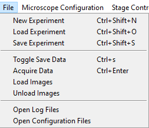

The :guilabel:`File` menu lets us create, load and save
:ref:`Experiment files <user_guide/software_configuration:experiment file>`,
which store states of the GUI and the hardware. This is useful if you want to perform
an experiment with the same parameters multiple times, but close the software in
between acqusitions.

The :guilabel:`File` menu also provides access to toggle the :guilabel:`Save Data` flag
under :guilabel:`Timepoint Settings` in the Channels Settings Notebook, and to start
an acquisition (which can also be done by pressing :guilabel:`Acquire` in the
:ref:`user_guide/gui_walkthrough:acquisition bar`). Loading and unloading images only
works if we have a
:ref:`synthetic camera <user_guide/hardware/supported_hardware:synthetic camera>`. In
this case, it loads images to display in lieu of the simulated noise generated by the
synthetic camera.

:guilabel:`Open Log Files` opens the folder containing the software's log files. This
is helpful for debugging code and configuration problems.

:guilabel:`Open Configuration Files` opens the folder containing the software's
:ref:`configuration file <user_guide/software_configuration:configuration file>`.

Microscope Configuration
------------------------

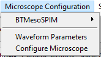

The :guilabel:`Microscope Configuration` menu is split into two parts, above and below
the horizontal divider.

Above the horizontal divider it lists the names of all 
microscopes named in the ``microscopes`` section of the 
:ref:`configuration file <user_guide/software_configuration:configuration file>`. Mousing over a
microscope name reveals all zoom values available under the 
:ref:`Mechanical Zoom <user_guide/hardware/supported_hardware:mechanical zoom>`. Selecting one of
these zoom values changes the magnification of the microscope.

Below the horizontal divider is access to the 
:ref:`Waveform Parameters <user_guide/gui_walkthrough:waveform parameters>` settings 
panel and the 
:ref:`Configure Microscope <user_guide/gui_walkthrough:configure microscopes>` settings 
panel.

.. _stage_control_menu:

Stage Control
-------------

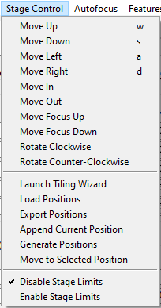

The stage control menu is split by horizontal dividers into three parts. 

The top part provides similar functionality to the 
:ref:`Stage Control Settings Notebook <stage_control_notebook>`. It allows movement
of the stage along x, y, z, focus and theta. Here, you can see the ``w``, ``s``, ``a``
and ``d`` keys are bound to movement in x and y, and these can be used to scroll around
a sample.

The middle part provides similar functionality to the 
:ref:`Multiposition Settings Notebook <user_guide/gui_walkthrough:multiposition>`.
Here, we can launch the 
:ref:`Tiling Wizard <user_guide/gui_walkthrough:multi-position tiling wizard>`, 
load and export (save) positions stored in the Multipositon Settings Notebook, and add 
the current stage position to the multiposition table.

The bottom part of the menu is used to enable and disable the stage limits set in the
configuration file (see the 
:ref:`stage subsection <user_guide/software_configuration:stage subsection>`).

Autofocus
---------

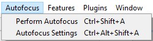

The autofocus menu has two options: :guilabel:`Perform Autofocus`, which autofocus the
sample using the current autofocus settings, and :guilabel:`Autofocus Settings`, which
launches the :ref:`Autofocus Settings <user_guide/gui_walkthrough:autofocus settings>`
popup.

Features
--------

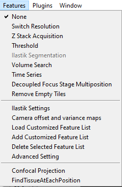

This menu provides access to acqusition feature lists. An explanation of features,
feature lists, and the use and operation of this menu is provided under
:doc:`Reconfigurable Acquisitions Using Features <features>`.

Plugins
-------

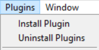

This menu provides an access point for :doc:`plugins <../plugin/plugin_home>` that feature
a popup GUI. 

Window
------

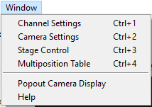

This menu is split into two parts by a horizontal divider and provides some GUI controls. 

The top part allows the user to switch between the main
:ref:`Settings Notebooks <user_guide/gui_walkthrough:settings notebooks>`.

The bottom part provides an option to move the camera display to a popup window and
provides access to a help popup that features some keyboard shortcuts and tricks for
using the software.

Acquisition Bar
===============

Left-to-right, the acquistion bar provides

* An :guilabel:`Acquire` button, which starts acquisition.
* A drop-down menu providing a selection of acquisition modes.
* A progress bar indicating how far through an acquisition we are.
* A time estimate indicatating how much time is left in the acquistion.
* An emergency :guilabel:`Stop Stage` button, which instantly halts all stage movement.
* An :guilabel:`Exit Button`, which quits the software.

Settings Notebooks
==================

The settings notebooks are a series of tabs that control microscope settings, including
laser power, camera settings and stage positions and many others.

Channels
--------

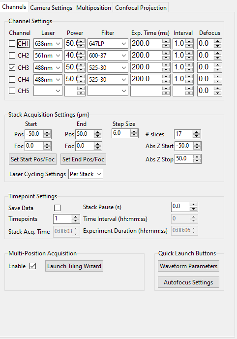

The Channels Settings Notebook is a tab (optionally, a popup) split into five sections:
channel settings, stack acquistion settings, timepoint settings, multi-position 
acquisition and quick launch buttons.

Channel Settings
^^^^^^^^^^^^^^^^

This is used to set up acquisition color channels. A channel is considered to be a 
combination of an illuminating laser wavelength and a detection filter. Each channel
has its own power, exposure time, interval and defocus. The checkbox on the left
indicates if a channel should be used during acquisition. An acquisition loops through
the channels in sequence.

* :guilabel:`Laser` is the name of the laser, taken from the 
  :doc:`configuration file <software_configuration>`, and usually expressed in 
  nanometers.
* :guilabel:`Power` is the power of the laser between 0 and 100 percent.
* :guilabel:`Filter` is the name of the filter selected in the detection path filter
  wheel. Filter names are stored in the configuration file.
* :guilabel:`Exp. Time (ms)` is the exposure time of the camera in milliseconds.
* :guilabel:`Interval` indicates how often this channel should be used in an 
  acquisition. For example, in two-color imaging, CH1 may images a process twice as 
  fast as in CH2. Setting the CH2 interval to 2 allows us to image both channels at
  a similar rate.
* :guilabel:`Defocus` indicates the defocus between two channels in micrometers. The
  defocus values are always relative to the focus of the first channel imaged. This 
  setting is useful for compensating for chromatic aberration.

Stack Acquisition Settings (:math:`\mu\text{m}`)
^^^^^^^^^^^^^^^^^^^^^^^^^^^^^^^^^^^^^^^^^^^^^^^^

These are the settings used for a standard Z-Stack Acquisition. 

:guilabel:`Pos` indicates z-positions. :guilabel:`Foc` indicates focus positions. The
z-stack can optionally ramp through focus along with z.

:guilabel:`Start` and :guilabel:`End` are always expressed relative to the center of 
the z-stack. :guilabel:`Abs Z Start` and :guilabel:`Abs Z Stop` provide true stage 
positions at the start and end of the z-stack. 

The buttons :guilabel:`Set Start Pos/Foc` and :guilabel:`Set End Pos/Foc` grab the
current z and focus positions from the stage and enter them into the corresponding
start and end (stop) GUI boxes.

The :guilabel:`Step Size` is expressed in microns and can be modified by the user. Upon
modificiation, :guilabel:`# slices` will automatically update.

:guilabel:`Laser Cycling Settings` provide the options "Per Stack" and "Per Z". In "Per
Stack" mode, the software will move through all positions before changing to another
color channel. In "Per Z" mode, the software will acquire all color channels selected
before moving to the next position in the z-stack.

Timepoint Settings
^^^^^^^^^^^^^^^^^^

These are used for acquiring data over multiple timepoints and for toggling the option
to save data.

* :guilabel:`Save Data` tells the software to save acquired data to disk when checked. 
  If this is selected, a 
  :ref:`saving popup window <user_guide/gui_walkthrough:file saving dialog>` will 
  appear when :guilabel:`Acquire` is pressed, unless you are in "Continuous Scan" mode, 
  which is designed for live previews only.
* :guilabel:`Timepoints` indicates how many time points this acquisition should 
  acquire.
* :guilabel:`Stack Acq Time` provides an estimate of how long a single z-stack will
  take to acquire.
* :guilabel:`Stack Pause (s)` indicates how much waiting time the software should 
  introduce in between acquisition steps (e.g. in between taking z-stacks).
* :guilabel:`Time Interval (hh:mm:ss)` provides an estimate of how long each time point
  takes to acquire. This is (stack acquisition + stack pause) x number of channels to
  image.
* :guilabel:`Experiment Duration (hh:mm:ss)` provides an estimate of how long the full
  acquisition will take.

Multi-Position Acquisition
^^^^^^^^^^^^^^^^^^^^^^^^^^

This contains settings to set up acquisition over multiple positions in the sample, 
e.g. tiling.

* :guilabel:`Enable` indicates that the software should move through the positions 
  listed in the 
  :ref:`Multiposition Settings Notebook <user_guide/gui_walkthrough:multiposition>`
  during the acquisition.
* :guilabel:`Launch Tiling Wizard` launches the 
  :ref:`Tiling Wizard <user_guide/gui_walkthrough:multi-position tiling wizard>`.

Quick Launch Buttons
^^^^^^^^^^^^^^^^^^^^

This provides access to the 
:ref:`Waveform Parameters <user_guide/gui_walkthrough:waveform parameters>` and
:ref:`Autofocus Settings <user_guide/gui_walkthrough:autofocus settings>` 
popups.

Camera Settings
---------------

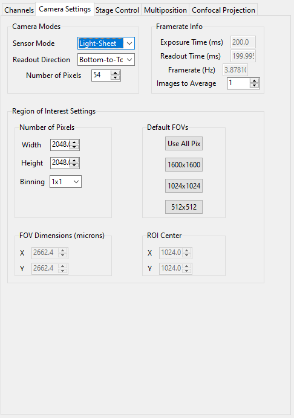

The Channels Settings Notebook is a tab (optionally, a popup) that controls the camera.
It is split into three sections: camera modes, framerate info and region of interest
settings.

Camera Modes
^^^^^^^^^^^^

The camera modes section is designed for switching between normal mode of operation,
where the camera exposes all pixels semi-simultaneously, and light-sheet mode, where
the camera exposes only a few pixels at a time, termed the rollign shutter width, and 
progressively images from the top to the bottom of the camera chip or vice versa.

* :guilabel:`Sensor Mode` is used to switch between "Normal" and "Light-Sheet" 
  (progressive) exposure.
* :guilabel:`Readout Direction` indicates if the rolling shutter should move from the
  bottom to the top of the camera chip or vice versa.
* :guilabel:`Number of Pixels` sets the rolling shutter width on the camera.

Framerate Info
^^^^^^^^^^^^^^

This displays information concerning the speed of acquisition and optionally allows the
user to average these values over multiple images.

* :guilabel:`Exposure Time (ms)` displays the set camera exposure time.
* :guilabel:`Readout Time (ms)` displays how long it takes to read a frame from the
  camera. This includes exposure time.
* :guilabel:`Framerate (Hz)` displays how long it takes to acquire an image. This is
  based on an internal "wait ticket" approach, where the software times how long it
  waits for a frame to come in after receiving the previous frame. This frequency 
  includes not only camera readout time, but, e.g. how long the software had to wait
  for the stage to finish moving before taking the next image in a z-stack. It is the
  most accurate time estimate in the software.
* :guilabel:`Images to Average` tells the camera to average frames.

Region of Interest Settings
^^^^^^^^^^^^^^^^^^^^^^^^^^^

These allows the user to set the size of the our region of interest in pixels. The
camera can also be told optionally to bin pixels. The corresponding field of view
is displayed by calculating the number of pixels multiplied by the camera's effective
pixel size, which is set in the 
:ref:`Mechanical Zoom <user_guide/hardware/supported_hardware:mechanical zoom>`.

:guilabel:`Default FOVs` includes buttons to quickly change the FOV to preset values.

:guilabel:`ROI center` indicates about what point the pixels crop on the camera.

.. _stage_control_notebook:

Stage Control
-------------

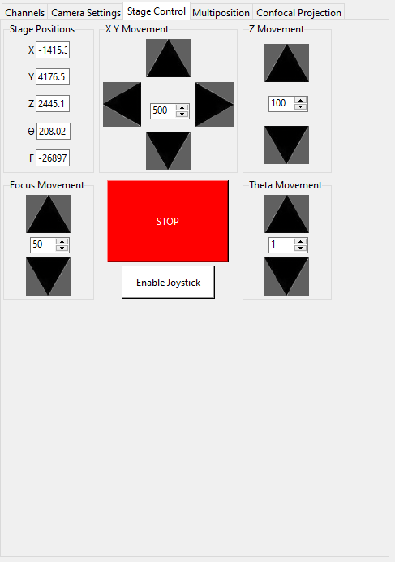

The Stage Control Settings Notebook is a tab (optionally, a popup) that controls the 
stage positions. It is split into six parts: stage positions, x and y movement, z 
movement, focus movement, theta movement, and stop stage and joystick buttons.

By default, the stage is expected to have x, y, z, focus and theta (rotation) axes. If
your stage does not have one of these axes, you can choose to not use that control. See
the :ref:`stage subsection <user_guide/software_configuration:stage subsection>` for
more information.

Stage Positions
^^^^^^^^^^^^^^^

The entry boxes report the current position of each stage axis. If a user changes the
value in the entry box, the stage will move to that value (provided it is within the
stage bounds if stage limits are enabled, see `here <stage_control_menu>`).

XY Movement
^^^^^^^^^^^

This includes the movement buttons for the X and Y axes. The left and right buttons
control X, while the up and down buttons control Y. The entry box in the middle of the
buttons indicates the step size along these axes in microns. It can be changed by the
user.

Z Movement
^^^^^^^^^^

This controls the movement of the Z stage. The entry box indicates the step size along
this axis and it can be changed by the user.

Focus Movement
^^^^^^^^^^^^^^

This controls the movement of the focus stage. The entry box indicates the step size 
along this axis and it can be changed by the user.

Theta Movement
^^^^^^^^^^^^^^

This controls the movement of the rotation stage. The entry box indicates the step size
along this axis and it can be changed by the user.

Buttons
^^^^^^^

The :guilabel:`STOP` button halts all stage axes and updates the stage positions to
wherever the stage stopped.

The :guilabel:`Enable Joystick` button disables control over the axes associated with
the joystick (see the 
:ref:`stage subsection <user_guide/software_configuration:stage subsection>`).

.. note:: 
    
    It is not necessary to press this button to use a joystick. The joystick can be 
    used along with the software controls. However, if you are running the acquisition
    in "Continous Scan" and use the joystick without pressing 
    :guilabel:`Enable Joystick`, the stage positions may not update unless you press 
    :guilabel:`STOP`. In "Continous Scan", if you try to move with the joystick and 
    then the software stage controls without first pressing  :guilabel:`STOP`, it is
    likely the stage will update to the software's position of choice and undo whatever
    joystick movement you did. 

.. tip:: 

    If you have the screen real estate, it is often helpful to convert the Stage
    Control Settings Notebook to a popup. Right click on the tab and press
    :guilabel:`Popout Tab`.

    .. image:: images/popout_right_click.png

    |

    Once this is done, you should be able to move the stage controls next to the
    main navigate window.

    .. image:: images/popout_stage.png

Multiposition
-------------

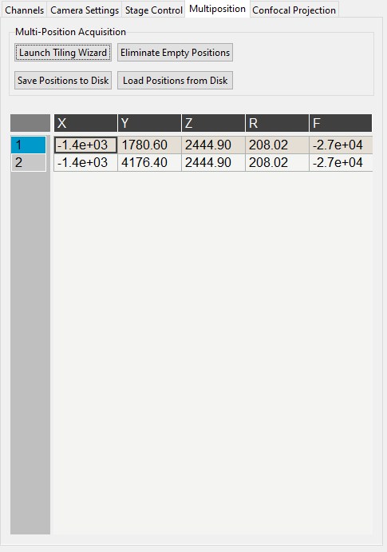

The Multiposition Settings Notebook is a tab (optionally, a popup) that helps the user
set up and visualize a multi-position acquisition for tiling a large sample. It is
split into two parts: buttons and the multi-position table.

Buttons
^^^^^^^

* :guilabel:`Launch Tiling Wizard` launches the 
  :ref:`Tiling Wizard <user_guide/gui_walkthrough:multi-position tiling wizard>`
* :guilabel:`Eliminate Empty Positions` is not implemented and does nothing.
* :guilabel:`Save Positions To Disk` saves the multi-position table to a file.
* :guilabel:`Load Positions From Disk` loads a multi-position file into the table.

Multi-Position Table
^^^^^^^^^^^^^^^^^^^^

The multi-position table lists stage positions that are included in a multi-position
acquisition. 

* Double-clicking on the integer to the left of a row moves the stage to
  that position.

* Double-clicking on a table cell allows the user to edit the stage position in that 
  cell.

* Right-clicking on the integer to the left of a row yields a popup with four options:

    .. image:: images/multiposition_right_click.png

  * :guilabel:`Insert New Position` adds an empy row to the table.
  * :guilabel:`Add Current Position` adds a row containing the current stage position 
    to the table.
  * :guilabel:`Add New Position(s)` yields a popup that asks the user how many new rows
    to add and then inserts that number of empty rows upon confirmation.
  * :guilabel:`Delete Position(s)` deletes the selected positions. Selection is 
    indicated by a blue highlight of the integer to the left of a row.

Display Notebooks
==================

The display notebooks provide visual feedback of the images taken on the camera and
of the galvo and remote focus waveforms sent to the DAQ.

Camera View
-----------

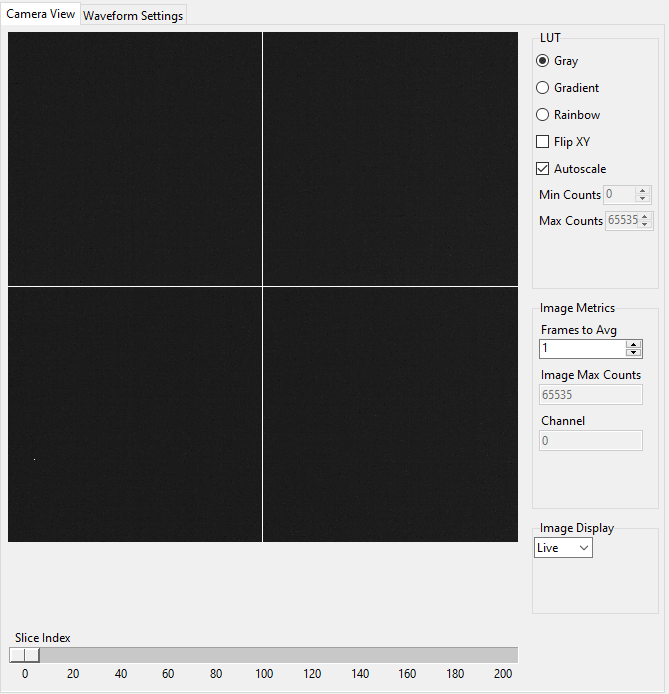

The Camera View Display Notebook is is a tab (optionally, a popup) that is split into
two parts. The left part displays the latest image acquired by the camera. The right 
part modifies this display and is split into LUT, Image Metrics, and Image Display.

Left-clicking on the image toggles crosshairs that indicate the center of the field of
view. 

LUT
^^^

The :guilabel:`LUT` section of the camera view allows the user to change the lookup
table the image uses to display. The options are "Gray", "Gradient" and "Rainbow". 

:guilabel:`Flip XY` transposes the image in the display. This can produce intuitive 
results in the display when clicking on the XY stage movements buttons (i.e. with 
:guilabel:`Flip XY` enabled, the sample moves along the direction expected when a 
stage movement button is clicked).

:guilabel:`Autoscale` toggles automatic image histogram scaling ona nd off. When 
:guilabel:`Autoscale` is enabled, the image automatically scales intensity between
the minimum and maximum pixel value in the image produced by the camera. When 
:guilabel:`Autoscale` is disabled, the image is scaled between :guilabel:`Min Counts`
and :guilabel:`Max Counts`.

Image Metrics
^^^^^^^^^^^^^

:guilabel:`Frames to Avg` is unimplemented, but should average this many frames coming
from the camera and display the average in the viewer.

:guilabel:`Image Max Counts` tells us the maximum pixel count in the image.

:guilabel:`Channel` informs us which color channel we are looking at. It indexes into
the selected channels in the 
:ref:`Channel Settings <user_guide/gui_walkthrough:channel settings>` 
(i.e. ``0`` is the first selected channel).

Image Display
^^^^^^^^^^^^^

This should toggle in between live mode and maximum projections in multiple dimensions,
but it is currently not implemented.

Waveform Settings
-----------------

.. image:: images/display_waveform.png

The Waveform Settings Display Notebook is a tab (optionally, a popup) is split into two
sections: a waveform display section at the top and a settings section at the bottom.

Waveform Display
^^^^^^^^^^^^^^^^

The waveform display shows the waveforms sent to the remote focus devices (top) and the
galvos (bottom). Each channel and each device gets its own color, which is then
displayed in the legend. The dotted black line indicates when the camera is acquiring
in relation to the waveforms. This can be considered identical to what is sent to the
DAQ.

Settings
^^^^^^^^

:guilabel:`Sample Rate` changes the frequency of the samples sent to the DAQ. It is not
recommended that a user change this.

:guilabel:`Waveform Template` changes the 
:ref:`waveform template <user_guide/software_configuration:waveform templates file>` 
used to generate the waveforms.

Additional GUIs
===============

This section includes popups and other non-main sections of the GUI.

File Saving Dialog
------------------

.. image:: images/save_dialog.png

The file saving dialog pops up if an 
:ref:`acquisition mode <user_guide/gui_walkthrough:acquisition bar>` other than 
"Continuous Scan" is selected 
and :ref:`save data <user_guide/gui_walkthrough:timepoint settings>` is checked.

* :guilabel:`Root Directory` indicates the local directory to which the software will
  save the data.
* :guilabel:`User` is the name of the user acquiring the data.
* :guilabel:`Tissue Type` is the type of tissue being imaged.
* :guilabel:`Cell Type` is the cell type being imaged.
* :guilabel:`Label` indicates the dyes used in the acquisition.
* :guilabel:`Solvent` indicates the immersion solvent of the tissue/cell.
* :guilabel:`File Type` indicates what type of file to save to.

Waveform Parameters
-------------------

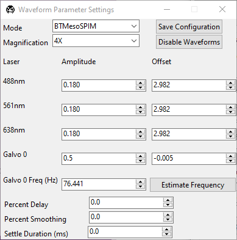

This is used to update the waveforms shown in 
:ref:`Waveform Settings <user_guide/gui_walkthrough:waveform settings>`.

* For each laser, the :guilabel:`Amplitude` and :guilabel:`Offset` correspond to the
  amplitude and offset of the sawtooth waveform sent to the remote focus device.
* For each galvo, the :guilabel:`Amplitude` and :guilabel:`Offset` correspond to the
  amplitude and offset of the waveform sent to the galvo, by default a triangle wave.
  The :guilabel:`Galvo <int> Frequency (Hz)` sets the frequency of the waveform sent
  to the galvo. :guilabel:`Estimate Frequency` estimates the frequency needed for a
  sawtooth wave to sweep over the full camera chip without aliasing with the light-
  sheet rolling shutter speed.
* :guilabel:`Percent Delay` introduces a delay before the remote focus sawtooth starts.
* :guilabel:`Percent Smoothing` smooths the remote focus waveform.
* :guilabel:`Settle Duration (ms)` introduces a delay after the remote focus sawtooth 
  ends.

Configure Microscopes
---------------------

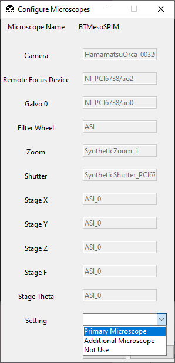

The configure microscopes window allows a user with multiple microscopes defined in 
their :ref:`configuration file <user_guide/software_configuration:configuration file>`
to select which microscope is primary and launch both microscopes simultaneously. The
primary microscope will have control over any hardware shared between both microscopes.
This window also provides a GUI interface to look at what hardware is in use.

Multi-Position Tiling Wizard
----------------------------

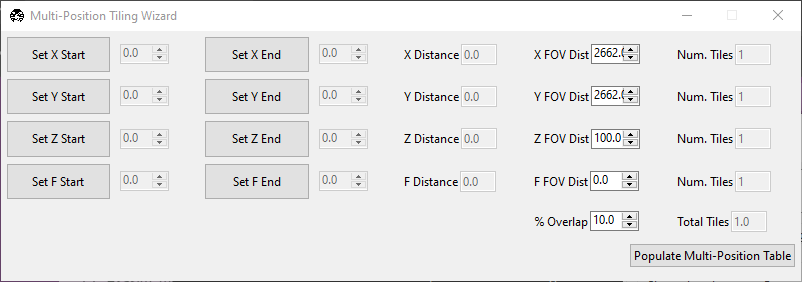

The tiling wizard helps the user set up a tiled acquisition of a sample large enough
that it cannot be imaged in a single field of view.

* :guilabel:`Set <axis> Start` indicates the starting position of an axis.
* :guilabel:`Set <axis> End` indicates the end position of an axis.
* :guilabel:`<axis> Distance` indicates difference between the start and end position.
* :guilabel:`<axis> FOV Dist` indicates the field of view along that axis. The Distance
  between start and end will be split into tiles of this size along this axis.
* :guilabel:`Num. Tiles` indicates how many tiles exist along this axis. It is roughly
  (End - Start)/FOV dist.
* :guilabel:`% Overlap` indicates the percent of the the that should overlap along each
  axis. It is a percent of the FOV Dist.
* :guilabel:`Populate Multi-Position Table` puts all of the tiles in the 
  :ref:`multi-position table <user_guide/gui_walkthrough:multi-position table>`.

For an example of how to use the tiling wizard, see 
:ref:`Tiling a sample larger than the field of view <user_guide/case_studies/acquire_mesospimbt:tiling a sample larger than the field of view>`.

Autofocus Settings
------------------

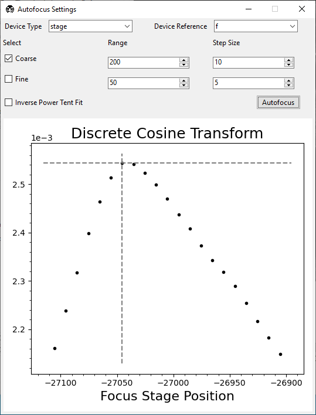

The autofocus settings panel controls parameters of the autofocus 
:doc:`feature <features>`.

* :guilabel:`Device Type` indicates if we want to apply the autofocus routine to A
  stage or to a remote focus device.
* :guilabel:`Device Reference` indices the stage axis, or the DAQ analog output for
  the remote focus device.
* The :guilabel:`Coarse` and :guilabel:`Fine` rows allow us to select a range and step
  size, both in microns (or volts, if using the remote focus device), over which we 
  should  search for an optimal focus value. If coarse and fine are selected, the 
  coarse search will be performed first and the fine search will be performed about 
  the coarse position with the highest value.
* :guilabel:`Inverse Power Tent Fit` will attempt to find a more accurate position for
  the optimal focus based on fitting a power tent to the search values. It will only
  use the fit if its :math:`R^2` value is higher than ``0.9``.
* :guilabel:`Autofocus` runs the autofocus with the set parameters.

Once the settings have been updated here, any run autofocus operation will use the new
settings.

